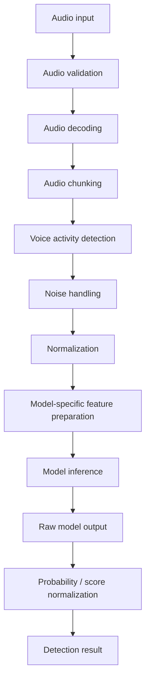
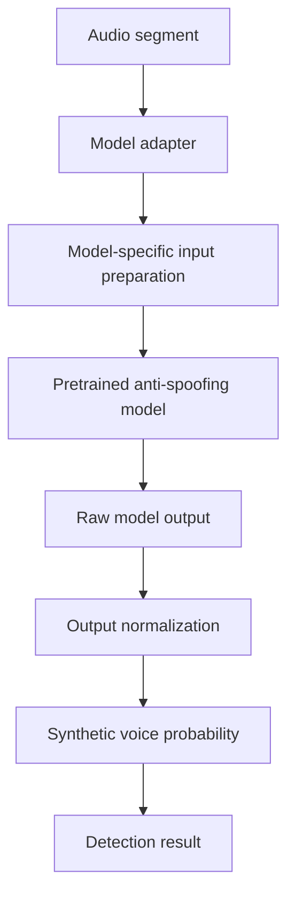
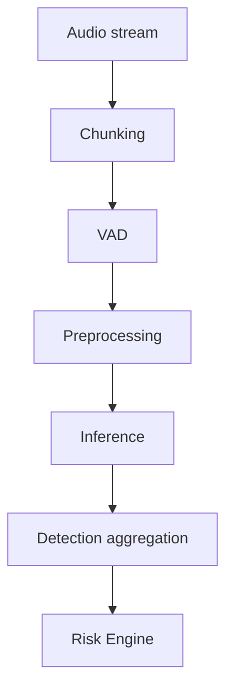
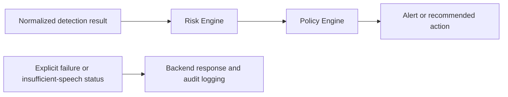

# AI/ML Model Design

## 1. Overview

This document defines the AI/ML design for detecting AI-generated voices, synthetic speech, voice cloning attempts, voice impersonation attacks, and audio spoofing attempts in real-time or near-real-time audio. The ML pipeline produces machine-readable detection signals for the Risk Scoring Engine.

Synthetic voice detection is distinct from final fraud decision-making. Detection signals are one input to the overall risk system, which also considers contextual risk factors and deterministic policy rules. The Security Copilot and its LLM are outside the core detection inference path and provide advisory assistance only.

## 2. Problem Definition

The conceptual classification objective is to classify an audio segment as one of the following:

- `BONAFIDE` / `AUTHENTIC`
- `SYNTHETIC` / `SPOOFED`

Exact labels and score semantics depend on the selected pretrained model. The model integration should expose a synthetic voice probability, authentic voice probability where the model supports it, detection confidence or equivalent confidence where available, detection status, and model metadata. The pipeline must support near-real-time inference for sufficiently sized audio segments.

## 3. AI Model Strategy

The MVP uses a pretrained voice anti-spoofing or synthetic speech detection model rather than training a large model from scratch. A model adapter layer isolates the backend from the selected model’s input requirements and output format.

This strategy supports rapid implementation, reliable local inference testing, modular integration, model replacement, and future optimization without redesigning the backend. It does not require proprietary datasets, large-scale training infrastructure, or a GPU training pipeline for the MVP.

## 4. Model Selection Criteria

| Criteria | Description | MVP Priority |
|---|---|---|
| Detection quality | Ability to discriminate bonafide and spoofed audio. | High |
| Synthetic speech support | Relevance to cloned and AI-generated speech. | High |
| Inference speed | Suitability for near-real-time processing. | High |
| CPU compatibility | Ability to run on available MVP hardware. | High |
| GPU acceleration support | Ability to use acceleration when available. | Medium |
| Input format requirements | Compatibility with practical audio preparation. | High |
| Model size | Operational practicality for deployment. | Medium |
| PyTorch integration | Compatibility with the selected ML stack. | High |
| Licensing suitability | Suitability for the project’s intended use. | High |
| Pretrained weights | Availability of usable pretrained weights. | High |
| Real-world robustness | Tolerance of realistic audio conditions. | High |
| Short-segment processing | Ability to process near-real-time chunks. | High |

## 5. Model Selection Strategy

### 5.1 MVP Model Selection Process

1. Identify compatible pretrained anti-spoofing models.
2. Verify licensing and availability of weights.
3. Test inference locally.
4. Evaluate latency on representative hardware.
5. Test authentic and synthetic audio samples.
6. Compare detection consistency.
7. Select the most practical model for the MVP.

### 5.2 Candidate Model Categories

Candidate categories include ASVspoof-compatible anti-spoofing models, CNN-based anti-spoofing models, Transformer-based speech-authenticity models, raw-waveform anti-spoofing models, and spectrogram-based detection models. These categories are evaluation options; none is claimed as implemented or selected.

### 5.3 Model Selection Decision

> **Model Status: To Be Finalized After Local Inference Testing**

## 6. Audio Input Requirements

The MVP supports uploaded audio files, microphone input, and chunked audio streams such as simulated or streamed input. The design remains compatible with future telephony or VoIP inputs.

Before inference, the pipeline validates files or streams, decodes audio, normalizes sample rate and channel configuration as required by the model, and validates duration. Exact thresholds are model- and deployment-specific and are not fixed in this document.

## 7. Audio Processing Pipeline

- **Audio validation:** Confirms that the input is supported and suitable for processing.
- **Audio decoding:** Converts accepted input into a processable audio representation.
- **Chunking:** Prepares audio segments for near-real-time inference.
- **VAD:** Identifies speech regions before analysis.
- **Noise handling and normalization:** Applies only model-compatible processing.
- **Feature preparation:** Produces the selected model’s required input.
- **Inference and output normalization:** Converts model output into a standard detection signal.

## 8. Voice Activity Detection

WebRTC VAD detects regions containing speech. It reduces unnecessary processing, permits silence to be ignored where appropriate, and improves inference efficiency. VAD does not identify synthetic speech; it only determines where speech is present.

## 9. Audio Preprocessing

Preprocessing may include sample-rate normalization, mono conversion, amplitude normalization, silence removal, chunk preparation, and noise handling. It must remain compatible with the selected model’s expected input distribution. Aggressive noise removal is not assumed, because modifying spoofing-relevant characteristics can reduce anti-spoofing performance.

## 10. Feature Preparation

Feature preparation depends on the selected pretrained model. Possible representations include raw waveform, Mel spectrogram, log-Mel features, spectral features, and model-specific embeddings. The system does not assume one representation for every model; the adapter prepares the exact representation required by the selected model.

## 11. Model Inference Pipeline

The Model Adapter abstracts differences among model architectures, input formats, score conventions, and metadata while preserving a common backend integration point.

## 12. Model Adapter Architecture

The modular adapter concept is responsible for:

- Loading the model and validating its availability.
- Preparing model input.
- Running inference.
- Interpreting raw output.
- Normalizing a probability or score.
- Returning a standard internal result object.

The backend consumes a standardized internal detection result rather than directly coupling to model-specific output. The conceptual result includes `detection_status`, `synthetic_probability`, `authentic_probability`, `confidence`, `model_name`, `model_version`, and `processing_time_ms`. This is an internal conceptual format, not a final API contract.

## 13. Detection Result and Confidence Handling

Not every anti-spoofing model produces calibrated probabilities. A raw score may require calibration before being treated as a probability. The Risk Engine consumes normalized detection signals, not an unexamined model score.

| Signal | Meaning | Consumer |
|---|---|---|
| Raw model score | Model-native classification output. | Model Adapter |
| Synthetic probability | Normalized likelihood or equivalent spoofing signal. | Risk Engine |
| Confidence | Model confidence or equivalent, where available. | Risk Engine and analyst interface |
| Detection status | Result state, including successful, insufficient, or failed analysis. | Backend and analyst interface |
| Final risk score | Security score that includes detection and context. | Policy Engine |

## 14. Real-Time and Near Real-Time Processing

Audio is processed as chunks. VAD and preprocessing occur before inference, and chunk-level results may be aggregated into a stable call-level signal before the Risk Engine receives it.

Rolling windows, temporal smoothing, and aggregation strategies are conceptual options; the selected model and local testing determine the appropriate approach.

## 15. Detection Aggregation Strategy

A complete call should not necessarily rely on one short prediction. Conceptual aggregation options include maximum suspicious score, mean suspicious score, weighted average, consecutive suspicious-chunk detection, and confidence-weighted aggregation.

> The exact aggregation strategy will be finalized after model inference testing.

## 16. Threshold Strategy

Detection thresholds must be configurable and calibrated through testing. The following values are not scientifically validated thresholds; they are **MVP configuration values subject to validation and calibration**.

| Detection Range | Interpretation | Suggested System Behavior |
|---|---|---|
| Low configured range | Lower indication of synthetic speech. | Continue monitoring and provide signal to the Risk Engine. |
| Intermediate configured range | Uncertain or elevated indication. | Aggregate additional chunks and apply contextual scoring. |
| High configured range | Stronger indication of synthetic speech. | Provide elevated signal to the Risk and Policy Engines. |

## 17. Model Performance Evaluation

No model performance values are claimed until evaluation is performed on the selected model and representative test data.

| Metric | Description |
|---|---|
| Accuracy | Overall correct classifications where class balance makes it meaningful. |
| Precision | Reliability of synthetic/spoofed predictions. |
| Recall | Ability to identify synthetic/spoofed samples. |
| F1 Score | Balance of precision and recall. |
| False Acceptance Rate | Conceptual rate at which spoofed audio is accepted as authentic. |
| False Rejection Rate | Conceptual rate at which authentic audio is rejected as spoofed. |
| False Positive Rate | Rate of authentic audio incorrectly marked suspicious. |
| False Negative Rate | Rate of spoofed audio incorrectly marked authentic. |
| Equal Error Rate | Error trade-off metric where supported by the methodology. |
| Inference latency | Time required to process an audio segment. |

## 18. Testing Strategy

### Functional Testing

- Valid authentic audio.
- Synthetic audio.
- Silence.
- Noise.
- Invalid files.

### Robustness Testing

- Different microphones.
- Compression artifacts.
- Background noise.
- Different languages and accents.
- Short audio segments.

### Performance Testing

- CPU inference.
- Optional GPU inference.
- Chunk processing latency.
- Multiple concurrent requests.

## 19. Dataset Strategy

Dataset planning does not assume that a specific dataset is already used to train the chosen model. Potential sources include public anti-spoofing datasets, ASVspoof benchmark datasets, authentic speech samples, and synthetic speech samples. All datasets must be used according to their licenses and usage restrictions.

For the hackathon MVP, pretrained model inference is preferred. Dataset use may be limited to validation and testing; large-scale training is not required.

## 20. Model Versioning and Reproducibility

Once selected, record the model name, version, source, checksum where appropriate, dependency versions, input configuration, and evaluation configuration. This supports reproducible inference and controlled model updates.

## 21. Failure and Fallback Handling

Possible failures include model unavailability, invalid audio, insufficient speech, audio that is too short, unsupported formats, inference timeout, and low-confidence results. The system must return an explicit analysis status, record failure events, and allow retry where appropriate. It must not silently treat a model failure as a `SAFE` decision or present uncertain audio as authentic.

## 22. Privacy Considerations for AI Processing

The AI pipeline follows data-minimization principles: process audio temporarily where possible, avoid unnecessary raw-audio retention, restrict access to sensitive data, maintain audit logs, and separate sensitive source data from stored analysis results. Detailed security requirements belong in `docs/SECURITY.md`.

## 23. Future AI Model Improvements

**Future scope — not part of the hackathon MVP:**

- Fine-tuning for Indian languages.
- Accent robustness improvements.
- Detection of new voice cloning techniques.
- Ensemble detection.
- Continuous evaluation.
- Model replacement.
- ONNX Runtime optimization.
- GPU inference services.
- Dedicated ML inference service.

## 24. Model Architecture Summary

| Component | Responsibility | MVP Status |
|---|---|---|
| Audio Input | Accept supported audio sources. | Core |
| VAD | Identify speech regions only. | Core |
| Preprocessing | Prepare model-compatible audio. | Core |
| Feature Preparation | Build model-specific input representation. | Core |
| Model Adapter | Isolate backend from specific model details. | Core |
| Pretrained Anti-Spoofing Model | Produce synthetic-speech detection signal. | Core; selection pending |
| Output Normalization | Standardize model results. | Core |
| Detection Aggregation | Stabilize chunk-level results. | Core; strategy pending validation |
| Risk Engine Integration | Supply normalized ML signals. | Core |
| Model Logging | Record model metadata and analysis events. | Core |

## 25. Final AI/ML Design Decisions

1. Use a pretrained model strategy for the MVP.
2. Use a model-agnostic adapter layer.
3. Use VAD for speech segmentation only.
4. Keep preprocessing model-specific and model-compatible.
5. Normalize detection output before risk scoring.
6. Keep the Risk Engine separate from ML inference.
7. Exclude the LLM from the detection pipeline.
8. Keep thresholds configurable and subject to validation.
9. Process near-real-time audio in chunks.
10. Preserve the ability to replace models in the future.
