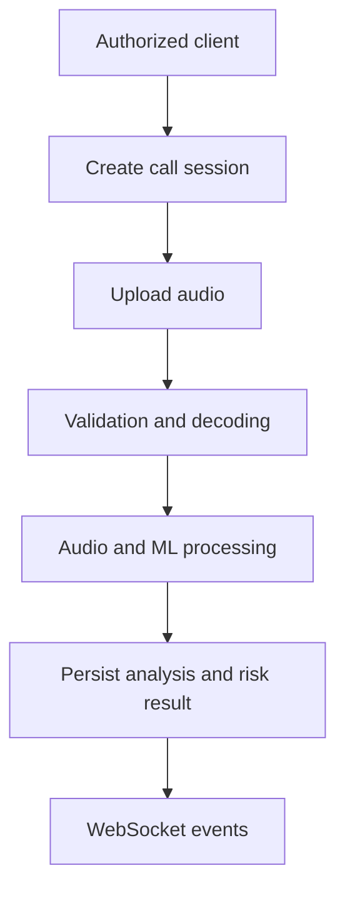
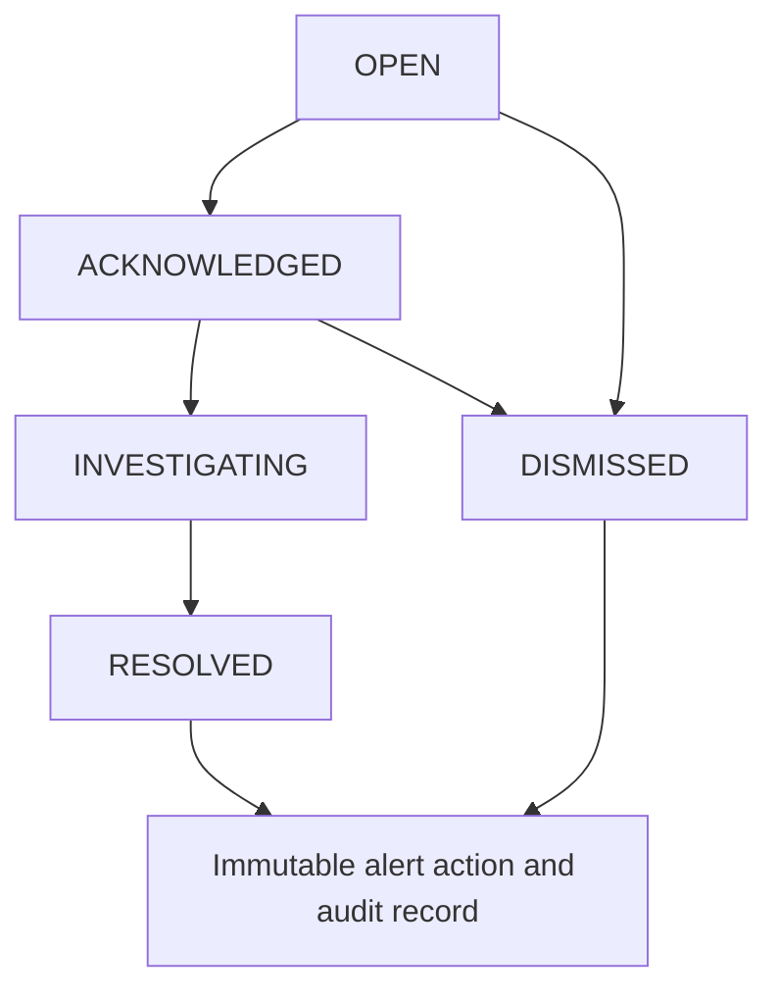
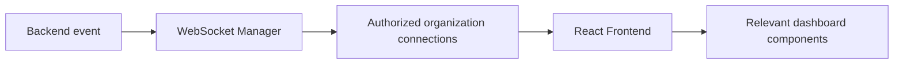
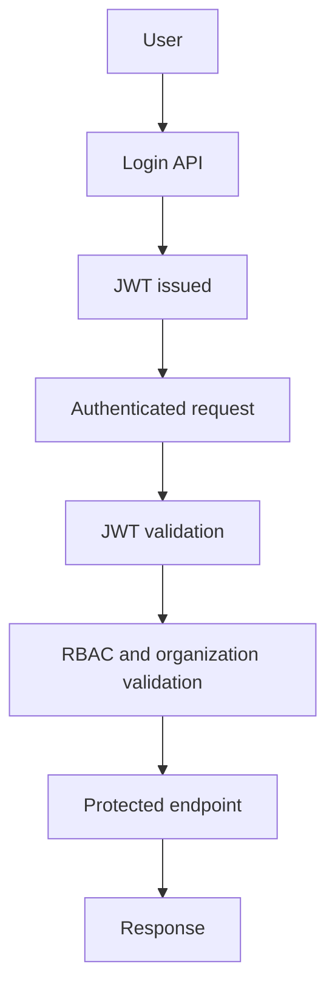

# API Design

## 1. API Overview

REST APIs handle request-response operations and WebSockets deliver real-time analysis and alert updates. FastAPI provides OpenAPI-compatible infrastructure, Pydantic validates requests and responses, JWT authenticates protected requests, and RBAC controls access. APIs enforce organization-level isolation where applicable.

## 2. API Base URL and Versioning

```text
/api/v1
```

The version prefix is part of every REST path. Breaking changes require a new version rather than silently changing an existing contract.

## 3. Authentication

### Login

**Method:** `POST`  
**Path:** `/api/v1/auth/login`  
**Authentication:** Not required  
**Required Role:** Not applicable

Authenticates a user and issues tokens.

```json
{"email":"analyst@example.com","password":"example-password"}
```

On `200 OK`, return access-token information and safe user details only. Return `401 Unauthorized` for invalid credentials and `422 Unprocessable Entity` for invalid input. Password hashes are never returned.

### Current Authenticated User

**Method:** `GET`  
**Path:** `/api/v1/auth/me`  
**Authentication:** Required  
**Required Role:** Any authenticated role

Returns the caller’s safe profile and role. Return `200 OK`, `401 Unauthorized`, or `403 Forbidden` as applicable.

### Token Refresh

**Method:** `POST`  
**Path:** `/api/v1/auth/refresh`  
**Authentication:** Refresh token required  
**Required Role:** Not applicable

Issues a refreshed access token. Return `200 OK` or `401 Unauthorized`.

## 4. User Management

Administrative user management is limited to the operations supported by the RBAC and user model: list users, retrieve a user, create a user, and update a user’s active status or role. Registration is not assumed to be public.

| Method | Path | Role | Purpose |
|---|---|---|---|
| GET | `/api/v1/users` | ADMIN or SUPER_ADMIN | List organization users. |
| GET | `/api/v1/users/{user_id}` | ADMIN or SUPER_ADMIN | Retrieve a user. |
| POST | `/api/v1/users` | ADMIN or SUPER_ADMIN | Create a user. |
| PATCH | `/api/v1/users/{user_id}` | ADMIN or SUPER_ADMIN | Update role or active status. |

Requests must exclude password hashes; responses never expose authentication secrets. These actions require organization isolation and audit logging.

## 5. Call and Analysis Session APIs

| Method | Path | Role | Purpose |
|---|---|---|---|
| POST | `/api/v1/calls` | OPERATOR, SECURITY_ANALYST, ADMIN | Create an analysis session for uploaded, microphone, simulated, or streamed input. |
| GET | `/api/v1/calls` | Authorized organization user | List sessions. |
| GET | `/api/v1/calls/{call_id}` | Authorized organization user | Retrieve session details. |
| POST | `/api/v1/calls/{call_id}/analysis` | OPERATOR, SECURITY_ANALYST, ADMIN | Start analysis for an eligible session. |

Example creation request:

```json
{"source_type":"uploaded_audio","external_reference":"optional-reference"}
```

Creation returns `201 Created`; retrieval returns `200 OK`. Invalid state transitions return `409 Conflict`; inaccessible resources return `404 Not Found` to preserve organization isolation.

## 6. Audio Upload and Processing APIs

### Upload Audio

**Method:** `POST`  
**Path:** `/api/v1/calls/{call_id}/audio`  
**Authentication:** Required  
**Required Role:** OPERATOR, SECURITY_ANALYST, or ADMIN

Uploads supported audio for a call using multipart form data. The service validates file type and decodability, supported format, and configured size limits; it associates the input with the session and does not expose internal filesystem paths or raw audio unnecessarily. Analysis progress is delivered through WebSockets. Large-file streaming design remains an implementation concern until finalized.

Return `202 Accepted` when processing is queued or begins, `400 Bad Request` for unsupported input, `413 Payload Too Large` for excessive upload size, and `404 Not Found` for unavailable or unauthorized sessions.



## 7. Voice Analysis APIs

| Method | Path | Role | Purpose |
|---|---|---|---|
| GET | `/api/v1/calls/{call_id}/voice-analyses` | Authorized organization user | List ML results for a call. |
| GET | `/api/v1/voice-analyses/{analysis_id}` | Authorized organization user | Retrieve an ML result. |

A response conceptually includes `id`, `detection_status`, `synthetic_probability`, `authentic_probability`, `confidence`, `model_name`, `model_version`, `processing_time_ms`, and `analyzed_at`. Probability and confidence fields can be null when unsupported or uncalibrated by the selected model. Raw model internals are not exposed.

## 8. Risk Score APIs

| Method | Path | Role | Purpose |
|---|---|---|---|
| GET | `/api/v1/calls/{call_id}/risk-scores` | Authorized organization user | Retrieve deterministic risk history. |
| GET | `/api/v1/risk-scores/{risk_score_id}` | Authorized organization user | Retrieve a risk result. |

Responses include `risk_score`, `risk_level`, `risk_factors`, `calculated_at`, and `policy_version` where available. Levels are `SAFE`, `LOW`, `MEDIUM`, `HIGH`, and `CRITICAL`. The deterministic Risk Engine produces authoritative scores; the Security Copilot and LLM do not.

## 9. Alert APIs

| Method | Path | Role | Purpose |
|---|---|---|---|
| GET | `/api/v1/alerts` | SECURITY_ANALYST, ADMIN, AUDITOR | List and filter alerts. |
| GET | `/api/v1/alerts/{alert_id}` | Authorized organization user | Retrieve alert details. |
| PATCH | `/api/v1/alerts/{alert_id}` | SECURITY_ANALYST or ADMIN | Perform validated status transition. |

The accepted statuses are `OPEN`, `ACKNOWLEDGED`, `INVESTIGATING`, `RESOLVED`, and `DISMISSED`. A `PATCH` request conceptually supplies an intended status and optional notes:

```json
{"status":"ACKNOWLEDGED","notes":"Review started."}
```

Transitions are validated; arbitrary changes are not permitted. Each accepted status operation creates an immutable alert action and audit record.

## 10. Alert Action APIs

**Method:** `GET`  
**Path:** `/api/v1/alerts/{alert_id}/actions`  
**Authentication:** Required  
**Required Role:** SECURITY_ANALYST, ADMIN, or AUDITOR

Returns the alert’s action history. Actions are created by validated alert status operations rather than by a duplicate action-creation endpoint.



## 11. Dashboard APIs

**Method:** `GET`  
**Path:** `/api/v1/dashboard/summary`  
**Authentication:** Required  
**Required Role:** SECURITY_ANALYST, ADMIN, or AUDITOR

Returns efficient dashboard summaries for recent analysis sessions, active alerts, risk distribution, recent high-risk activity, and summary counts. It avoids requiring the frontend to download large data sets for local aggregation.

## 12. Security Copilot APIs

**Method:** `POST`  
**Path:** `/api/v1/copilot/assist`  
**Authentication:** Required  
**Required Role:** SECURITY_ANALYST or ADMIN

The Copilot can explain flagged analyses, summarize incidents, explain risk factors, recommend verification steps, and answer investigation-related questions using authorized context.

```mermaid
flowchart TD
    user[User request] --> api[Authorized API request]
    api --> context[Context retrieval]
    context --> graph[LangGraph workflow]
    graph --> llm[LLM]
    llm --> structured[Structured output]
    structured --> validation[Backend validation]
    validation --> frontend[Frontend response]
```

Copilot output is advisory only. Authorization occurs before sensitive context retrieval, and structured output is validated. It cannot execute critical security actions or create authoritative Risk Engine decisions.

## 13. WebSocket API

WebSocket connections deliver organization-isolated events after authentication. The server validates the connection’s JWT, authorizes access, associates the connection with the organization, handles errors without sensitive details, and supports client reconnection conceptually.

| Event | Direction | Purpose | Example Payload |
|---|---|---|---|
| `analysis.started` | Server to client | Analysis begins. | `{"call_id":"uuid"}` |
| `analysis.progress` | Server to client | Processing progress update. | `{"call_id":"uuid","status":"processing"}` |
| `analysis.completed` | Server to client | Analysis completion. | `{"call_id":"uuid","status":"completed"}` |
| `analysis.failed` | Server to client | Analysis failure. | `{"call_id":"uuid","status":"failed"}` |
| `risk.updated` | Server to client | New risk result. | `{"call_id":"uuid","risk_level":"HIGH"}` |
| `alert.created` | Server to client | New alert. | `{"alert_id":"uuid","severity":"HIGH"}` |
| `alert.updated` | Server to client | Alert workflow update. | `{"alert_id":"uuid","status":"ACKNOWLEDGED"}` |



## 14. Request and Response Conventions

Use JSON request and response bodies except for multipart audio uploads. Use `snake_case` fields, UUID identifiers, ISO 8601 timestamps, and direct resource responses or a consistent `{"data": ...}` envelope. This design adopts the `data` envelope for successful REST responses:

```json
{"data":{}}
```

Collections support pagination where useful. Pydantic validation errors use FastAPI-compatible `422` responses.

## 15. Error Handling

| HTTP Status | Meaning | Example Scenario |
|---|---|---|
| 400 | Bad Request | Unsupported audio input. |
| 401 | Unauthorized | Missing or invalid authentication. |
| 403 | Forbidden | Role cannot perform the action. |
| 404 | Not Found | Resource unavailable in organization scope. |
| 409 | Conflict | Invalid analysis or alert state transition. |
| 422 | Validation Error | Pydantic request validation fails. |
| 429 | Too Many Requests | Rate limit is exceeded. |
| 500 | Internal Server Error | Unexpected server error. |
| 503 | Service Unavailable | Analysis dependency is unavailable. |

Errors must not expose stack traces or sensitive implementation details.

## 16. Pagination and Filtering

Collection endpoints may use `page` and `page_size`; supported alert filters include `status`, `severity`, `risk_level`, and relevant date ranges. Values are validated and page size has a configured maximum. Filters are added only where they serve dashboard or investigation queries.

## 17. Authentication and Authorization Flow



Authentication establishes identity; RBAC and organization checks authorize each protected operation.

## 18. API Security

The API uses JWT validation, RBAC, Pydantic input validation, rate limiting, file upload type and size validation, authorization checks, organization isolation, sensitive-data minimization, audit logging, and HTTPS/TLS in deployment. Detailed security policy belongs in `docs/SECURITY.md`.

## 19. API-to-Module Mapping

| API Group | Backend Module | Database Entities | Real-Time Events |
|---|---|---|---|
| Authentication | Authentication Module | users, audit_logs | None |
| Users | Authentication / API Layer | users, organizations, audit_logs | None |
| Calls / Analysis | Audio Ingestion and Processing | calls, audio_segments | `analysis.*` |
| Voice Analysis | Voice Detection Module | voice_analyses | `analysis.completed` |
| Risk | Risk Scoring Engine | risk_scores | `risk.updated` |
| Alerts | Alert and Policy Engines | alerts, alert_actions, audit_logs | `alert.*` |
| Dashboard | API and Database Layers | calls, risk_scores, alerts | Relevant updates |
| Security Copilot | Security Copilot Module | Authorized contextual data | None |
| WebSockets | WebSocket Manager | N/A | All live events |

## 20. API Lifecycle and Versioning

`/api/v1` is the MVP contract. Compatible additions may be introduced within the version; breaking changes are deprecated with migration guidance and released under a future `/api/v2` path. An API gateway version-management layer is not required for the MVP.

## 21. MVP API Scope

| API Group | Required for MVP | Notes |
|---|---|---|
| Authentication | Yes | Login and current-user access; refresh where implemented. |
| Users | Optional administrative | Limited RBAC user management. |
| Calls and audio analysis | Yes | Core demonstration workflow. |
| Voice analysis and risk | Yes | Retrieve model and deterministic risk results. |
| Alerts and action history | Yes | Monitor and manage validated alert transitions. |
| Dashboard | Yes | Security analyst summary. |
| Security Copilot | Where feasible | Advisory modular capability. |
| WebSockets | Yes | Live status, risk, and alerts. |
| gRPC, webhooks, SDKs | No | Future integration scope. |

## 22. Future API Integrations

**Future Scope — Not Required for Hackathon MVP**

- Telephony provider APIs.
- Webhooks.
- SDKs.
- gRPC.
- External fraud intelligence.
- Enterprise SIEM integration.

## 23. API Design Summary

This API design uses versioned REST APIs for standard operations and WebSockets for real-time events. JWT and RBAC protect organization-scoped resources. It supports audio analysis, model-result retrieval, deterministic risk retrieval, alert management, dashboard data, and an advisory Security Copilot. The design remains MVP-first while preserving future integration paths.
