# System Architecture

## 1. Architecture Overview

The system is a modular, AI-powered cybersecurity platform for real-time or near-real-time detection of AI-generated, synthetic, or cloned voices. For the Smart India Hackathon MVP, it is implemented as a modular backend application rather than as separate microservices. This keeps development focused while retaining clear boundaries for future service extraction.

The React and TypeScript frontend communicates with the FastAPI backend through REST APIs for request-response operations and WebSockets for server-pushed, real-time updates. The backend orchestrates audio processing, ML detection, risk scoring, policy evaluation, alerting, and audit logging. PostgreSQL persists system data. LangGraph and the LLM support advisory reasoning and analyst assistance only; critical security actions remain deterministic and are controlled by backend policy rules.

## 2. Architecture Goals

- Provide near real-time voice analysis and risk updates.
- Maintain a modular design suitable for an MVP and future service extraction.
- Integrate security controls into application architecture.
- Support low-latency audio processing and risk scoring.
- Produce explainable risk assessments through detection signals and contextual factors.
- Minimize unnecessary raw-audio retention and support privacy-aware processing.
- Prioritize fast, reliable MVP implementation.
- Enable future horizontal scaling without introducing unnecessary initial complexity.

## 3. High-Level System Architecture

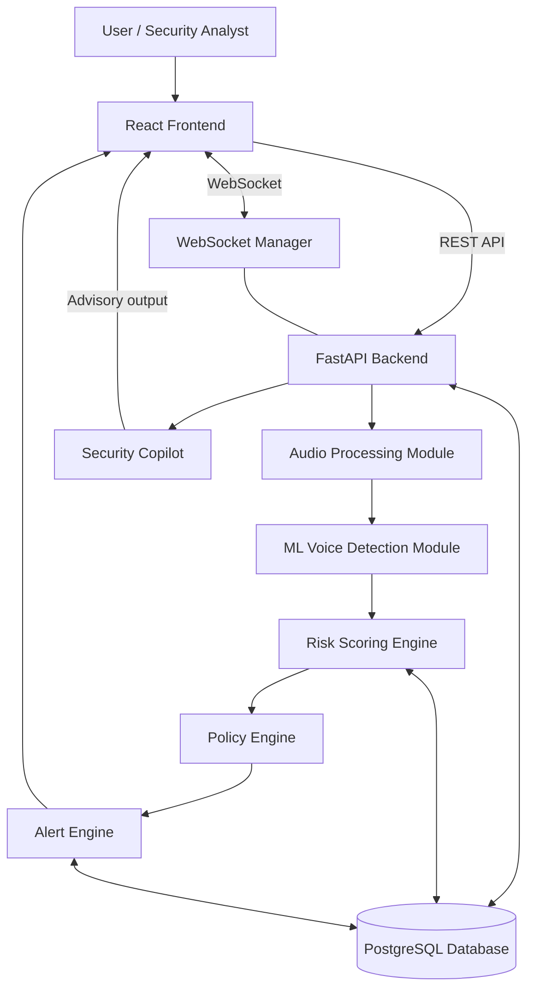

## 4. End-to-End System Flow

1. Audio is received from an MVP-supported input source.
2. The Audio Ingestion Module segments audio into processing chunks.
3. Voice activity detection identifies relevant speech.
4. The audio is normalized and prepared for analysis.
5. Features are extracted.
6. The pretrained anti-spoofing model analyzes the audio.
7. The model produces a synthetic voice probability.
8. The Risk Engine calculates a risk score.
9. Contextual information is incorporated into the score.
10. The Policy Engine evaluates deterministic rules.
11. Alerts or recommended actions are generated.
12. Real-time updates are sent through WebSockets.
13. Events and results are stored in PostgreSQL.
14. The Security Copilot may generate an explanation or incident summary for an analyst.

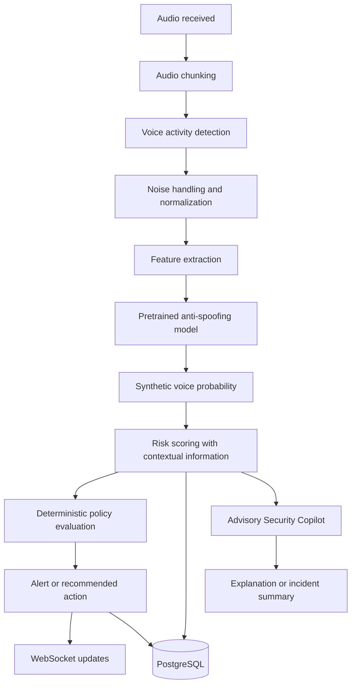

## 5. Frontend Architecture

The frontend is built with React, TypeScript, and Vite. Tailwind CSS and shadcn/ui support interface styling and reusable components; Lucide React provides icons. React Router manages navigation, Axios supports REST communication, Recharts supports visualization, and the WebSocket client receives live system events.

Major frontend modules are:

- Authentication
- Dashboard
- Live Call Monitoring
- Call Analysis View
- Alert Management
- Incident Investigation
- Security Copilot
- Administration
- Reports

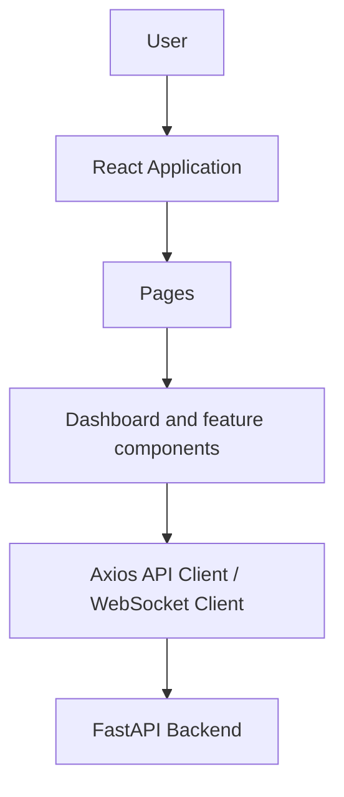

## 6. Backend Architecture

The MVP uses a modular FastAPI backend. Modules operate within one application, and their interfaces provide boundaries for later extraction into independent services if required.

- **API Layer:** Receives REST and WebSocket requests and returns application responses.
- **Authentication Module:** Authenticates users and applies authorization checks.
- **Audio Ingestion Module:** Accepts and segments supported audio input.
- **Audio Processing Module:** Performs VAD, noise handling, normalization, and feature preparation.
- **Voice Detection Module:** Invokes the model-agnostic pretrained anti-spoofing detector.
- **Risk Scoring Engine:** Produces a weighted, contextual risk score independently of the LLM.
- **Policy Engine:** Applies deterministic policy and rule validation.
- **Alert Engine:** Creates alerts and recommended workflow actions.
- **Security Copilot Module:** Produces advisory explanations and structured recommendations.
- **WebSocket Manager:** Publishes live analysis, risk, and alert updates.
- **Database Layer:** Accesses PostgreSQL through SQLAlchemy and manages migrations through Alembic.
- **Audit Logging Module:** Captures relevant alerts, overrides, and configuration changes.

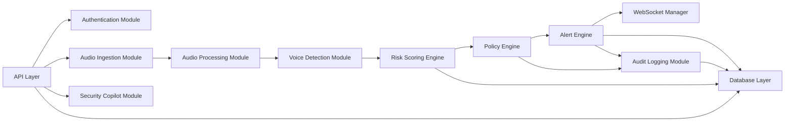

## 7. Audio Processing Architecture

The MVP may accept microphone input, uploaded audio files, and simulated or streamed audio input. The pipeline remains compatible with future live telephony and VoIP integrations through SIP/RTP or platform-specific APIs.

Raw audio retention should be minimized where possible. Where required by privacy-sensitive deployments, the system can support feature-only logging and on-device or edge inference as described in the SRS.

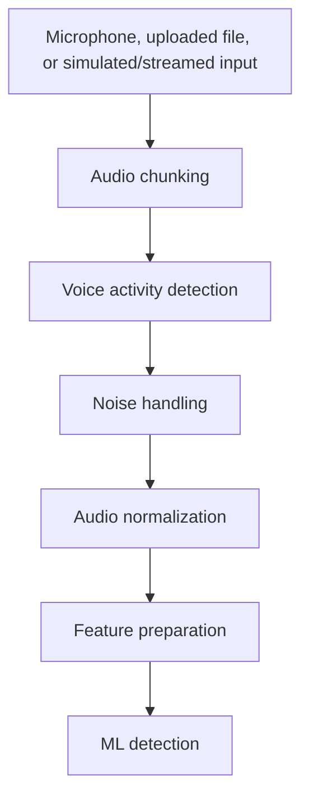

## 8. Machine Learning Detection Pipeline

The ML pipeline uses PyTorch with torchaudio, librosa, NumPy, SciPy, PyDub, and WebRTC VAD. It uses a pretrained voice anti-spoofing or synthetic voice detection model. The detection layer is model-agnostic: a specific pretrained architecture is not assumed, allowing later replacement without changing the core system flow.

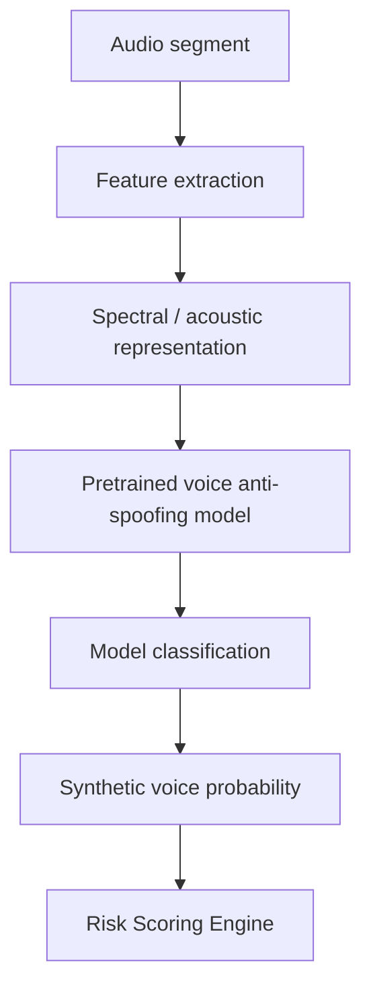

## 9. Risk Scoring Architecture

The custom risk scoring system is implemented in Python and is independent of the LLM. It combines detection output with weighted contextual factors to produce a score from 0–100 and a classification of `SAFE`, `LOW`, `MEDIUM`, `HIGH`, or `CRITICAL`.

Potential inputs are:

- Synthetic voice probability.
- Audio quality indicators.
- Voice consistency indicators.
- Caller information and reputation.
- Transaction context.
- Historical risk indicators.

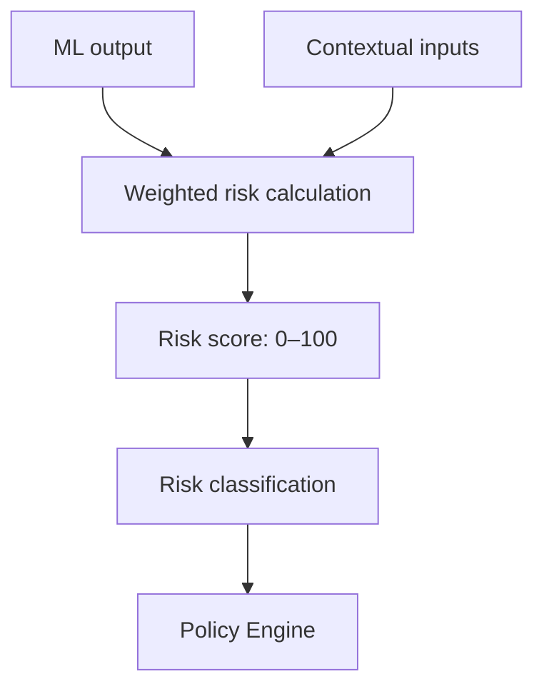

## 10. Policy and Security Decision Architecture

The Policy Engine evaluates deterministic rules after risk assessment. It controls the security response and ensures that an LLM cannot bypass or replace policy enforcement.

Possible outputs are:

- No Action
- Warning
- Require Secondary Verification
- Escalate to Security Analyst
- Hold High-Risk Action

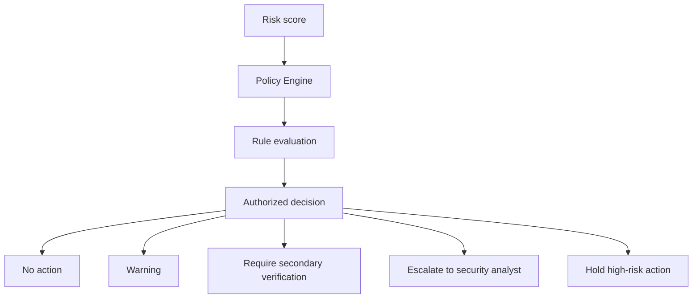

## 11. AI Security Copilot Architecture

The Security Copilot is an advisory component implemented with LangChain, LangGraph, an LLM API, and Pydantic Structured Output. It may explain why a call was flagged, summarize incidents, analyze available context, recommend verification steps, and assist analyst investigations through natural-language queries.

Its recommendation does not directly trigger critical actions. Such actions remain subject to deterministic policy and rule validation.

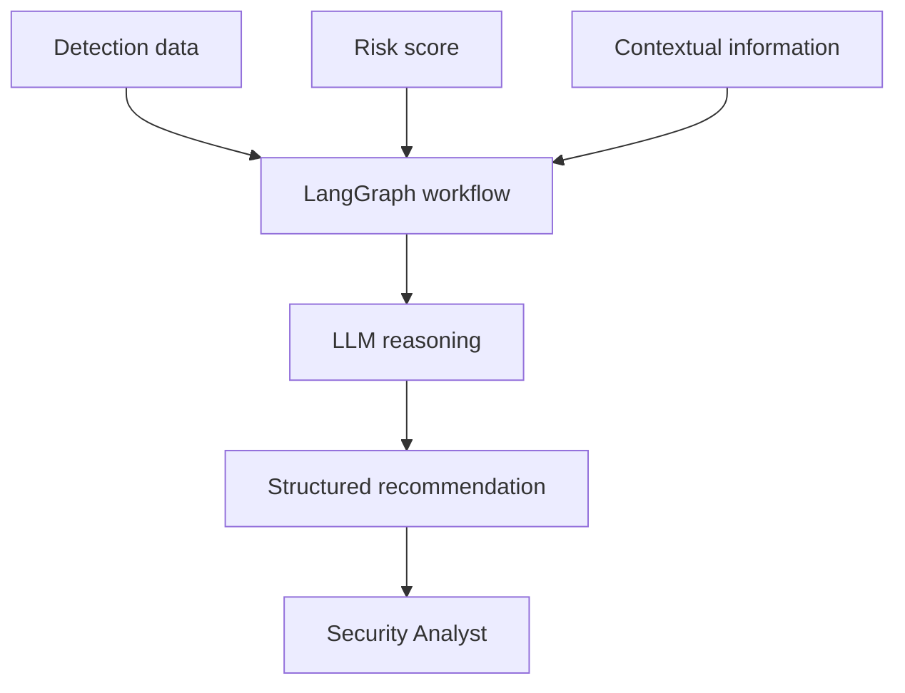

## 12. Real-Time Communication Architecture

REST APIs support request-response operations. WebSockets support server-pushed live analysis progress, synthetic probability updates, risk score updates, alert notifications, and call-monitoring updates.

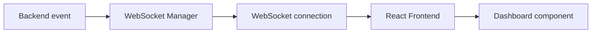

## 13. Database Architecture

PostgreSQL is the primary persistent database. Detailed schema design belongs in `docs/DATABASE.md`; this architecture identifies the logical data areas only.

- Users
- Organizations
- Calls
- Audio Segments
- Voice Analysis
- Risk Scores
- Alerts
- Alert Actions
- Audit Logs

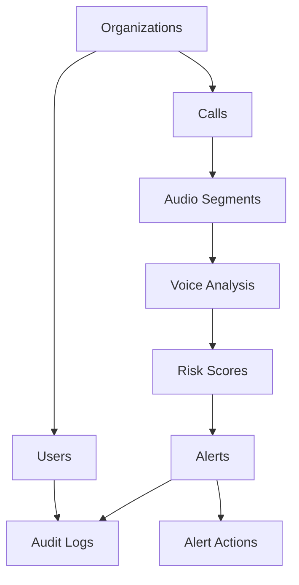

## 14. Data Flow Architecture

Audio and active processing results are transient data. Persistent data includes authorized application records, analysis results, risk scores, alerts, alert actions, and audit logs. Raw audio retention is minimized where possible.

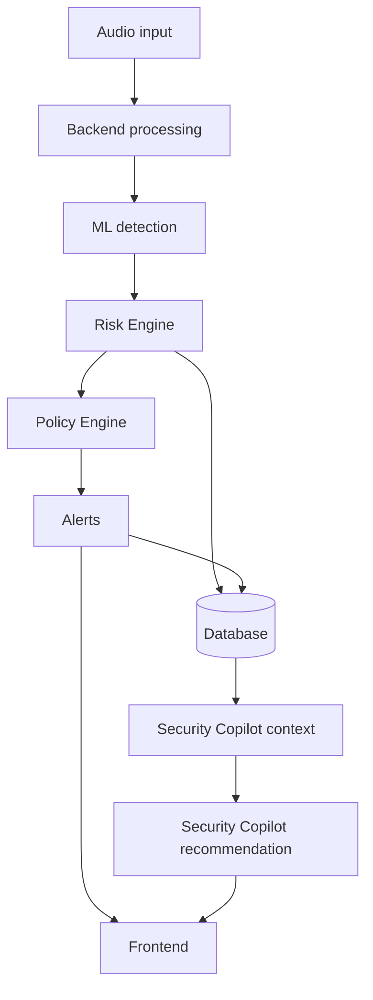

## 15. API and Communication Architecture

### REST APIs

REST APIs are used for authentication, dashboard data, historical call data, alerts, reports, administration, and Security Copilot requests.

### WebSockets

WebSockets are used for live call analysis, real-time risk updates, and real-time alerts.

Detailed endpoint definitions belong in `docs/API.md`.

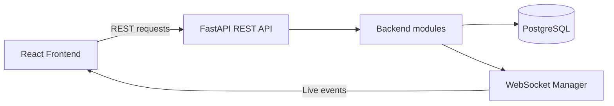

## 16. Security Architecture

The architecture applies JWT authentication, RBAC, Argon2 password hashing, input validation, API rate limiting, environment-based secrets, HTTPS/TLS, authorization checks, and audit logging. Detailed security controls belong in `docs/SECURITY.md`.

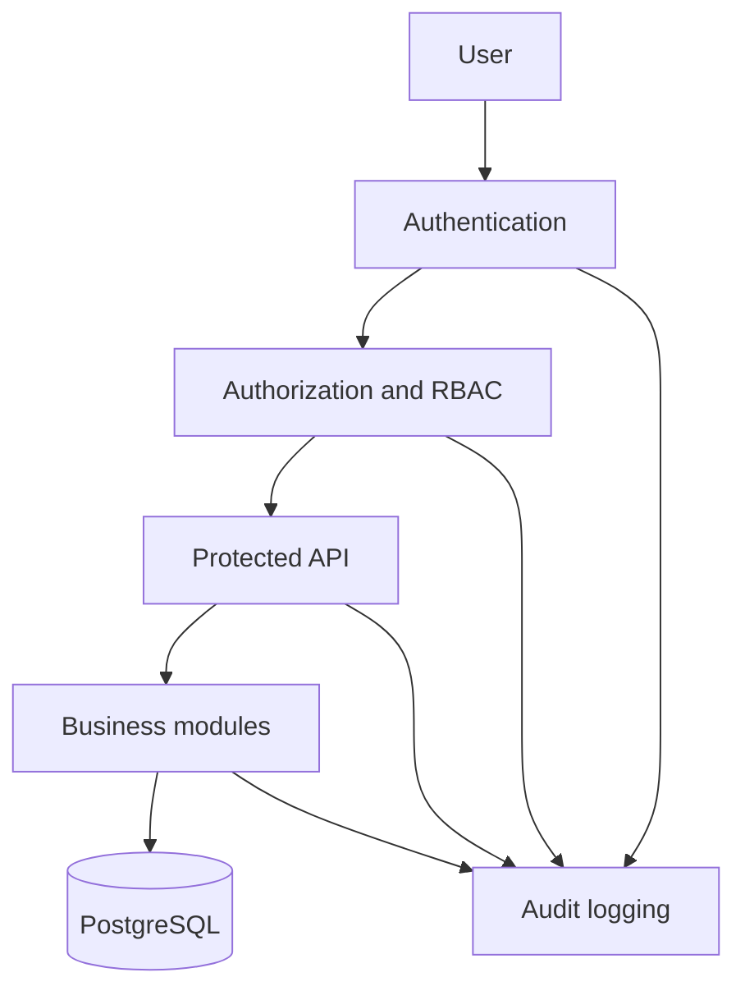

## 17. Docker Deployment Architecture

The MVP deployment uses Docker and Docker Compose. The core containers are `frontend`, `backend`, and `postgres`. Redis is optional and may be added later. The ML pipeline initially runs inside the backend container.

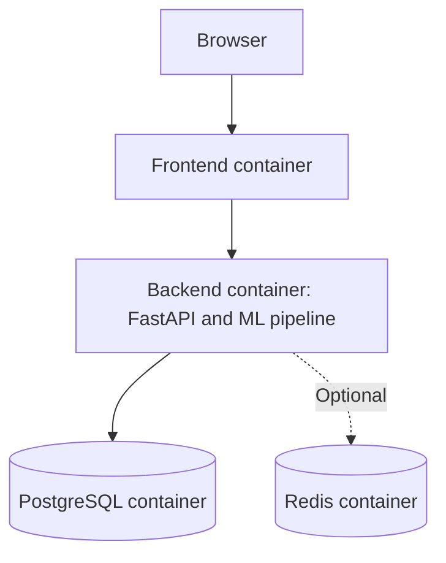

## 18. Future Scalable Architecture

**Future Production Architecture — Not Required for Hackathon MVP**

The modular MVP can evolve into independently deployable services when justified by traffic, integration, or operational needs. Potential future infrastructure includes an API gateway, Redis, a message queue, Kubernetes, gRPC, webhooks, and SDKs. These technologies are future scope and are not implied to be part of the MVP.

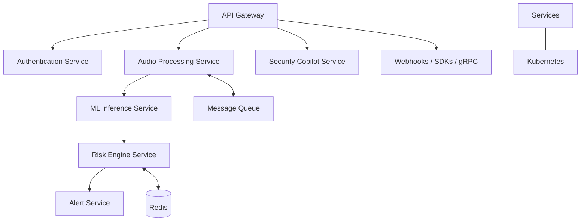

## 19. Module Interaction Summary

| Module | Responsibility | Primary Inputs | Primary Outputs |
|---|---|---|---|
| Frontend | Present dashboard and user interfaces. | User interactions, REST responses, WebSocket events. | API requests, interface updates. |
| API Layer | Expose REST and WebSocket application interfaces. | Client requests. | Validated requests and responses. |
| Audio Processing | Prepare audio for detection. | Audio input. | Prepared audio features. |
| Voice Detection | Detect synthetic or cloned voice indicators. | Prepared audio features. | Synthetic voice probability. |
| Risk Engine | Calculate contextual risk. | Detection output and contextual factors. | Risk score and level. |
| Policy Engine | Apply deterministic security rules. | Risk score and policy configuration. | Authorized decision. |
| Alert Engine | Create alerts and recommended actions. | Policy decision. | Alerts and workflow actions. |
| Security Copilot | Provide analyst assistance. | Detection data, risk score, context. | Structured advisory recommendation. |
| WebSocket Manager | Publish real-time events. | Analysis, risk, and alert events. | Dashboard updates. |
| Database Layer | Persist and retrieve system data. | Module data operations. | Persistent data access. |
| Audit Logging | Record security-relevant activity. | Alerts, overrides, and configuration changes. | Audit records. |

## 20. Architecture Decisions

### Modular Monolith for MVP

The MVP avoids unnecessary microservices to reduce delivery and operational complexity. Module boundaries preserve a practical path to later extraction.

### Python-First ML Integration

FastAPI and PyTorch permit backend orchestration and ML integration in the same primary language and application context.

### Deterministic Security Actions

The LLM is advisory only. Critical actions must be evaluated through deterministic backend policy and rule validation to maintain controlled, auditable decisions.

### WebSockets for Real-Time Updates

WebSockets provide server-pushed updates needed for live analysis, risk scores, and alerts without repeated client polling.

### Model-Agnostic Detection Layer

The detection module accepts a pretrained anti-spoofing model without fixing a specific model architecture. This preserves the ability to replace or improve the detector without changing the core application design.

### PostgreSQL for Persistent Data

PostgreSQL is the primary persistent store for the application’s users, organizations, calls, analyses, scores, alerts, actions, and audit logs.

### Future Service Extraction

Audio processing, ML inference, risk scoring, alerting, authentication, and Security Copilot modules can be extracted as independent services later while preserving the system’s core flow.

## 21. Architecture Summary

The project uses a modular MVP architecture centered on a FastAPI backend, React and TypeScript frontend, PostgreSQL persistence, PyTorch-based model-agnostic voice detection, and WebSocket real-time updates. Audio analysis produces synthetic voice probability, which feeds an independent deterministic risk and policy engine. The Security Copilot provides advisory assistance only and cannot execute critical actions. Docker and Docker Compose provide the initial deployment model, while modular boundaries support a future scalability path when required.
