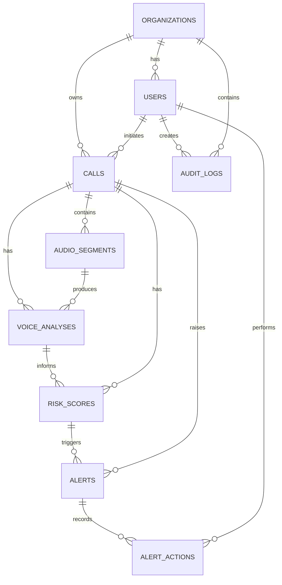
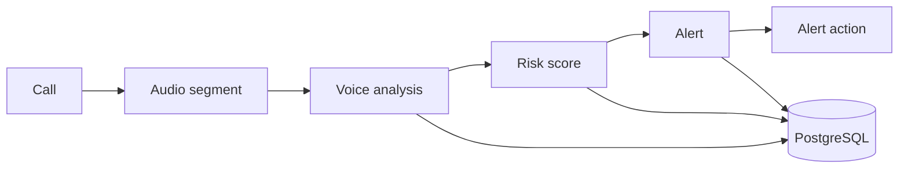
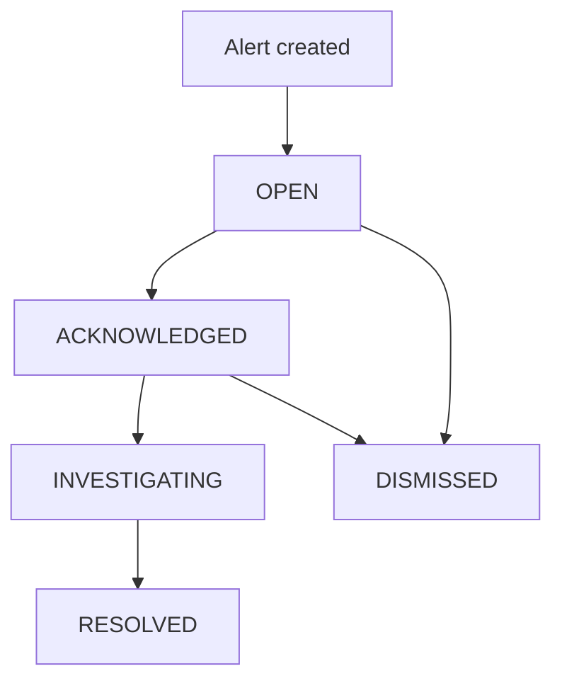
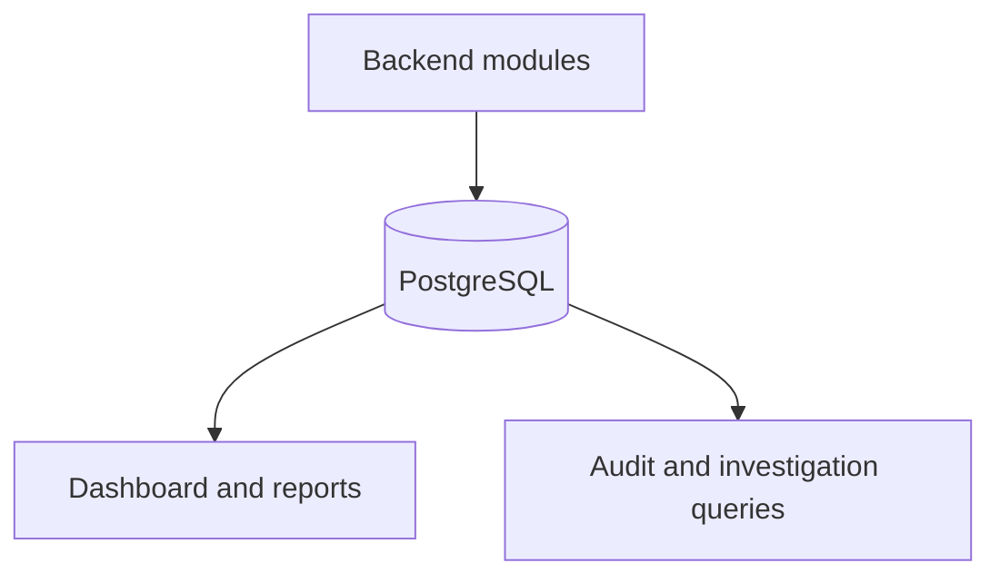

# Database Design

## 1. Database Overview

PostgreSQL is the primary persistent database. SQLAlchemy provides ORM integration and Alembic manages schema migrations. The database stores users, organizations, call metadata, analysis results, deterministic risk decisions, alerts, alert actions, and audit events. Redis is optional for future transient state and is not required for persistent storage.

Raw audio should not be stored directly in PostgreSQL unless explicitly required. The database stores metadata and, if audio persistence is needed in future, a secure object-storage reference rather than audio binary data.

## 2. Database Architecture Principles

- Normalize relational data where practical and avoid unnecessary duplication.
- Use foreign keys to preserve referential integrity.
- Use UUID primary keys and timestamps for important entities.
- Minimize retained sensitive data and separate transient from persistent data.
- Preserve auditability for security-sensitive actions.
- Support organization-level data isolation.
- Use version-controlled, safe migrations.
- Keep the MVP schema focused while retaining scalable relationship boundaries.

## 3. High-Level Entity Overview

| Entity | Purpose | MVP Status |
|---|---|---|
| organizations | Organization-level isolation and ownership. | Core MVP |
| users | Identity, authentication, and role assignment. | Core MVP |
| calls | Audio call, stream, upload, or analysis session. | Core MVP |
| audio_segments | Logical analysis chunks for a call. | Core MVP |
| voice_analyses | Model-agnostic AI/ML analysis results. | Core MVP |
| risk_scores | Deterministic risk assessment results. | Core MVP |
| alerts | Security alerts raised from policy evaluation. | Core MVP |
| alert_actions | Immutable alert decision history. | Core MVP |
| audit_logs | Append-oriented security and administrative events. | Core MVP |
| API keys, integration metadata, model registry | Expanded integration and operations support. | Future |

## 4. Entity Relationship Overview

## 5. Organization Data Model

The `organizations` table supports organization-level data isolation and associates users and security events with an organization.

| Field | Type | Description | Constraints |
|---|---|---|---|
| id | UUID | Primary identifier. | Primary key, not null |
| name | TEXT | Organization name. | Not null |
| slug | TEXT | Stable organization identifier. | Not null, unique |
| created_at | TIMESTAMPTZ | Creation time. | Not null |
| updated_at | TIMESTAMPTZ | Most recent update time. | Not null |

One organization has many users, calls, alerts, and audit logs. The `slug` should be unique.

## 6. User and Authentication Data Model

The `users` table stores user identity, organization membership, authentication data, and RBAC role assignment.

| Field | Type | Description | Constraints |
|---|---|---|---|
| id | UUID | Primary identifier. | Primary key |
| organization_id | UUID | Owning organization. | Foreign key, not null |
| email | TEXT | User email address. | Not null, unique |
| password_hash | TEXT | Argon2 password hash. | Not null |
| full_name | TEXT | User display name. | Optional |
| role | TEXT or enum | Assigned RBAC role. | Not null, constrained |
| is_active | BOOLEAN | Account availability. | Not null |
| last_login_at | TIMESTAMPTZ | Latest successful login. | Optional |
| created_at | TIMESTAMPTZ | Creation time. | Not null |
| updated_at | TIMESTAMPTZ | Most recent update time. | Not null |

Roles are `SUPER_ADMIN`, `ADMIN`, `SECURITY_ANALYST`, `OPERATOR`, and `AUDITOR`. For the MVP, use a constrained value or PostgreSQL enum; separate permissions tables are not required. Index `organization_id` and `email` to support tenant queries and login lookup.

## 7. Call Data Model

The `calls` table represents an audio call, stream, upload, or analysis session. MVP sources include uploaded audio, microphone input, and simulated or streamed input; external telephony metadata is future-compatible rather than assumed.

| Field | Type | Description | Constraints |
|---|---|---|---|
| id | UUID | Primary identifier. | Primary key |
| organization_id | UUID | Owning organization. | Foreign key, not null |
| initiated_by_user_id | UUID | User starting analysis. | Foreign key, optional |
| source_type | TEXT or enum | Input source classification. | Not null, constrained |
| external_reference | TEXT | External or future integration reference. | Optional |
| caller_identifier | TEXT | Caller identifier where available. | Optional, sensitive metadata |
| started_at | TIMESTAMPTZ | Start time. | Optional |
| ended_at | TIMESTAMPTZ | End time. | Optional |
| duration_ms | BIGINT | Duration in milliseconds. | Optional, non-negative |
| status | TEXT or enum | Call analysis state. | Not null, constrained |
| created_at | TIMESTAMPTZ | Creation time. | Not null |
| updated_at | TIMESTAMPTZ | Most recent update time. | Not null |

## 8. Audio Segment Data Model

The `audio_segments` table represents logical chunks processed during analysis. It must not store raw audio bytes. A future audio storage requirement should use a secure object-storage reference outside PostgreSQL.

| Field | Type | Description | Constraints |
|---|---|---|---|
| id | UUID | Primary identifier. | Primary key |
| call_id | UUID | Parent call. | Foreign key, not null |
| sequence_number | INTEGER | Segment order within call. | Not null, non-negative |
| start_offset_ms | BIGINT | Start position. | Not null, non-negative |
| end_offset_ms | BIGINT | End position. | Not null, non-negative |
| duration_ms | BIGINT | Segment duration. | Not null, non-negative |
| speech_detected | BOOLEAN | VAD result. | Not null |
| processing_status | TEXT or enum | Processing state. | Not null, constrained |
| created_at | TIMESTAMPTZ | Creation time. | Not null |

Index `call_id` and use a unique composite constraint on `(call_id, sequence_number)`.

## 9. Voice Analysis Data Model

The model-agnostic `voice_analyses` table stores AI/ML authenticity results. Fields may be nullable when the chosen model does not supply a given output; a score is not assumed to be a calibrated probability.

| Field | Type | Description | Constraints |
|---|---|---|---|
| id | UUID | Primary identifier. | Primary key |
| call_id | UUID | Parent call. | Foreign key, not null |
| audio_segment_id | UUID | Analyzed segment. | Foreign key, optional |
| model_name | TEXT | Model identity. | Not null |
| model_version | TEXT | Model version. | Optional |
| detection_status | TEXT or enum | Analysis outcome. | Not null |
| synthetic_score | NUMERIC | Model-native score. | Optional |
| synthetic_probability | NUMERIC | Normalized probability where supported. | Optional |
| authentic_probability | NUMERIC | Authentic probability where supported. | Optional |
| confidence | NUMERIC | Confidence or equivalent. | Optional |
| processing_time_ms | BIGINT | Inference time. | Optional, non-negative |
| analyzed_at | TIMESTAMPTZ | Analysis time. | Not null |
| created_at | TIMESTAMPTZ | Record creation time. | Not null |

It relates to calls and optional segments, and informs `risk_scores`. Index `call_id` and `audio_segment_id`.

## 10. Risk Score Data Model

The `risk_scores` table stores deterministic security risk assessment. The LLM must not directly create authoritative risk scores.

| Field | Type | Description | Constraints |
|---|---|---|---|
| id | UUID | Primary identifier. | Primary key |
| call_id | UUID | Parent call. | Foreign key, not null |
| voice_analysis_id | UUID | Contributing analysis. | Foreign key, optional |
| risk_score | NUMERIC | Deterministic score. | Not null, range validated |
| risk_level | TEXT or enum | SAFE through CRITICAL. | Not null, constrained |
| risk_factors | JSONB | Contributing normalized factors. | Not null |
| policy_version | TEXT | Applied policy version. | Optional |
| calculated_at | TIMESTAMPTZ | Calculation time. | Not null |
| created_at | TIMESTAMPTZ | Record creation time. | Not null |

`risk_factors` may use JSONB. Validate score range conceptually against 0–100 and constrain `risk_level` to `SAFE`, `LOW`, `MEDIUM`, `HIGH`, or `CRITICAL`. Index `call_id` and `risk_level`.

## 11. Alert Data Model

The `alerts` table stores security alerts raised from risk and policy evaluation; it is not a full incident-management system.

| Field | Type | Description | Constraints |
|---|---|---|---|
| id | UUID | Primary identifier. | Primary key |
| organization_id | UUID | Owning organization. | Foreign key, not null |
| call_id | UUID | Related call. | Foreign key, optional |
| risk_score_id | UUID | Related risk score. | Foreign key, optional |
| alert_type | TEXT | Alert classification. | Not null |
| severity | TEXT or enum | Severity classification. | Not null, constrained |
| status | TEXT or enum | Alert workflow status. | Not null, constrained |
| title | TEXT | Concise alert title. | Not null |
| description | TEXT | Alert detail. | Optional |
| created_at | TIMESTAMPTZ | Creation time. | Not null |
| updated_at | TIMESTAMPTZ | Most recent update. | Not null |
| resolved_at | TIMESTAMPTZ | Resolution time. | Optional |
| resolved_by_user_id | UUID | Resolving user. | Foreign key, optional |

Conceptual statuses are `OPEN`, `ACKNOWLEDGED`, `INVESTIGATING`, `RESOLVED`, and `DISMISSED`.

## 12. Alert Actions Data Model

`alert_actions` maintains an immutable history of alert decisions and state transitions.

| Field | Type | Description | Constraints |
|---|---|---|---|
| id | UUID | Primary identifier. | Primary key |
| alert_id | UUID | Parent alert. | Foreign key, not null |
| performed_by_user_id | UUID | User performing action. | Foreign key, optional |
| action_type | TEXT | Action classification. | Not null |
| previous_status | TEXT | Status before action. | Optional |
| new_status | TEXT | Status after action. | Optional |
| notes | TEXT | Decision notes. | Optional |
| created_at | TIMESTAMPTZ | Action time. | Not null |

Historical actions are append-only so investigation and auditing preserve the decision trail.

## 13. Audit Log Data Model

`audit_logs` records important security and administrative events and is append-oriented; existing records should not normally be modified.

| Field | Type | Description | Constraints |
|---|---|---|---|
| id | UUID | Primary identifier. | Primary key |
| organization_id | UUID | Organization scope. | Foreign key, optional |
| user_id | UUID | Acting user where known. | Foreign key, optional |
| event_type | TEXT | Event classification. | Not null |
| entity_type | TEXT | Affected entity type. | Optional |
| entity_id | UUID | Affected entity identifier. | Optional |
| action | TEXT | Recorded action. | Not null |
| metadata | JSONB | Event details. | Optional |
| ip_address | TEXT | Client address where available. | Optional |
| created_at | TIMESTAMPTZ | Event time. | Not null |

Examples include login success or failure, call analysis started or completed, risk score generated, alert created, acknowledged or resolved, and administrative actions.

## 14. Table Relationship Details

| Parent Entity | Relationship | Child Entity | Description |
|---|---|---|---|
| organizations | One-to-many | users | Organization membership. |
| organizations | One-to-many | calls | Data ownership and isolation. |
| users | One-to-many | calls | Optional analysis initiator. |
| calls | One-to-many | audio_segments | Processing chunks. |
| calls | One-to-many | voice_analyses | Analysis results. |
| audio_segments | One-to-many | voice_analyses | Segment-specific analysis. |
| calls | One-to-many | risk_scores | Deterministic evaluations. |
| voice_analyses | One-to-many | risk_scores | Contributing model output. |
| risk_scores | One-to-many | alerts | Policy-driven alerts. |
| alerts | One-to-many | alert_actions | Append-only alert history. |
| users | One-to-many | audit_logs | Actor attribution. |
| organizations | One-to-many | audit_logs | Organization scope. |

## 15. Data Types and PostgreSQL Recommendations

| Data Category | Recommended PostgreSQL Type | Notes |
|---|---|---|
| Primary IDs | UUID | Consistent identifiers. |
| Timestamps | TIMESTAMPTZ | Time-zone-aware records. |
| Scores | NUMERIC | Preserve model and risk precision. |
| Durations | BIGINT | Millisecond values. |
| Text | TEXT | Names, descriptions, identifiers. |
| Structured metadata | JSONB | Risk factors and event metadata. |
| Boolean values | BOOLEAN | Flags such as speech detection. |
| Enumerated values | TEXT with constraint or enum | Roles, statuses, and levels. |

## 16. Indexing Strategy

Recommended MVP indexes: `users.organization_id`, `users.email`, `calls.organization_id`, `calls.initiated_by_user_id`, `calls.status`, `calls.created_at`, `audio_segments.call_id`, `(audio_segments.call_id, sequence_number)`, `voice_analyses.call_id`, `voice_analyses.audio_segment_id`, `risk_scores.call_id`, `risk_scores.risk_level`, `alerts.organization_id`, `alerts.status`, `alerts.severity`, `audit_logs.organization_id`, `audit_logs.user_id`, and `audit_logs.created_at`.

These support expected dashboard, investigation, alert, and audit queries. Additional indexes should be added only when demonstrated query patterns require them.

## 17. Data Integrity and Constraints

Use primary keys, foreign keys, appropriate `NOT NULL` constraints, unique constraints, and check constraints. Important constraints include unique user email, unique organization slug, unique audio-segment sequence within a call, non-negative durations, valid risk-score range, and valid role, status, and risk-level values.

## 18. Privacy and Data Retention

MVP decisions prioritize data minimization, no unnecessary raw-audio storage, analysis metadata retention, audit logs, and organization isolation. Future implementation must define configurable retention and secure deletion policies in accordance with applicable requirements. This document does not claim compliance certification.

## 19. Transient vs Persistent Data

| Data | Storage Type | Purpose |
|---|---|---|
| Live audio chunks | Transient | Input to active analysis. |
| Active WebSocket state | Transient | Real-time client communication. |
| Temporary inference data | Transient | In-process ML processing. |
| Call metadata | Persistent PostgreSQL | Analysis session record. |
| Voice analysis results | Persistent PostgreSQL | ML result history. |
| Risk scores | Persistent PostgreSQL | Deterministic security assessment. |
| Alerts | Persistent PostgreSQL | Alert workflow state. |
| Audit logs | Persistent PostgreSQL | Security and administrative history. |

Redis may support future transient state but is not required for the MVP.

## 20. Database Security

Store database credentials in environment variables or secrets management, use least-privilege database access, enforce organization-level isolation, use parameterized ORM queries, run secure migrations, restrict database network access, and plan backups for future production. Detailed policy belongs in `docs/SECURITY.md`.

## 21. Migration Strategy

SQLAlchemy models define application mappings and Alembic manages version-controlled schema migrations. Development resets should be controlled and separate from production migration procedures. Production migrations must be reviewed, incremental, and safe; this document does not generate migration files.

## 22. MVP Database Scope

| Table | Required for MVP | Purpose |
|---|---|---|
| organizations | Yes | Data isolation. |
| users | Yes | Authentication and RBAC. |
| calls | Yes | Analysis-session metadata. |
| audio_segments | Yes | Chunk tracking. |
| voice_analyses | Yes | Model results. |
| risk_scores | Yes | Deterministic risk records. |
| alerts | Yes | Security-alert workflow. |
| alert_actions | Yes | Alert history. |
| audit_logs | Yes | Auditability. |

## 23. Future Database Evolution

**Future Scope — Not Required for Hackathon MVP**

- API keys.
- External integrations.
- Telephony-provider metadata.
- Model registry.
- Feature flags.
- Advanced incident management.
- Notification preferences.
- Data retention policies.
- Multi-region architecture.

## 24. Database Design Summary

PostgreSQL is the persistent database for a focused, normalized MVP schema. Core relationships connect organizations and users to calls, audio segments, model-agnostic analyses, deterministic risk scores, alerts, actions, and immutable audit records. The design avoids raw-audio storage, separates transient from persistent data, and provides a clear future evolution path without over-engineering the MVP.

