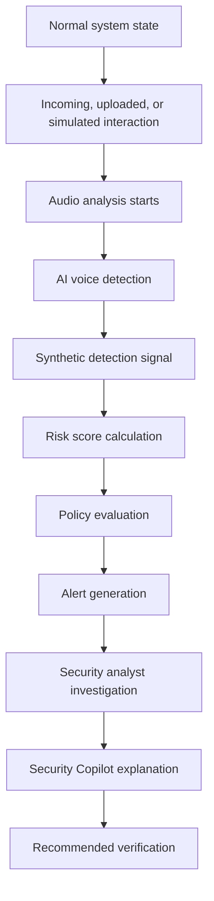
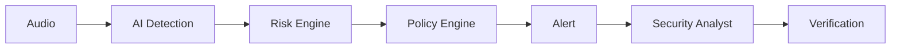
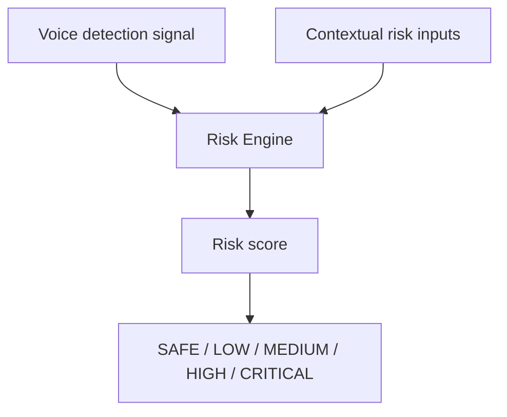
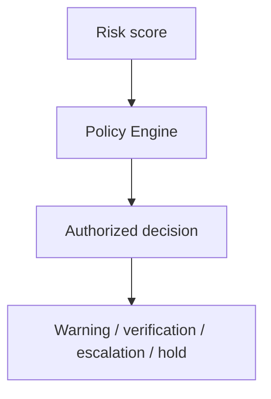
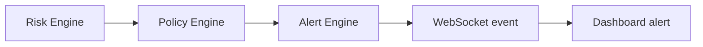
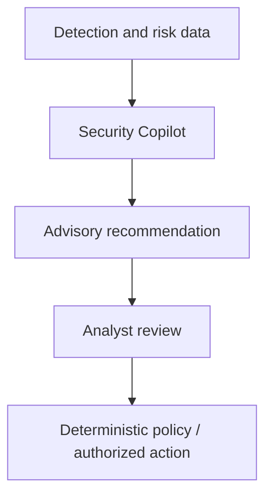
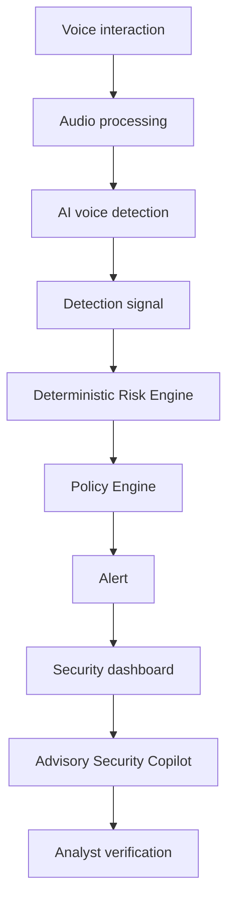

# Hackathon Demo Guide

## 1. Demo Overview

This demo proves a complete detection-to-prevention workflow: voice analysis produces a synthetic-voice signal, the deterministic Risk Engine calculates risk, the Policy Engine creates an authorized outcome, and an analyst investigates the resulting alert. The scenario is a realistic but safe simulated impersonation attempt. Detection, risk assessment, and prevention are separate stages.

## 2. Demo Narrative

A fictional employee receives an urgent voice instruction from a fictional authorized person requesting a security-sensitive action. The attacker’s voice is a legally suitable synthetic sample. The system analyzes the interaction before any action is completed, identifies suspicious characteristics, escalates risk, and recommends secondary verification. No real person, organization, account, or transaction is used.

## 3. Demo Story Flow

1. Show the normal dashboard and safe baseline.
2. Analyze a simulated interaction.
3. Show ML detection and deterministic risk escalation.
4. Show policy-driven alerting and investigation.
5. Show advisory Copilot output only if stable.

## 4. Pre-Demo Setup

- **Application:** Verify frontend, backend, database, ML model, configured environment variables, and WebSocket connection.
- **Demo data:** Prepare authentic and authorized synthetic audio, simulated session metadata, optional demo accounts, and dashboard data.
- **Infrastructure:** Check local fallback, power, laptop performance, browser tabs, and internet only if needed. Never expose credentials or secrets.

## 5. Recommended Demo Duration

| Time | Demo Step | What the Judge Sees | Key Message |
|---|---|---|---|
| 0:00–0:30 | Introduction | Problem and dashboard | Voice impersonation needs automated analysis. |
| 0:30–1:00 | System overview | Detection-to-policy flow | AI, risk, and policy are separate. |
| 1:00–1:40 | Authentic baseline | Lower-risk analysis | Detection is a signal, not proof. |
| 1:40–3:00 | Synthetic attack | Processing and suspicious result | Synthetic characteristics are identified. |
| 3:00–4:00 | Risk and alert | Risk level and alert | Deterministic policy controls response. |
| 4:00–5:30 | Investigation | Alert details and history | Analysts receive actionable context. |
| 5:30–6:15 | Copilot, if stable | Advisory explanation | LLM assists but does not decide. |
| 6:15–7:00 | Closing | Verification outcome | Safer voice-based workflows. |

## 6. Demo Step 1 — Problem Introduction

Voice cloning can enable high-quality impersonation in security-sensitive conversations. Human familiarity alone may be insufficient, so the system adds automated analysis before high-risk actions proceed.

## 7. Demo Step 2 — System Introduction

Show the dashboard, analysis interface, and core flow. AI Detection produces a signal; deterministic Risk and Policy Engines govern outcomes; the Security Copilot is advisory.

## 8. Demo Step 3 — Authentic Voice Baseline

Analyze an authentic or bonafide sample. Show analysis start, processing, result, and a lower or otherwise appropriate risk signal. State that this is a detection signal, not absolute proof of authenticity.

## 9. Demo Step 4 — Synthetic Voice Attack Simulation

Start a new analysis session for an authorized synthetic sample. Show processing progress, suspicious detection output, and increasing risk. Use only publicly permitted, self-generated, or authorized audio.

## 10. Demo Step 5 — AI Detection Visualization

Show analysis status, segment progress if implemented, detection status, synthetic probability or normalized detection signal where available, confidence where supported, and model-processing status. Do not present uncalibrated scores as guaranteed probabilities.

## 11. Demo Step 6 — Risk Score Escalation

The model provides a signal; the Risk Engine evaluates multiple factors and produces the final deterministic score. The LLM does not generate the risk score.

## 12. Demo Step 7 — Policy and Prevention Response

Possible implemented outcomes are no action, warning, require secondary verification, escalate to analyst, or hold a high-risk action. Neither the ML model nor LLM independently blocks actions.

## 13. Demo Step 8 — Real-Time Alert

Show high-risk detection, score generation, alert creation, and dashboard notification. REST supports standard access; WebSockets support live updates.

## 14. Demo Step 9 — Security Analyst Investigation

Show call/session details, detection result, risk score and factors, alert status, and action history. Demonstrate an implemented valid lifecycle such as `OPEN` → `ACKNOWLEDGED` → `INVESTIGATING` → `RESOLVED`.

## 15. Demo Step 10 — Security Copilot

Only demonstrate the Copilot when stable. Ask: “Why was this interaction flagged?”, “Summarize the risk factors,” or “What verification steps should the analyst consider?” Present the output as an advisory explanation, then show analyst review and deterministic policy or authorized action. If unstable, skip it and continue with core detection and risk evidence.

## 16. Demo Step 11 — Final Prevention Outcome

Show a safe outcome: secondary-channel verification, escalation, pending high-risk action, or documented investigation. The demonstration reinforces: detection + risk assessment + deterministic policy + human verification = improved protection.

## 17. Complete Screen-by-Screen Demo Flow

| Step | Screen / Module | User Action | System Response | Judge Takeaway |
|---|---|---|---|---|
| 1 | Dashboard | Open system | Shows normal state | Analyst-ready interface |
| 2 | Analysis | Select baseline sample | Processes audio | AI pipeline is visible |
| 3 | Results | Review baseline | Shows appropriate signal | Results are not absolute proof |
| 4 | Analysis | Select synthetic sample | Starts new session | Safe attack simulation |
| 5 | Results | Observe output | Shows suspicious signal | Detection feeds risk |
| 6 | Alert | Open alert | Shows policy outcome | Deterministic response |
| 7 | Investigation | Acknowledge/investigate | Records history | Auditability |
| 8 | Copilot | Ask question, if stable | Advisory answer | LLM does not decide |

## 18. Recommended Presenter Script

“Voice cloning can make an urgent instruction sound convincing. We analyze the interaction before a security-sensitive action proceeds. First, this authorized baseline shows how analysis is recorded. Now we analyze a simulated synthetic voice. The detection layer produces a suspicious signal; it does not make the security decision. Our deterministic Risk Engine combines that signal with context, and the Policy Engine creates this alert. The analyst can inspect the evidence and record the response. If enabled, the Copilot summarizes the evidence and recommends verification steps, but it cannot block, resolve, or override decisions. The final outcome is secondary verification and a controlled, auditable response.”

## 19. Key Judge Talking Points

| Feature | What to Explain | Why It Matters |
|---|---|---|
| Voice anti-spoofing | Detects synthetic speech indicators. | Addresses voice impersonation. |
| Near real-time analysis | Processes audio in chunks. | Supports timely response. |
| Deterministic risk | Combines signal and context. | Controlled security scoring. |
| Policy validation | Controls outcomes. | No uncontrolled AI action. |
| Real-time alerts | WebSocket dashboard updates. | Faster investigation. |
| Auditability | Alert actions are recorded. | Trust and investigation. |
| Copilot boundary | Advisory only. | AI cannot bypass controls. |
| Modular architecture | FastAPI, React, PostgreSQL. | MVP practicality and evolution. |

## 20. Demo Failure and Fallback Plan

| Failure | Backup Strategy | Presenter Action |
|---|---|---|
| ML model failure | Prepared successful result or prior record | State clearly that it is prepared. |
| Internet failure | Local frontend, backend, and assets | Use local path. |
| WebSocket failure | Refresh or REST retrieval | Continue without live push. |
| Copilot failure | Skip optional segment | Show deterministic core flow. |
| Database failure | Prepared local seeded database | Use backup dataset. |
| Browser/UI failure | Pre-open backup tab; recording last | Switch calmly. |

## 21. Demo Data Preparation Checklist

- [ ] Authentic audio sample prepared.
- [ ] Authorized synthetic audio sample prepared.
- [ ] Audio formats and ML model tested.
- [ ] Frontend, backend, database, alerts, and WebSocket tested.
- [ ] Demo accounts and seeded data prepared.
- [ ] Copilot tested if included.
- [ ] Backup result and path prepared.
- [ ] No secrets or real sensitive data visible.

## 22. Pre-Presentation Checklist

- [ ] Laptop charged and adapter available.
- [ ] Frontend, backend, database, and model running.
- [ ] Audio, browser tabs, WebSocket, and logs checked.
- [ ] Story and timing rehearsed.
- [ ] Team responsibilities, fallback, opening, and closing understood.

## 23. Demo Architecture Summary

## 24. Demo Success Criteria

### Minimum Viable Demo

Audio input, AI analysis, detection output, risk score, alert, and dashboard visibility.

### Strong Demo

Real-time updates, multiple segments, investigation workflow, and stable Copilot assistance.

### Stretch Demo

Optional future enhancements that do not block the core presentation.

## 25. Final Demo Summary

The demo proves that the system analyzes a voice interaction, identifies suspicious synthetic characteristics, supplies an ML signal to a deterministic risk engine, applies policy-controlled outcomes, provides analyst alerts, and uses an advisory Copilot without bypassing security controls.
