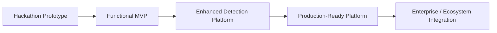
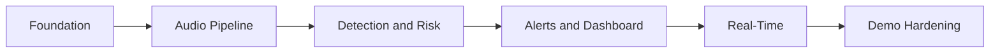
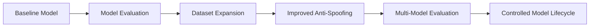
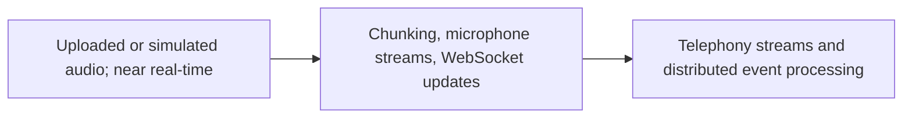
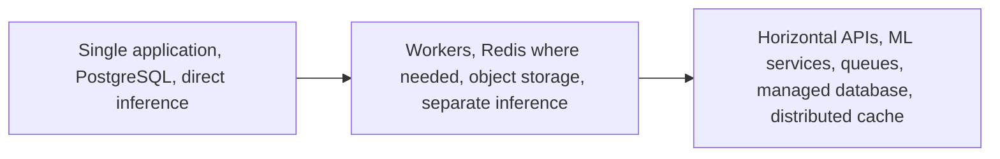
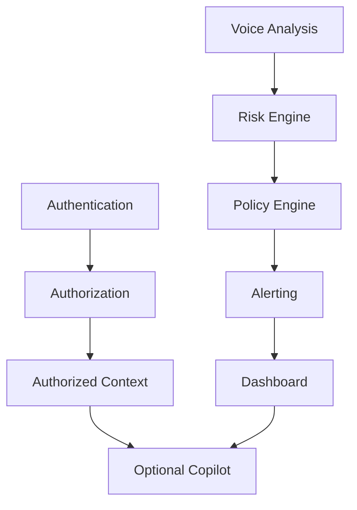
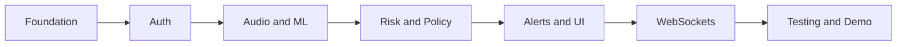
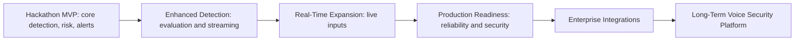

# Product and Technical Roadmap

## 1. Roadmap Overview

The project begins as a hackathon MVP that proves the detection-to-response workflow. Later phases improve detection quality, real-time capabilities, integrations, security, and scalability. Future capabilities in this document are not current functionality.

## 2. Product Evolution Strategy

The prototype demonstrates the concept; the MVP proves the core workflow; later stages improve quality, operational maturity, and integrations.

## 3. Phase 1 — Hackathon MVP

**Current Priority — Hackathon MVP**

```mermaid
flowchart LR
    input[Audio Input] --> processing[Audio Processing] --> ai[AI Voice Detection] --> signal[Detection Signal] --> risk[Deterministic Risk Engine] --> policy[Policy Evaluation] --> alert[Alert] --> dashboard[Dashboard] --> analyst[Analyst Investigation]
    analyst -. Optional .-> copilot[Security Copilot Assistance]
```

| Feature Area | MVP Requirement | Priority |
|---|---|---|
| Authentication and RBAC | Protected analyst access. | Must Have |
| Audio input and validation | Uploaded, microphone, or simulated input. | Must Have |
| Voice analysis | Pretrained model inference. | Must Have |
| Detection result | Normalized detection signal. | Must Have |
| Risk and policy | Deterministic score and controlled outcome. | Must Have |
| Alerts and dashboard | Alert visibility and investigation. | Must Have |
| Audit logging | Record critical operations. | Should Have |
| WebSocket updates | Live progress and alert updates. | Should Have |
| Security Copilot | Advisory assistance only. | Optional |

## 4. Phase 1 Development Milestones

1. **Project Foundation:** repository, documentation, environment, backend, frontend, and database foundations.
2. **Core Audio Pipeline:** ingestion, validation, processing, and ML inference integration.
3. **Detection and Risk Workflow:** detection output, Risk Engine, risk level, and policy evaluation.
4. **Alerting and Dashboard:** alert creation, visibility, investigation, and dashboard.
5. **Real-Time Experience:** WebSockets, analysis progress, and live alerts where supported.
6. **Demo Hardening:** testing, demo data, failure handling, fallback, and rehearsal.

## 5. Phase 1 MVP Completion Criteria

### Required

- [ ] Audio input and validation.
- [ ] AI analysis and detection output.
- [ ] Deterministic risk and policy workflow.
- [ ] Alert and dashboard visibility.

### Strong MVP

- [ ] WebSocket updates.
- [ ] Alert investigation workflow.
- [ ] Audit logging.

### Optional

- [ ] Stable advisory Security Copilot.

## 6. Phase 2 — Enhanced Detection and Product Features

**Future Phase — Post-Hackathon Enhancement**

| Feature | Value | Dependency | Priority |
|---|---|---|---|
| Improved anti-spoofing models | Better detection quality | Model testing | High |
| Multiple/ensemble models | Broader detection coverage | Model adapter and evaluation | Medium |
| Noise and streaming improvements | Better real-world operation | Audio pipeline | High |
| Advanced risk configuration | Context-specific control | Risk engine | Medium |
| Enhanced workflows and history | Better analyst experience | Core alert data | Medium |

## 7. AI/ML Evolution Roadmap

Future work includes diverse datasets, real-world audio conditions, languages and accents, cloning techniques, benchmarking, false-positive/negative analysis, and version comparison. Model changes must be evaluated before deployment; continuous learning is not currently implemented.

## 8. Phase 3 — Production Readiness

**Future Phase — Production Readiness**

Production work includes containerized environment separation, horizontal scaling, background workers where needed, object storage, managed database, backup/recovery, health checks, retries, graceful degradation, capacity testing, structured logs, metrics, error monitoring, CI/CD, staging, and rollback strategy.

## 9. Security Maturity Roadmap

| Security Area | MVP | Enhanced | Production |
|---|---|---|---|
| Access control | JWT, server-side RBAC, validation | Distributed rate limits | Central monitoring and SIEM |
| Secrets | Environment-based secrets | Improved secrets management | Enterprise key management |
| Assurance | Audit logging | Dependency scanning and automated testing | Vulnerability management and model integrity controls |

See `docs/SECURITY.md`. These are requirements and future plans, not claims of implementation.

## 10. Real-Time Architecture Evolution

## 11. Product and User Experience Roadmap

Future improvements include dashboard usability, alert investigation workflows, search and filtering, incident timelines, risk visualization, user preferences, notification preferences, and accessibility. The scope remains focused on voice impersonation security rather than a full enterprise SOC platform.

## 12. Integration Roadmap

**Future Scope — Integrations**

| Integration Category | Potential Purpose | Roadmap Phase |
|---|---|---|
| Telephony and communication platforms | Live audio sources | Future |
| Identity providers | Enterprise access integration | Production |
| SIEM and incident response | Security correlation | Production |
| Notifications and fraud intelligence | Response and enrichment | Future |

## 13. Scalability Roadmap

## 14. Priority Matrix

| Feature / Capability | MVP | Post-MVP | Production | Long-Term |
|---|---|---|---|---|
| Detection-to-alert workflow | Required | High | High | High |
| Model evaluation | Required | High | High | High |
| WebSockets | Should Have | High | High | High |
| Copilot | Optional | Medium | Medium | High |
| Telephony integrations | Future | Medium | High | High |
| Horizontal scaling | Future | Medium | High | High |
| SIEM integration | Future | Low | High | High |

## 15. Dependency Mapping

Optional Copilot functionality must not block the core path.

## 16. Development Risk Management

| Risk | Potential Impact | Mitigation | MVP Strategy |
|---|---|---|---|
| Model performance | Weak demonstration | Local testing and prepared samples | Use pretrained model |
| Hardware/latency | Slow analysis | Small samples and fallback records | Near-real-time scope |
| Dataset limits | Limited validation | Authorized/public test samples | No large training |
| Integration complexity | Delays | Simulated inputs | Defer integrations |
| Demo instability | Presentation failure | Local assets and fallback path | Rehearse |

## 17. Technical Debt Strategy

MVP choices prioritize speed and demo reliability, but security-critical shortcuts are not acceptable. Document debt and retain modular boundaries for model replacement, storage abstraction, background processing, authentication improvements, and observability.

## 18. Suggested Development Sequence

1. Repository and environment setup.
2. Backend foundation.
3. Database models and migrations.
4. Authentication and authorization.
5. Audio ingestion.
6. ML inference integration.
7. Risk Engine.
8. Policy Engine.
9. Alert Engine.
10. Dashboard APIs and frontend integration.
11. WebSocket updates.
12. Optional Security Copilot.
13. Testing and demo hardening.

The sequence may change with team capacity and deadlines.

## 19. Success Metrics

Measure, rather than assume, technical metrics such as analysis latency, API reliability, pipeline success, and alert delivery; AI metrics including false positives, false negatives, precision, recall, and evaluation performance; and product metrics such as investigation time, dashboard usability, and workflow completion.

## 20. Long-Term Product Vision

**Long-Term Vision**

The system may evolve from voice and audio analysis through AI authenticity detection, risk intelligence, policy, alerting, investigation, and enterprise integration into a broader fraud and impersonation intelligence platform. This is not current functionality.

## 21. Complete Roadmap Visualization

## 22. Roadmap Summary

The immediate priority is a reliable Hackathon MVP that proves core detection and deterministic security workflow. AI quality and real-time capabilities evolve iteratively; production requires added infrastructure and security maturity; enterprise integrations remain future scope. The modular architecture supports this scalable path.
