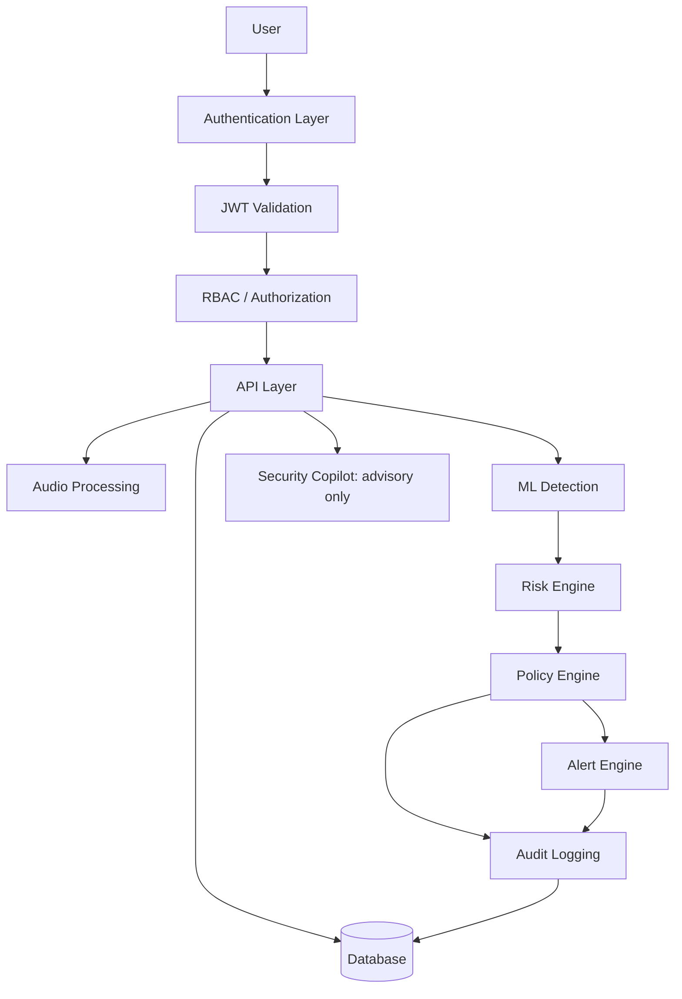
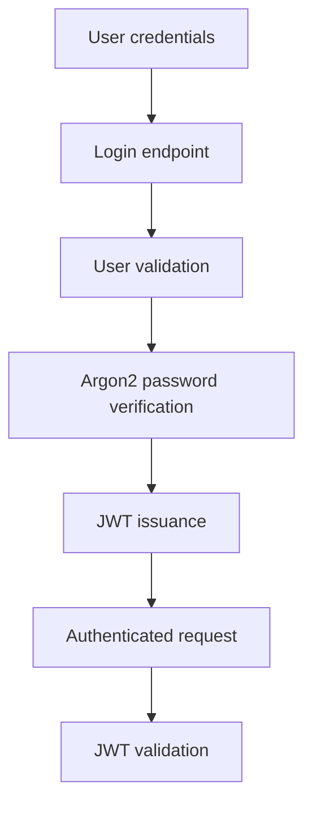
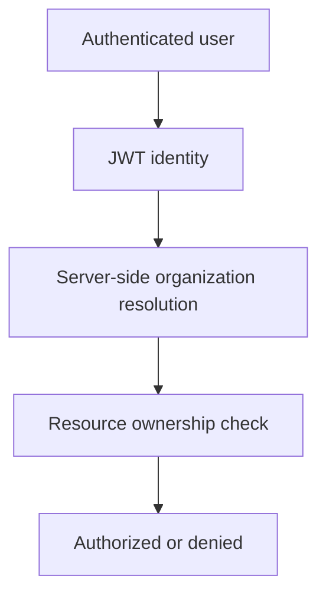
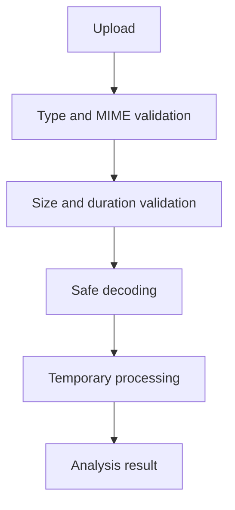
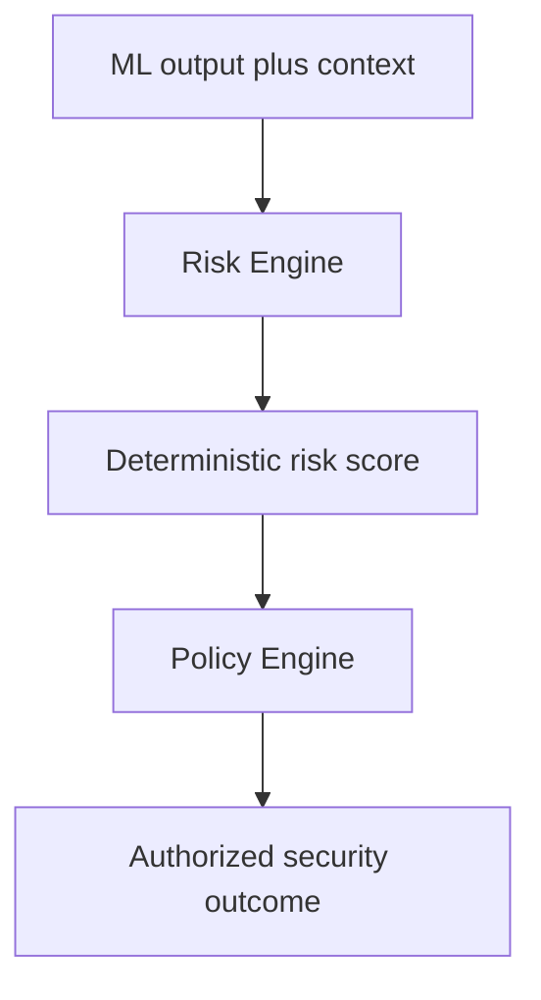
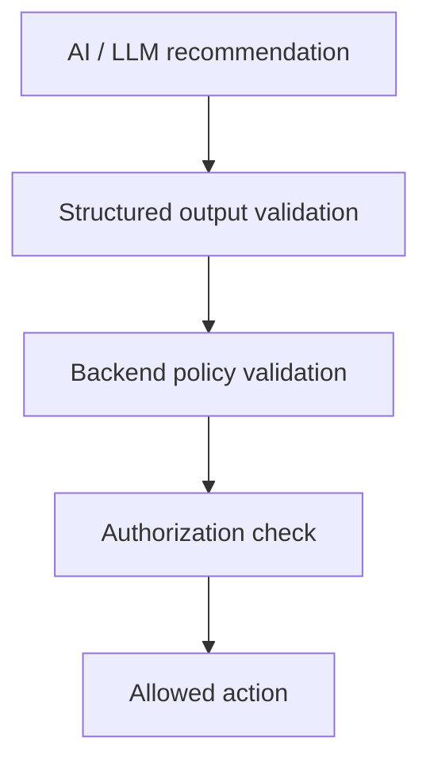
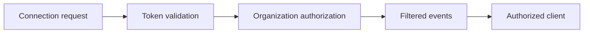

# Security Architecture

## 1. Security Overview

Security protects both the platform and the integrity of its voice-impersonation detection workflow. The system handles identity, credentials, audio metadata, ML signals, risk scores, alerts, audit records, and Security Copilot context. ML output must not be misused as a final decision: deterministic Risk and Policy Engines control critical outcomes. The Security Copilot is advisory only.

## 2. Security Objectives

- Protect accounts and prevent unauthorized API access.
- Enforce RBAC and organization-level isolation.
- Protect sensitive metadata, ML results, risk-score integrity, alerts, and audit records.
- Prevent LLM or Copilot bypass of deterministic decisions.
- Minimize unnecessary sensitive-data retention.

## 3. Security Architecture Overview



## 4. Threat Model

Threat categories include credential theft, brute force, token theft, session misuse; privilege escalation, cross-organization access, unauthorized alert changes; malformed or excessive API requests; malicious, oversized, or malformed audio uploads; adversarial audio, model failure, low-confidence results, model tampering, and future dataset poisoning; database access and raw-audio over-retention; unauthorized WebSocket subscriptions; and Copilot prompt injection, context leakage, hallucination, or action-triggering attempts.

## 5. Threat Model Matrix

| Threat | Attack Surface | Potential Impact | Mitigation | MVP Priority |
|---|---|---|---|---|
| Credential abuse | Login | Account takeover | Argon2, generic failures, rate limits | Required for MVP |
| Token theft | API / WebSocket | Unauthorized access | JWT validation and expiration | Required for MVP |
| Cross-organization access | Resource identifiers | Data exposure | Server-side ownership checks | Required for MVP |
| Upload abuse | Audio upload | Resource exhaustion or parsing risk | Allowlist, validation, size limits | Required for MVP |
| Model failure | ML pipeline | Incorrect security outcome | Explicit failure status; no silent SAFE | Required for MVP |
| LLM action bypass | Copilot | Unauthorized critical action | Policy and authorization validation | Required for MVP |
| Prompt injection | Copilot input | Unsafe advice or leakage | Authorized context and structured validation | Recommended for MVP |
| Excessive connections | WebSockets | Availability impact | Authentication and rate limiting | Recommended for MVP |

## 6. Authentication Security

JWT authentication and Argon2 password hashing are required. Passwords are never stored in plaintext or returned by APIs; failures do not reveal account existence. Login endpoints should be rate limited. Tokens expire, and token refresh is supported where the API implementation enables it.



## 7. Authorization and RBAC

Authorization is enforced server-side; the frontend is not an enforcement point. Roles are `SUPER_ADMIN`, `ADMIN`, `SECURITY_ANALYST`, `OPERATOR`, and `AUDITOR`.

| Role | Typical Permissions | Restrictions |
|---|---|---|
| SUPER_ADMIN | Highest administrative control. | Must remain organization-scoped where applicable. |
| ADMIN | Manage users, configurations, and authorized operations. | Cannot bypass backend controls. |
| SECURITY_ANALYST | Investigate alerts and use Copilot assistance. | No unauthorized administration. |
| OPERATOR | Start authorized analysis operations. | Limited administrative access. |
| AUDITOR | View audit and permitted reports. | No modification of security workflow. |

## 8. Organization-Level Data Isolation

Each organization-scoped request validates authenticated identity, resolved user organization, and requested resource ownership. User-supplied organization identifiers are not authorization evidence.



This prevents horizontal privilege escalation, identifier manipulation, and cross-organization exposure.

## 9. API Security

| API Risk | Control |
|---|---|
| Invalid input | Pydantic validation and safe error responses. |
| Unauthorized access | JWT, RBAC, and ownership validation. |
| Excessive requests | Rate limiting. |
| Injection | Parameterized SQLAlchemy access. |
| Sensitive errors | No production stack traces. |
| Unsafe methods | Explicit allowed methods and validated transitions. |

Endpoint-specific rules belong in `docs/API.md`.

## 10. Audio Upload and Processing Security

Allowlist formats, validate MIME type and actual server-side format, apply configured file-size and duration limits, generate storage names, distrust client filenames, hide internal paths, and limit processing resources. Raw audio is not stored in PostgreSQL. Future persistence must use controlled object storage references.



## 11. Machine Learning Pipeline Security

Use trusted model sources, record model versions, protect dependency integrity, control model loading, and prevent unauthorized replacement. Handle invalid output, timeout, low confidence, and failure explicitly.

**Model failure must not be interpreted as a successful authentic voice result.** ML output is a Risk Engine input, not a final security decision.

## 12. Risk Engine Integrity

The Risk Engine is deterministic; it validates inputs, records policy versions where appropriate, and cannot be directly modified by the LLM. The Copilot may receive results but cannot alter them.



## 13. Policy Engine Security Boundaries

The LLM must not directly modify risk scores, resolve or suppress alerts, execute high-risk actions, bypass authorization, or write arbitrary security records. Critical actions pass through deterministic validation.



## 14. Security Copilot and LLM Security

The Copilot uses advisory-only, authorized context. It applies prompt-injection awareness, context minimization, Pydantic structured-output validation, recommendation labeling, and relevant interaction logging. Final actions remain with authorized users and deterministic backend controls.

```mermaid
flowchart TD
    request[Analyst request] --> auth[Authentication and authorization]
    auth --> context[Authorized context retrieval]
    context --> graph[LangGraph workflow]
    graph --> llm[LLM]
    llm --> output[Structured output]
    output --> validation[Backend validation]
    validation --> response[Advisory response]
```

## 15. WebSocket Security

Connections require authentication, token validation, connection authorization, organization-scoped event filtering, lifecycle management, and rate limiting where practical. WebSockets must not create an authorization bypass.



## 16. Database Security

Use environment-based credentials, least-privilege database users, restricted network access, SQLAlchemy parameterization, secure migrations, organization isolation, and protected sensitive fields. Backup strategy is future production work. See `docs/DATABASE.md`.

## 17. Secrets Management

Secrets use environment variables or secrets management. `.env` is not committed; `.env.example` contains placeholders only. JWT secrets, database credentials, LLM keys, and model-provider credentials remain private. Use `.gitignore`, secret scanning where available, and code review before publishing.

## 18. Input Validation and Output Safety

Validate type, length, format, enums, files, and JSON through Pydantic and server-side upload validation. Do not expose secrets, password hashes, stack traces, internal paths, or unnecessary sensitive metadata.

## 19. Rate Limiting and Abuse Prevention

Prioritize login, token refresh, audio upload, analysis start, and Copilot requests. Exact values are configured after deployment testing. Redis-backed distributed rate limiting, IP reputation, and advanced abuse detection are future scope.

## 20. Audit Logging

Record authentication events, user management, call analysis start/completion, risk generation, alert creation/status changes, and security-sensitive administration. Audit logs are append-oriented, timestamped, associated with an organization and user where available, and never contain secrets. See `docs/DATABASE.md`.

## 21. Data Privacy and Retention

The MVP minimizes data, avoids unnecessary raw-audio retention, retains analysis metadata when sufficient, isolates organization data, and restricts access. Configurable retention and secure deletion are future compliance work; no unsupported certification is claimed.

## 22. Secure Error Handling and Failure Modes

Invalid JWTs and unauthorized resources are denied; invalid audio is rejected; ML failures produce explicit analysis failure; low confidence produces uncertainty or appropriate risk handling; database failures do not claim success; policy failures fail safely according to implementation policy. Failures must not silently produce false SAFE outcomes.

## 23. Logging and Monitoring Security

Use structured application logging while avoiding secrets, passwords, and unnecessary sensitive metadata. Prometheus, Grafana, centralized logging, and security event monitoring are future production enhancements.

## 24. Security Testing Strategy

- **Authentication:** invalid credentials, missing/expired/invalid tokens.
- **Authorization:** role escalation, cross-organization access, unauthorized alert modification.
- **API:** invalid input, malformed JSON, oversized payloads, rate-limit tests.
- **Audio:** unsupported format, malformed media, unexpected MIME type, oversized file.
- **AI:** unavailable model, low-confidence or invalid output, adversarial-input awareness.
- **Copilot:** prompt injection, unauthorized context, unsafe recommendation, structured-output validation.

## 25. MVP Security Checklist

- [ ] Password hashing using Argon2.
- [ ] JWT authentication.
- [ ] Server-side RBAC and organization resource validation.
- [ ] Input, upload, file-size, and processing-limit validation.
- [ ] Secure environment variables and `.env` excluded from Git.
- [ ] Sensitive-endpoint rate limiting and audit logging.
- [ ] No unnecessary raw audio in PostgreSQL.
- [ ] Explicit ML-failure handling.
- [ ] Deterministic Risk and Policy Engines.
- [ ] Advisory-only LLM and authorized WebSockets.
- [ ] Production errors without stack traces.

## 26. Future Security Enhancements

**Future Scope — Not Required for Hackathon MVP**

- Distributed rate limiting, WAF, advanced secret management, dependency and container scanning, SAST/DAST, SIEM integration, centralized monitoring, hardware-backed secrets, enterprise key management, and dedicated model-integrity verification.

## 27. Security Architecture Summary

The MVP security architecture combines JWT authentication, server-side RBAC, organization isolation, validated APIs and uploads, deterministic risk and policy decisions, advisory-only Copilot boundaries, authenticated WebSockets, database protection, secret hygiene, audit logging, and privacy-aware data handling. Controls are practical for the MVP while leaving advanced production capabilities as future scope.
