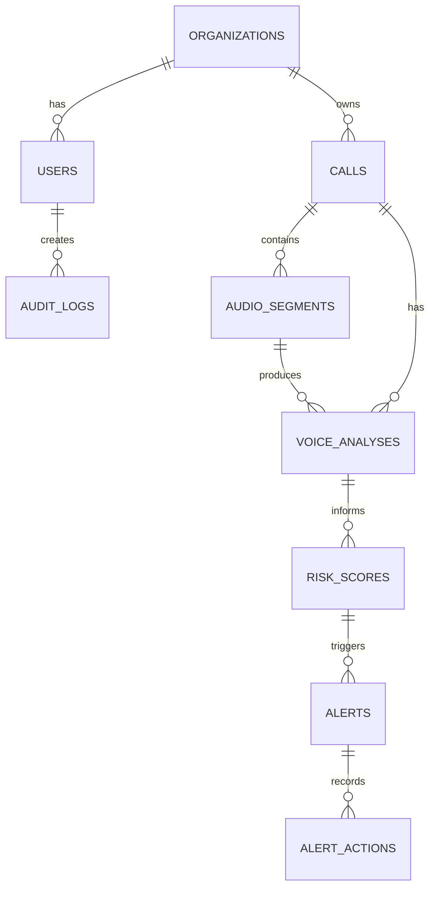
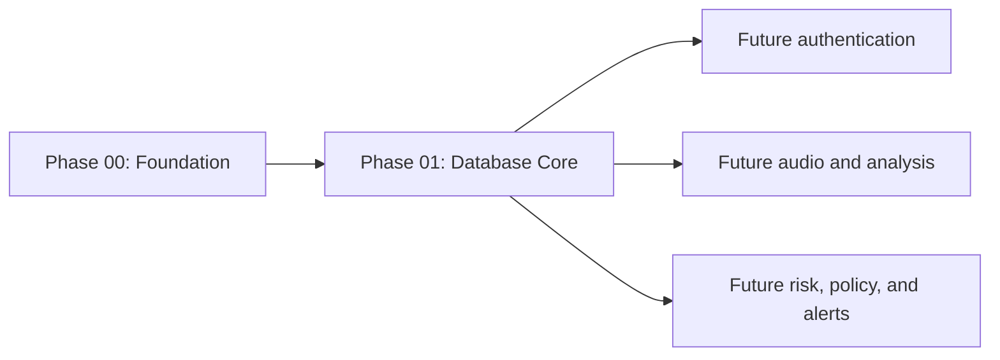

# Phase 01 – Database Core

## 📋 Phase Information

| Category | Details |
|---|---|
| **Project** | AI-Powered Real-Time Detection and Prevention of Voice Cloning Impersonation Attacks |
| **Phase** | 01 |
| **Phase Name** | Database Core |
| **Status** | 🟡 Planning / Specification |
| **Dependencies** | Phase 00 — Project Foundation |
| **Implementation Status** | ⚪ Not Started |
| **Document Type** | Phase Implementation Specification |
| **Primary Output** | Migrated and Tested PostgreSQL Database Foundation |
| **Next Phase** | Phase 02 — Authentication & User Management |

## 1. Phase Overview

Phase 01 establishes the PostgreSQL database layer that later application modules use. It converts the logical design in [DATABASE.md](../Docs/DATABASE.md) into a reliable ORM, migration, model, constraint, index, and test foundation without implementing any application business workflow. The result is a migrated, tested schema ready for future authentication, analysis, risk, alert, and audit features.

## 2. Phase Objective

Establish an extensible database foundation consistent with [DATABASE.md](../Docs/DATABASE.md), [ARCHITECTURE.md](../Docs/ARCHITECTURE.md), [TECH_STACK.md](../Docs/TECH_STACK.md), and [SECURITY.md](../Docs/SECURITY.md): PostgreSQL connectivity, SQLAlchemy ORM, Alembic migrations, documented models, sessions, constraints, tenant structure, audit schema, and tests.

## 3. Scope

- PostgreSQL connection configuration through environment variables.
- SQLAlchemy declarative base, engine, session factory, lifecycle, and cleanup pattern.
- Alembic configuration and initial schema migration.
- Core models: `organizations`, `users`, `calls`, `audio_segments`, `voice_analyses`, `risk_scores`, `alerts`, `alert_actions`, and `audit_logs`.
- Documented foreign keys, constraints, indexes, timestamps, UUID keys, organization tenant references, and audit schema.
- Database connectivity, model, relationship, constraint, migration, and Phase 00 regression tests.

## 4. Database Architecture Summary

| Area | Technology / Strategy |
|---|---|
| Persistent database | PostgreSQL |
| ORM | SQLAlchemy |
| Migrations | Alembic |
| Configuration | Environment-based database URL; no hardcoded credentials |
| Identifiers | UUID primary keys |
| Model organization | Focused modular model package with relationships registered before migrations |
| Persistent data | Metadata, analyses, deterministic risk scores, alerts, action history, and audit records |

## 5. Database Configuration Requirements

| Configuration Area | Requirement | Source Document |
|---|---|---|
| Database URL | Environment-based PostgreSQL connection configuration. | DATABASE.md, SECURITY.md |
| Credentials | No hardcoded values or committed secrets. | SECURITY.md |
| Validation | Validate required configuration at startup. | PHASE_00_FOUNDATION.md |
| Errors | Safe connection-error handling without credential exposure. | SECURITY.md |
| Local setup | Document local PostgreSQL expectations. | PHASE_00_FOUNDATION.md |

## 6. ORM and Session Management Requirements

Use a SQLAlchemy declarative base, engine, session factory, and a scoped per-request or equivalent application session lifecycle. Future modules acquire a database session through the established dependency/session pattern, commit or roll back explicitly, and always close resources. This phase specifies the foundation only and does not implement endpoint dependencies or business transactions.

## 7. Core Database Models

### Organization

**Table:** `organizations` — tenant ownership and isolation.

| Field | Type | Required | Purpose |
|---|---|---|---|
| id | UUID | Yes | Primary key |
| name | TEXT | Yes | Organization name |
| slug | TEXT | Yes | Unique stable identifier |
| created_at, updated_at | TIMESTAMPTZ | Yes | Record timestamps |

Relationships: one-to-many users, calls, alerts, and audit logs. Constraints: unique `slug`; required name. Index unique `slug`.

### User

**Table:** `users` — user identity, organization membership, authentication data, and role.

| Field | Type | Required | Purpose |
|---|---|---|---|
| id | UUID | Yes | Primary key |
| organization_id | UUID | Yes | Organization foreign key |
| email, password_hash | TEXT | Yes | Identity and password hash storage |
| full_name | TEXT | No | Display name |
| role | TEXT or enum | Yes | Documented RBAC role |
| is_active | BOOLEAN | Yes | Account state |
| last_login_at | TIMESTAMPTZ | No | Latest successful login |
| created_at, updated_at | TIMESTAMPTZ | Yes | Timestamps |

Relationships: belongs to organization; may initiate calls, perform alert actions, and create audit events. Constraints: unique email; constrained role. Index `organization_id` and `email`.

### Call

**Table:** `calls` — audio call, stream, upload, or analysis session metadata.

| Field | Type | Required | Purpose |
|---|---|---|---|
| id, organization_id | UUID | Yes | Primary and tenant foreign key |
| initiated_by_user_id | UUID | No | Initiating user |
| source_type, status | TEXT or enum | Yes | Input source and session state |
| external_reference, caller_identifier | TEXT | No | Optional future-compatible metadata |
| started_at, ended_at | TIMESTAMPTZ | No | Session times |
| duration_ms | BIGINT | No | Non-negative duration |
| created_at, updated_at | TIMESTAMPTZ | Yes | Timestamps |

Relationships: belongs to organization; has segments, analyses, risk scores, and alerts. Index `organization_id`, `initiated_by_user_id`, `status`, and `created_at`.

### Audio Segment

**Table:** `audio_segments` — logical processed chunks; never raw audio bytes.

| Field | Type | Required | Purpose |
|---|---|---|---|
| id, call_id | UUID | Yes | Primary and parent foreign key |
| sequence_number | INTEGER | Yes | Segment order |
| start_offset_ms, end_offset_ms, duration_ms | BIGINT | Yes | Non-negative offsets/duration |
| speech_detected | BOOLEAN | Yes | VAD result |
| processing_status | TEXT or enum | Yes | Processing state |
| created_at | TIMESTAMPTZ | Yes | Timestamp |

Relationships: belongs to call; has analyses. Constraint: unique `(call_id, sequence_number)`. Index `call_id` and composite sequence lookup.

### Voice Analysis

**Table:** `voice_analyses` — model-agnostic ML output.

| Field | Type | Required | Purpose |
|---|---|---|---|
| id, call_id | UUID | Yes | Primary and call foreign key |
| audio_segment_id | UUID | No | Optional segment foreign key |
| model_name | TEXT | Yes | Model identity |
| model_version, detection_status | TEXT | Version and outcome | Model version optional; status required |
| synthetic_score, synthetic_probability, authentic_probability, confidence | NUMERIC | No | Model outputs where supported |
| processing_time_ms | BIGINT | No | Non-negative inference duration |
| analyzed_at, created_at | TIMESTAMPTZ | Yes | Timestamps |

Relationships: belongs to call and optional segment; informs risk scores. Index `call_id` and `audio_segment_id`. Probability fields remain nullable because models may not return calibrated values.

### Risk Score

**Table:** `risk_scores` — deterministic security assessment, never authoritative LLM output.

| Field | Type | Required | Purpose |
|---|---|---|---|
| id, call_id | UUID | Yes | Primary and call foreign key |
| voice_analysis_id | UUID | No | Contributing analysis foreign key |
| risk_score | NUMERIC | Yes | Validated 0–100 score |
| risk_level | TEXT or enum | Yes | SAFE to CRITICAL |
| risk_factors | JSONB | Yes | Normalized factors |
| policy_version | TEXT | No | Applied policy version |
| calculated_at, created_at | TIMESTAMPTZ | Yes | Timestamps |

Relationships: belongs to call and optional analysis; may trigger alerts. Index `call_id` and `risk_level`.

### Alert

**Table:** `alerts` — policy-driven security alert, not a full incident-management system.

| Field | Type | Required | Purpose |
|---|---|---|---|
| id, organization_id | UUID | Yes | Primary and tenant foreign key |
| call_id, risk_score_id | UUID | No | Related session and assessment |
| alert_type, severity, status, title | TEXT | Yes | Alert classification and state |
| description | TEXT | No | Detail |
| resolved_at, resolved_by_user_id | TIMESTAMPTZ / UUID | No | Resolution data |
| created_at, updated_at | TIMESTAMPTZ | Yes | Timestamps |

Statuses: `OPEN`, `ACKNOWLEDGED`, `INVESTIGATING`, `RESOLVED`, `DISMISSED`. Relationships: belongs to organization; has actions. Index `organization_id`, `status`, and `severity`.

### Alert Action

**Table:** `alert_actions` — append-only alert decision history.

| Field | Type | Required | Purpose |
|---|---|---|---|
| id, alert_id | UUID | Yes | Primary and alert foreign key |
| performed_by_user_id | UUID | No | Acting user |
| action_type | TEXT | Yes | Action classification |
| previous_status, new_status, notes | TEXT | No | State/history context |
| created_at | TIMESTAMPTZ | Yes | Action time |

Relationships: belongs to alert and optional user. Historical records should not be modified.

### Audit Log

**Table:** `audit_logs` — append-oriented security and administrative event record.

| Field | Type | Required | Purpose |
|---|---|---|---|
| id | UUID | Yes | Primary key |
| organization_id, user_id | UUID | No | Organization and actor foreign keys |
| event_type, action | TEXT | Yes | Event and action |
| entity_type | TEXT | No | Target type |
| entity_id | UUID | No | Target identifier |
| metadata | JSONB | No | Safe event context |
| ip_address | TEXT | No | Client address where available |
| created_at | TIMESTAMPTZ | Yes | Event time |

Index `organization_id`, `user_id`, and `created_at`. Do not store secrets in metadata.

## 8. Entity Relationship Overview

## 9. Multi-Tenancy Requirements

Organizations are the documented tenant boundary. `users`, `calls`, `alerts`, and `audit_logs` carry organization relationships; indexes support organization-scoped queries. The schema provides foreign-key structure but does not itself guarantee tenant isolation—authorization and access enforcement belong to future phases.

## 10. Audit Data Foundation

Phase 01 creates the `audit_logs` schema and persistence foundation only. Future phases generate automatic events from authentication, analysis, risk, alert, and administrative workflows. Audit records are append-oriented and capture actor, organization, target reference, safe metadata, and timestamp.

## 11. Database Constraints and Data Integrity

| Entity | Constraint | Purpose |
|---|---|---|
| organizations | Unique slug | Stable tenant identifier |
| users | Unique email; organization foreign key | Identity and membership integrity |
| audio_segments | Unique call and sequence pair | Ordered segment integrity |
| durations/offsets | Non-negative validation | Valid time values |
| risk_scores | Score range and valid level | Deterministic score integrity |
| alerts | Valid documented status | Valid workflow state |
| all relations | Foreign keys and required fields | Referential integrity |

Cascade behavior is not explicitly defined in the source documentation and must be confirmed before implementation.

## 12. Database Indexing Strategy

| Table | Indexed Field(s) | Reason |
|---|---|---|
| users | organization_id; email | Tenant and login lookup |
| calls | organization_id; initiated_by_user_id; status; created_at | Dashboard and investigation queries |
| audio_segments | call_id; call_id + sequence_number | Ordered call processing lookup |
| voice_analyses | call_id; audio_segment_id | Analysis retrieval |
| risk_scores | call_id; risk_level | Risk retrieval and filtering |
| alerts | organization_id; status; severity | Analyst queues |
| audit_logs | organization_id; user_id; created_at | Audit investigations |

## 13. Migration Strategy

Alembic manages every schema change. Configure migrations with the environment-based database URL, keep migration files in the implementation’s configured migration-version location, and create one initial schema migration after all core models are registered. Migration names should describe schema intent. Apply and validate migrations against a clean database; manual schema edits are not the supported change process.

## 14. Database Initialization Strategy

1. Configure environment values.
2. Start PostgreSQL.
3. Install documented backend dependencies.
4. Validate connection.
5. Apply migrations.
6. Verify tables and indexes.
7. Run database and Phase 00 regression tests.

## 15. Error Handling Requirements

Handle configuration, connection, migration, and unexpected database errors without exposing credentials or sensitive connection details. Log useful diagnostic information safely. Future application endpoints translate errors into safe application-level responses; advanced retry infrastructure is out of scope.

## 16. Security Requirements

| Security Requirement | Phase 01 Responsibility | Future Responsibility |
|---|---|---|
| Credentials | Environment-based, never committed | Secrets-management maturity |
| Access | Support least-privilege configuration | Authorization enforcement |
| Errors | No sensitive error disclosure | Endpoint-specific response handling |
| Data | Avoid raw audio storage; protect sensitive fields | Retention/deletion workflows |
| Audit | Create append-oriented schema | Automatic event generation |

## 17. Testing Requirements

Test valid and invalid configuration, connection success and safe failure, model record creation, required fields, relationships, foreign keys, unique/check constraints, organization relationship integrity, clean migrations, schema consistency, and Phase 00 startup regression. Tenant authorization enforcement is not tested in this phase because it is not implemented here.

## 18. Implementation Tasks

1. Review database documentation and confirm unresolved ambiguities.
2. Configure environment-based connection settings.
3. Configure SQLAlchemy base, engine, and session lifecycle.
4. Create the documented model package and all core models.
5. Configure relationships, constraints, and indexes.
6. Configure Alembic and generate the initial migration.
7. Apply it to a clean database and validate schema.
8. Add database tests and Phase 00 regression tests.
9. Update setup documentation.

## 19. Expected Repository Changes

Phase 01 may create or modify database configuration, ORM base/session modules, model modules, migration configuration and versions, database tests, and environment example/setup documentation. Exact paths follow the Phase 00 foundation structure. No unrelated frontend or feature modules change.

## 20. Acceptance Criteria

### Database Foundation

- [ ] Environment-based PostgreSQL configuration and safe session lifecycle exist.
- [ ] No credentials are hardcoded.

### ORM and Schema

- [ ] All documented models, fields, relationships, constraints, and indexes are implemented.
- [ ] Raw audio is not stored in PostgreSQL.

### Migration and Testing

- [ ] Alembic configuration and initial migration exist.
- [ ] Migration applies to a clean database.
- [ ] Connection, model, relationship, constraint, and migration tests pass.
- [ ] Phase 00 tests still pass.

## 21. Validation Procedure

Validate environment configuration, PostgreSQL startup, application connection, migration execution, table/index creation, automated database tests, application startup, and Phase 00 regression. Use the actual Phase 00 package and command choices; no undocumented commands are prescribed here.

## 22. Expected Deliverables

- Database configuration, SQLAlchemy base, and session management.
- Documented model set with relationships, constraints, and indexes.
- Alembic configuration and initial migration.
- Database test suite and updated configuration documentation.

## 23. Out of Scope

Phase 01 does not implement registration, login, JWT, authorization middleware, RBAC enforcement, audio upload/processing, AI model integration or inference, cloning detection, Risk/Policy/Alert Engines, WebSockets, real-time processing, Copilot, LangChain, LangGraph, integrations, advanced frontend work, or production infrastructure. It may prepare schema for these future features without implementing their workflows.

## 24. Dependencies

**Depends On:** Phase 00 – Project Foundation.

**Enables:** future authentication, audio analysis, risk/policy, alert/audit, dashboard, and integration phases.

## 25. Phase Completion Checklist

### Required for Phase Completion

- [ ] Environment-based PostgreSQL, SQLAlchemy sessions, models, constraints, indexes, Alembic migration, and tests are complete.

### Recommended Before Moving to Phase 02

- [ ] Clean-database migration and Phase 00 regression have been verified.

### Explicitly Not Required Yet

- [ ] Authentication, business APIs, audio/ML workflows, risk/policy, alerts, WebSockets, and Copilot implementation.

## AI Implementation Guardrails

1. Implement only Phase 01 scope.
2. Follow `docs/DATABASE.md` as schema source of truth.
3. Preserve Phase 00 functionality.
4. Do not implement Phase 02 authentication or future business workflows.
5. Do not hardcode credentials or create undocumented entities/fields.
6. Use migrations for schema changes.
7. Test all database functionality.
8. Report ambiguity rather than inventing architecture.
9. Do not modify unrelated frontend functionality.
10. Keep the database layer modular for future phases.
