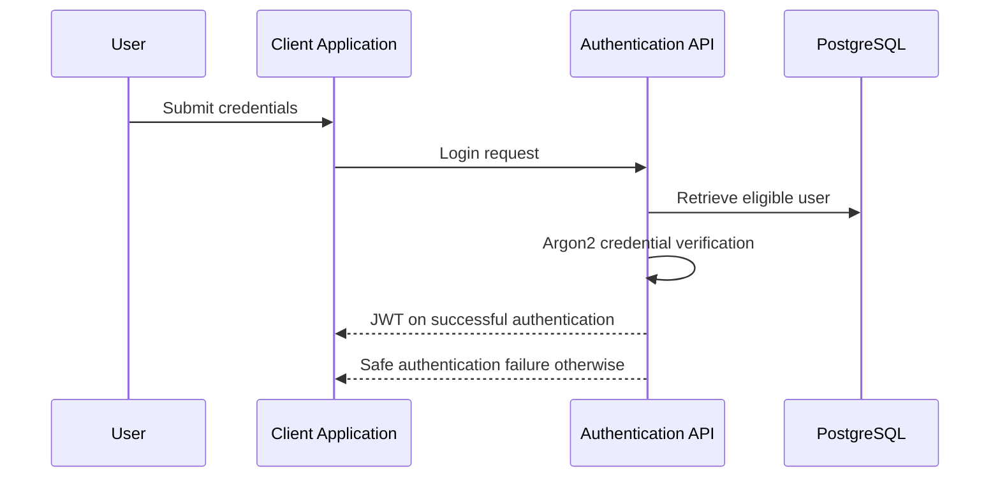
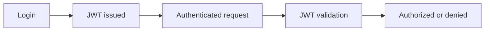
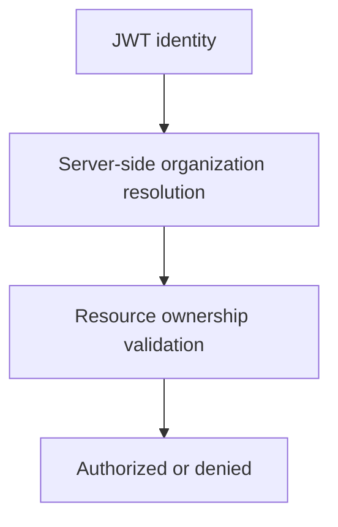
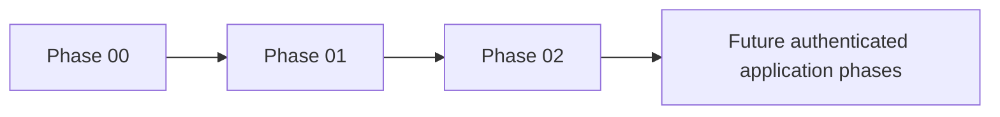

# Phase 02 – Authentication & Authorization

## 📋 Phase Information

| Category | Details |
|---|---|
| **Project** | AI-Powered Real-Time Detection and Prevention of Voice Cloning Impersonation Attacks |
| **Phase** | 02 |
| **Phase Name** | Authentication & Authorization |
| **Status** | 🟡 Planning / Specification |
| **Dependencies** | Phase 00 — Project Foundation Phase 01 — Database Core |
| **Implementation Status** | ⚪ Not Started |
| **Document Type** | Phase Implementation Specification |
| **Primary Output** | Secure JWT-Based Authentication and Authorization Foundation |
| **Next Phase** | Phase 03 — Analysis Session |

## 1. Phase Overview

Phase 02 establishes identity and access control for a security-sensitive platform. It builds on the Phase 01 `users`, `organizations`, and `audit_logs` schema to authenticate users, enforce server-side authorization, and prevent cross-organization access. Authentication proves identity; authorization determines permitted actions; tenant isolation ensures access only to authorized organization data.

## 2. Phase Objective

Implement the documented JWT-based identity, authentication, authorization, and organization-access foundation for future application workflows, consistent with [SECURITY.md](../Docs/SECURITY.md), [API.md](../Docs/API.md), [DATABASE.md](../Docs/DATABASE.md), and [ARCHITECTURE.md](../Docs/ARCHITECTURE.md).

## 3. Scope

- Login, current authenticated-user retrieval, and token refresh where supported by API design.
- Argon2 password verification, JWT creation and validation, secure authentication failures, and authenticated-state resolution.
- Server-side RBAC, protected-route checks, least privilege, and default-deny behavior.
- Organization-membership and resource-ownership checks.
- Authentication and authorization audit events documented in the security design.
- Authentication-related frontend state and protected-route behavior only.
- Automated authentication, authorization, tenant-isolation, and regression tests.

Public self-registration, password reset, OAuth, SSO, MFA, token lifetimes, token revocation, and logout behavior are not fully specified. They require confirmation before implementation; no replacement mechanism should be silently selected.

## 4. Authentication Architecture Summary

| Authentication Component | Selected Approach | Source Document |
|---|---|---|
| Credential type | Email and password-hash based user identity | DATABASE.md |
| Password protection | Argon2 hashing | TECH_STACK.md, SECURITY.md |
| Authenticated access | JWT | TECH_STACK.md, API.md, SECURITY.md |
| Refresh | Token refresh endpoint where implemented | API.md |
| Authorization | Server-side RBAC and organization ownership checks | API.md, SECURITY.md |
| Audit | Append-oriented audit records | DATABASE.md, SECURITY.md |

## 5. User Identity Model

Identity is represented by the documented `users` record: UUID `id`, `organization_id`, unique `email`, `password_hash`, optional `full_name`, constrained `role`, `is_active`, optional `last_login_at`, and timestamps. Identity resolution must use the authenticated user, organization membership, account status, and documented role; it must not trust client-supplied organization values.

## 6. Authentication Flow

Validate input, account state, and credentials; return safe responses that do not reveal unnecessary account-existence information. Tokens and responses must never expose password hashes or secrets.

## 7. Credential Security Requirements

### Backend Responsibility

- Store passwords only as Argon2 hashes and verify them server-side.
- Never return password hashes, secrets, or sensitive authentication diagnostics.
- Rate limit authentication endpoints and validate input.

### Frontend Responsibility

- Send credentials only to the authenticated API over HTTPS/TLS deployment.
- Do not log credentials or expose tokens in UI diagnostics.

### User Responsibility

- Use authorized account credentials and protect them from disclosure.

## 8. Token or Session Management

JWT is the documented authentication state. The backend creates and validates JWTs; protected APIs require valid authentication state. Token expiration and refresh strategy are required concepts, but exact lifetime, claims, storage approach, invalidation, and logout semantics are not defined and must be confirmed before implementation.

## 9. Authorization Model

Authorization is server-side and follows least privilege. Documented roles are `SUPER_ADMIN`, `ADMIN`, `SECURITY_ANALYST`, `OPERATOR`, and `AUDITOR`.

| Role / Access Level | Allowed Actions | Restrictions |
|---|---|---|
| SUPER_ADMIN | Highest documented administrative control. | Must not bypass organization constraints where applicable. |
| ADMIN | Manage authorized users and configuration. | Cannot bypass backend policy or authorization. |
| SECURITY_ANALYST | Investigate alerts and use authorized Copilot context. | No unauthorized administration. |
| OPERATOR | Start authorized analysis operations. | Restricted administrative access. |
| AUDITOR | View permitted audit and report data. | No modification of security workflow. |

Exact endpoint-to-role mapping is defined by [API.md](../Docs/API.md); undocumented granular permissions require confirmation.

## 10. Protected API Requirements

Login is public. Current-user retrieval, token refresh, user management, calls/analysis, model-result retrieval, risk retrieval, alerts, dashboard, Copilot assistance, and WebSocket connections require documented authentication as applicable. Privileged operations require documented roles; every organization-scoped resource requires ownership validation.

## 11. Multi-Tenant Authorization

Resolve the organization from authenticated server-side identity, validate resource ownership, then authorize or deny the operation. Database foreign keys provide structure only; application-level checks enforce tenant isolation.

## 12. Authentication and Authorization Error Handling

Use consistent safe API errors: invalid credentials, missing/expired/invalid authentication, insufficient permission, and unauthorized organization access are distinct categories. Do not expose secrets, token internals, account-enumeration details, or stack traces. Use documented HTTP semantics: `401` for invalid/missing authentication, `403` for insufficient authorization, and organization-scoped `404` where API design uses it to avoid resource disclosure.

## 13. Authentication Security Requirements

| Security Requirement | Phase 02 Responsibility | Source |
|---|---|---|
| Password hashing | Argon2; no plaintext storage | SECURITY.md |
| Token security | JWT validation, expiration strategy confirmation | API.md, SECURITY.md |
| Brute force | Rate-limit sensitive auth endpoints | SECURITY.md |
| Authorization | Server-side RBAC and least privilege | SECURITY.md |
| Tenant isolation | Ownership checks per request | SECURITY.md, API.md |
| Transport | HTTPS/TLS deployment expectation | TECH_STACK.md, SECURITY.md |

## 14. Authentication Audit Requirements

Phase 01 provides `audit_logs`; Phase 02 records documented authentication success, authentication failure, access denial, and relevant privileged authentication/authorization activity. Audit records remain append-oriented, organization-associated where available, and free of passwords, tokens, and secrets.

## 15. Frontend Authentication Requirements

Provide only a login interface, authentication state, protected-route behavior, safe unauthorized handling, and logout behavior if token invalidation/logout semantics are confirmed. Do not build the full dashboard or unrelated product UI in this phase.

## 16. API Contract Requirements

| API Contract | Purpose | Auth / Authorization | Expected Result |
|---|---|---|---|
| `POST /api/v1/auth/login` | Authenticate user | Public | Safe token response or safe failure |
| `GET /api/v1/auth/me` | Retrieve current identity | Authenticated | Safe profile and role |
| `POST /api/v1/auth/refresh` | Refresh access state | Refresh token required | Token response or `401` |
| User administration | Documented user operations | ADMIN or SUPER_ADMIN | Organization-scoped safe response |

No public registration endpoint is included because API design does not establish one.

## 17. Security Threat Considerations

| Threat | Relevant Phase 02 Control | Source |
|---|---|---|
| Credential theft / brute force | Argon2, safe failures, rate limiting | SECURITY.md |
| Token theft / misuse | JWT validation and expiration strategy | SECURITY.md |
| Privilege escalation | Server-side RBAC and default deny | SECURITY.md |
| Cross-tenant access | Organization and resource ownership checks | API.md, SECURITY.md |
| Authentication bypass | Protected-route tests | SECURITY.md |

## 18. Testing Requirements

Test successful and invalid authentication, missing/invalid/expired authentication state where configured, protected-route enforcement, role boundaries, cross-organization denial, bypass attempts, safe errors, audit generation, and Phase 00/01 regressions. Do not require tests for undocumented mechanisms.

## 19. Implementation Tasks

1. Review Phase 01 identity models and documented security architecture.
2. Confirm selected dependencies and unresolved token-policy details.
3. Configure authentication settings and secret handling.
4. Implement documented credential verification and login flow.
5. Implement JWT creation, validation, identity resolution, and current-user retrieval.
6. Implement server-side RBAC, tenant ownership checks, and protected routes.
7. Add documented authentication audit events and minimal frontend auth state.
8. Add tests, security validation, and regressions.

## 20. Expected Repository Changes

Later implementation may add authentication/authorization modules, security utilities, API routes and dependencies, tests, authentication frontend components, and environment-example values. It must not modify unrelated workflow modules.

## 21. Acceptance Criteria

### Authentication

- [ ] Documented JWT/Argon2 architecture is implemented.
- [ ] Identity is securely established and invalid authentication is rejected safely.

### Authorization and Tenant Isolation

- [ ] Protected resources require authentication.
- [ ] Documented privileged operations require authorization.
- [ ] Cross-organization access is rejected.

### Security and Regression

- [ ] No secrets are hardcoded or exposed.
- [ ] Required tests pass.
- [ ] Phase 00 and Phase 01 remain operational.

## 22. Validation Procedure

Configure the environment and Phase 01 database; start backend and required frontend auth view; validate successful and failed authentication, protected resources, role boundaries, tenant boundaries, audit events, automated tests, and Phase 00/01 regression. Exact commands follow the implemented Phase 00 toolchain.

## 23. Expected Deliverables

- Authentication mechanism and authentication API contracts.
- JWT/session handling consistent with confirmed design.
- Server-side authorization and tenant-access enforcement.
- Auth-related frontend state only.
- Authentication/authorization tests, audit events, and security validation.

## 24. Out of Scope

Audio ingestion/upload/storage, preprocessing, AI model loading/inference, cloning detection, Risk/Policy/Alert Engines, WebSockets, real-time processing, Security Copilot, LangChain, LangGraph, AI chat, advanced dashboard/product UI, production deployment, and unrelated integrations are not Phase 02 work.

## 25. Dependencies

**Depends On:** Phase 00 – Project Foundation and Phase 01 – Database Core.

**Enables:** future audio-analysis access, risk/policy/alert workflows, analyst dashboard, authorized Copilot context, and integrations.

## 26. Phase Completion Checklist

### Required for Phase Completion

- [ ] Authenticated identity, JWT validation, RBAC, tenant checks, audit events, and tests meet the documented contract.

### Recommended Before Moving to Phase 03

- [ ] Token-policy ambiguities have been resolved and regression validation completed.

### Explicitly Not Required Yet

- [ ] Audio, AI, risk/policy, alerts, WebSockets, Copilot, integrations, and production features.

## AI Implementation Guardrails

1. Implement only Phase 02 scope.
2. Preserve Phase 00 and Phase 01 functionality.
3. Follow `docs/SECURITY.md`, `docs/API.md`, and `docs/DATABASE.md`.
4. Do not implement audio, AI detection, risk/policy, alerts, WebSockets, or Copilot.
5. Do not hardcode credentials or create undocumented roles/permissions.
6. Enforce documented organization boundaries.
7. Test authentication and authorization boundaries.
8. Report ambiguity rather than inventing major security behavior.
9. Do not modify unrelated functionality.
