# Phase 03 — Analysis Session and Audio Intake

## 📋 Phase Information

| Category | Details |
|---|---|
| **Project** | AI-Powered Real-Time Detection and Prevention of Voice Cloning Impersonation Attacks |
| **Phase** | 03 |
| **Status** | 🟡 Planning / Specification |
| **Dependencies** | Phase 00<br>Phase 01<br>Phase 02 |
| **Implementation Status** | ⚪ Not Started |
| **Document Type** | Phase Implementation Specification |

---

# Table of Contents

* [1. Phase Overview](#1-phase-overview)
* [2. Phase Objective](#2-phase-objective)
* [3. Background and Context](#3-background-and-context)
* [4. Scope](#4-scope)
* [5. High-Level Architecture](#5-high-level-architecture)
* [6. Phase Boundary](#6-phase-boundary)
* [7. Analysis Session Architecture](#7-analysis-session-architecture)
* [8. Analysis Session Lifecycle](#8-analysis-session-lifecycle)
* [9. Audio Intake Workflow](#9-audio-intake-workflow)
* [10. Authentication and Authorization Requirements](#10-authentication-and-authorization-requirements)
* [11. Multi-Tenant Ownership Requirements](#11-multi-tenant-ownership-requirements)
* [12. Audio Input Requirements](#12-audio-input-requirements)
* [13. Input Validation Architecture](#13-input-validation-architecture)
* [14. Secure File Handling](#14-secure-file-handling)
* [15. Storage Strategy](#15-storage-strategy)
* [16. Analysis Session Metadata](#16-analysis-session-metadata)
* [17. Database Interaction Requirements](#17-database-interaction-requirements)
* [18. API Requirements](#18-api-requirements)
* [19. Error Handling Requirements](#19-error-handling-requirements)
* [20. Security Requirements](#20-security-requirements)
* [21. Auditability and Traceability](#21-auditability-and-traceability)
* [22. Frontend Requirements](#22-frontend-requirements)
* [23. Testing Requirements](#23-testing-requirements)
* [24. Implementation Plan](#24-implementation-plan)
* [25. Expected Repository Changes](#25-expected-repository-changes)
* [26. Acceptance Criteria](#26-acceptance-criteria)
* [27. Validation Procedure](#27-validation-procedure)
* [28. Expected Deliverables](#28-expected-deliverables)
* [29. Out of Scope](#29-out-of-scope)
* [30. Dependencies](#30-dependencies)
* [31. Risks and Design Considerations](#31-risks-and-design-considerations)
* [32. Phase Completion Checklist](#32-phase-completion-checklist)
* [33. AI Implementation Guardrails](#33-ai-implementation-guardrails)

---

# 1. Phase Overview

Phase 03 establishes the controlled entry point for voice analysis requests.

The system must provide a secure and traceable mechanism through which an authenticated and authorized user can submit an audio sample for future analysis.

This phase does **not** perform voice cloning detection.

Instead, Phase 03 is responsible for creating the analysis context required by later processing and AI detection phases.

The core responsibilities are:

* Creating an analysis session.
* Associating the session with the authenticated user.
* Associating the session with the correct organization or tenant.
* Accepting audio input through the documented application workflow.
* Validating incoming files.
* Safely handling uploaded audio.
* Recording relevant session and file metadata.
* Tracking the initial lifecycle state of the analysis request.
* Preparing validated input for the future audio processing pipeline.

---

# 2. Phase Objective

The objective of Phase 03 is to establish a secure, authenticated, tenant-aware, and traceable entry point for voice analysis requests.

After Phase 03 implementation, the system should be able to reliably answer:

* Who initiated an analysis?
* Which organization owns the analysis?
* Which analysis session belongs to which user?
* Was valid audio submitted?
* Was the uploaded input accepted or rejected?
* Where is the validated input referenced?
* What is the current state of the analysis session?

Phase 03 must stop before actual audio processing or AI inference begins.

---

# 3. Background and Context

The project is being developed in phases to prevent unrelated functionality from being implemented together.

The dependency chain is:

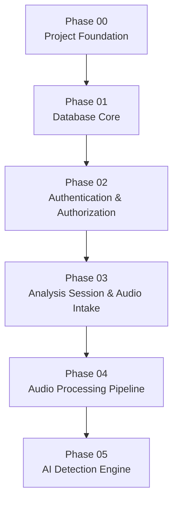

Phase 03 depends on the following foundations:

| Previous Phase | Dependency                                                       |
| -------------- | ---------------------------------------------------------------- |
| Phase 00       | Application structure and development foundation                 |
| Phase 01       | Database models, relationships, migrations, and persistence      |
| Phase 02       | Authentication, authorization, user identity, and access control |

Phase 03 enables the future processing pipeline by creating a validated analysis input.

---

# 4. Scope

## 4.1 Included

Phase 03 includes:

* Authenticated analysis request initiation.
* Analysis session creation.
* User ownership association.
* Organization or tenant association.
* Audio input intake.
* Request validation.
* File validation.
* Safe file handling.
* Server-generated file identifiers.
* File metadata capture.
* Session metadata capture.
* Initial session state management.
* Session failure handling.
* Storage reference management.
* Access-controlled retrieval of session information where required.
* Minimal frontend support for audio submission.
* Testing of analysis session and audio intake boundaries.

---

## 4.2 Scope Summary

```mermaid
flowchart LR

    AUTH[Authenticated User]
        --> AUTHZ[Authorization Validation]
        --> SESSION[Create Analysis Session]
        --> INPUT[Receive Audio Input]
        --> VALIDATE[Validate Request and File]
        --> STORE[Safe Storage Handling]
        --> META[Store Metadata]
        --> READY[Ready for Phase 04]

    READY -. Outside Phase 03 .-> PROCESS[Audio Processing]
    PROCESS -. Future Phase .-> AI[AI Detection]
```

---

# 5. High-Level Architecture

Phase 03 occupies the boundary between authenticated user interaction and the future processing pipeline.

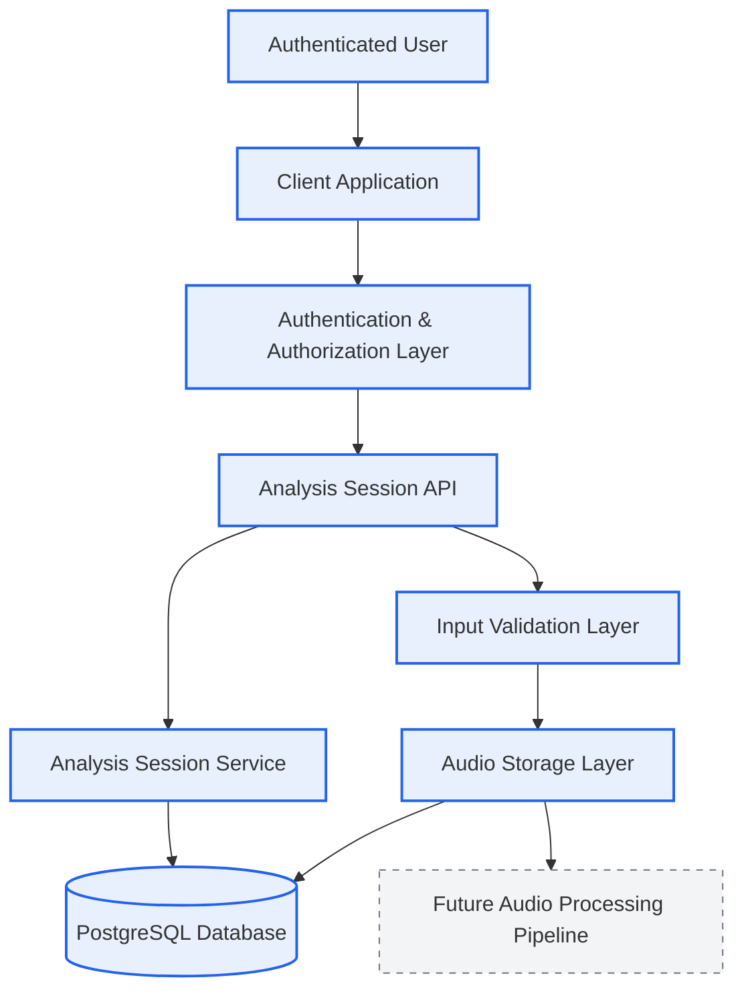

The future processing pipeline must not be implemented during this phase.

---

# 6. Phase Boundary

## Phase 03 Responsibility

```text
User
  ↓
Authenticated Request
  ↓
Authorized Access
  ↓
Create Analysis Session
  ↓
Receive Audio
  ↓
Validate Input
  ↓
Safely Store / Reference Input
  ↓
Record Metadata
  ↓
Session Ready
```

## Future Responsibility

```text
Session Ready
  ↓
Audio Preprocessing
  ↓
Audio Normalization
  ↓
Audio Segmentation
  ↓
Feature Extraction
  ↓
AI Model Inference
  ↓
Voice Clone Detection
  ↓
Risk Assessment
  ↓
Policy Decision
  ↓
Alert / Prevention
```

---

# 7. Analysis Session Architecture

An analysis session represents a single logical voice analysis request.

The analysis session must act as the parent context for future processing operations.

Conceptually:

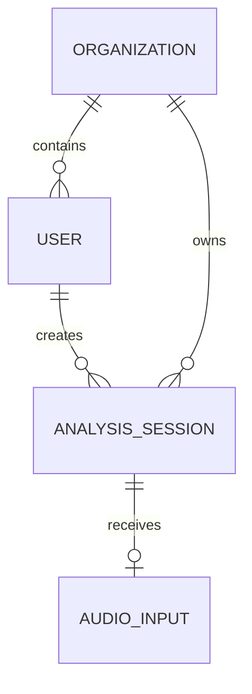

The exact database entities and field names must remain consistent with the database architecture defined in Phase 01.

Phase 03 must not silently introduce conflicting schema structures.

---

# 8. Analysis Session Lifecycle

The analysis session must have a clearly defined lifecycle.

A recommended conceptual lifecycle is:

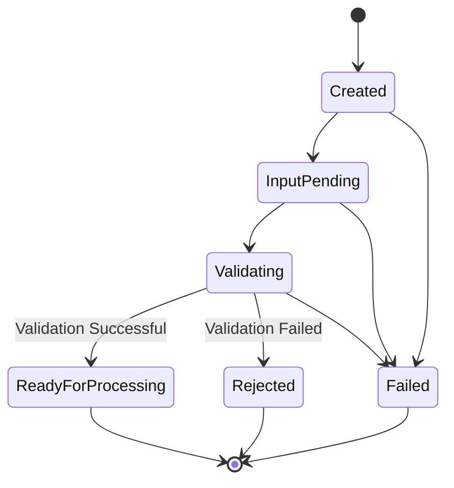

## 8.1 Lifecycle States

| State              | Meaning                                  | Phase 03 Responsibility |
| ------------------ | ---------------------------------------- | ----------------------- |
| Created            | Analysis session exists                  | Yes                     |
| InputPending       | Waiting for valid audio input            | Yes                     |
| Validating         | Input validation is in progress          | Yes                     |
| ReadyForProcessing | Input is accepted and ready for Phase 04 | Yes                     |
| Rejected           | Input failed validation                  | Yes                     |
| Failed             | Unexpected system failure occurred       | Yes                     |

If the existing database architecture defines different status values, those values must take precedence during implementation.

---

# 9. Audio Intake Workflow

The audio intake workflow should follow a controlled sequence.

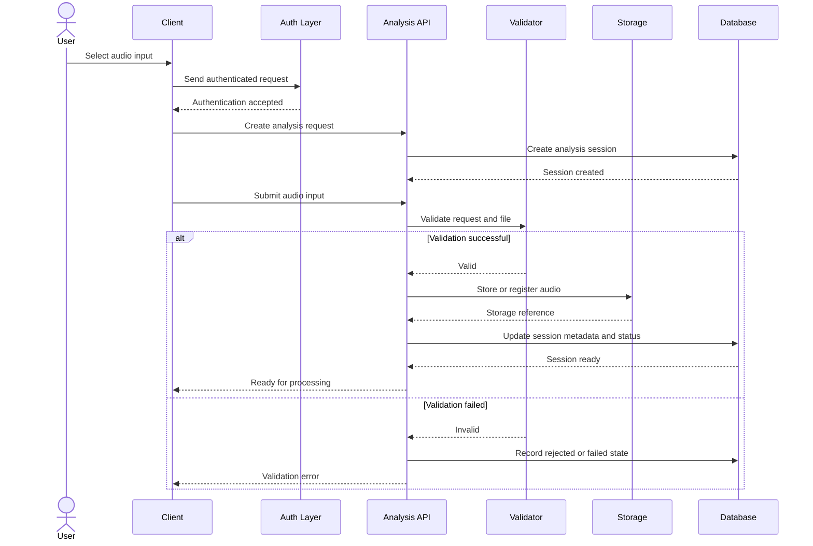

---

# 10. Authentication and Authorization Requirements

Phase 03 must reuse the identity and access-control foundation established in Phase 02.

## 10.1 Authentication

Analysis session creation must require an authenticated identity unless the overall project documentation explicitly defines a public analysis workflow.

The authenticated identity must be available to the analysis session layer.

The client must not be trusted to provide ownership identifiers that conflict with the authenticated identity.

---

## 10.2 Authorization

Authorization must verify that the authenticated user is permitted to:

* Create analysis sessions.
* Submit audio to their permitted sessions.
* Access session metadata.
* Access organization-owned analysis resources.

The exact role and permission rules must follow Phase 02.

---

# 11. Multi-Tenant Ownership Requirements

Where the platform uses organization-level isolation, every analysis session must remain associated with the correct organization.

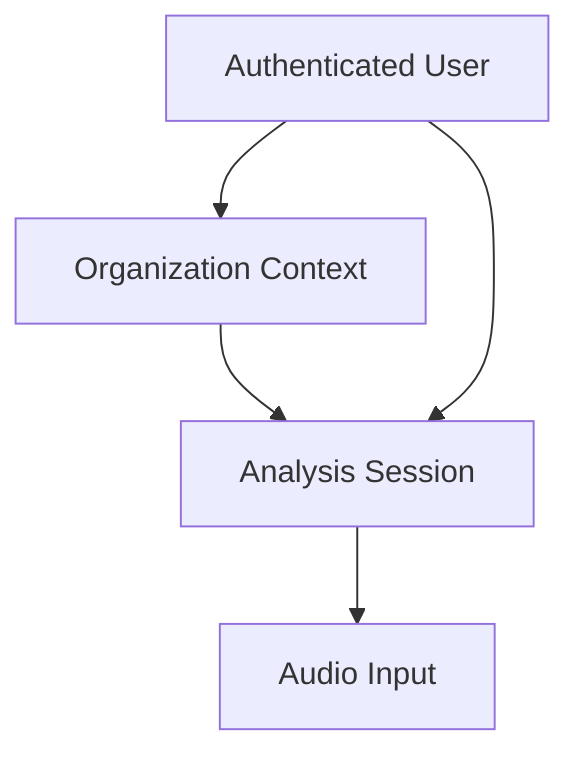

## Requirements

* The organization context must be derived from trusted application state.
* Users must not be able to select arbitrary organization identifiers.
* Cross-organization analysis access must be rejected.
* Session queries must respect organization boundaries.
* Future processing must inherit the correct session ownership context.

Database relationships alone are not sufficient to guarantee tenant isolation.

Application-level authorization enforcement remains required.

---

# 12. Audio Input Requirements

The implementation must follow the formats, limits, and input mechanisms defined by the project's technical documentation.

Phase 03 must not invent arbitrary production limits.

The following validation categories are required conceptually:

| Validation Area | Requirement                                               |
| --------------- | --------------------------------------------------------- |
| Authentication  | Request must have valid identity                          |
| Authorization   | User must have permission                                 |
| File Presence   | Audio input must exist                                    |
| Input Type      | Must match supported audio requirements                   |
| File Size       | Must comply with configured limits                        |
| Empty Input     | Empty files must be rejected                              |
| Filename        | User-provided filename must not be trusted                |
| Storage         | Input must be stored outside executable application paths |
| Ownership       | Input must belong to the authorized session               |

Specific values such as maximum upload size and supported audio formats must come from the authoritative project documentation or application configuration.

---

# 13. Input Validation Architecture

Validation should occur in multiple layers.

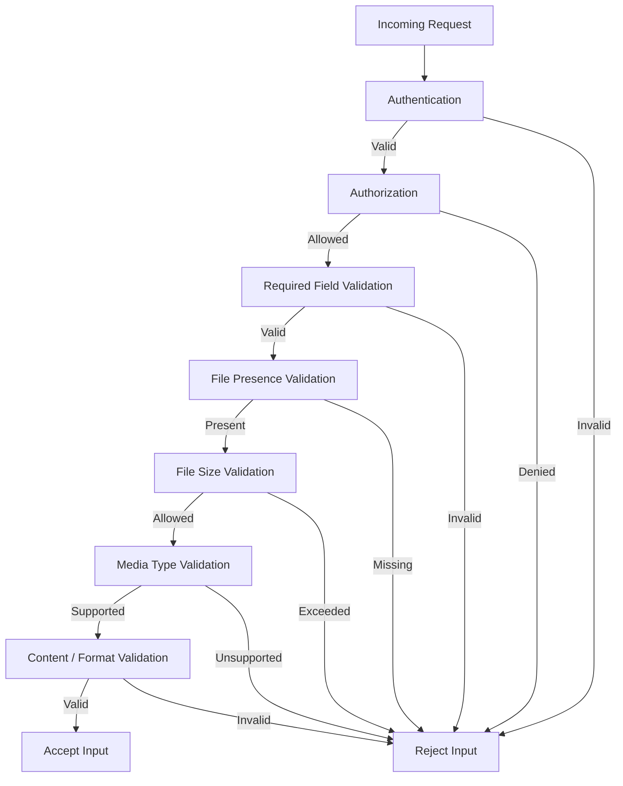

---

# 14. Secure File Handling

Uploaded audio must always be treated as untrusted user input.

## Required Principles

### 14.1 Do Not Trust User Filenames

The original filename may be recorded as metadata where permitted, but it must not determine the server storage path.

Server-side identifiers should determine the storage reference.

---

### 14.2 Prevent Path Traversal

User-controlled input must never be allowed to construct arbitrary filesystem paths.

Examples of dangerous input patterns include:

```text
../../sensitive-file
..\..\system-file
/arbitrary/path
```

The implementation must ensure storage locations are generated and controlled by the application.

---

### 14.3 Separate Storage from Application Code

Uploaded files must not be placed in locations where they can:

* Replace application files.
* Modify source code.
* Become executable application assets.
* Affect deployment configuration.

---

### 14.4 Validate Before Future Processing

An input must pass required validation before being marked ready for the next pipeline phase.

---

### 14.5 Safe Failure Handling

If storage fails:

* The failure must be recorded appropriately.
* Internal filesystem information must not be returned to the client.
* Sensitive infrastructure details must not be exposed.

---

# 15. Storage Strategy

The storage implementation must follow the architecture selected for the project.

Phase 03 should conceptually maintain:


The database should store the appropriate reference or metadata required by later phases rather than assuming the database itself is responsible for storing raw audio unless the database architecture explicitly requires binary audio storage.

The final implementation must follow the project's documented storage strategy.

---

# 16. Analysis Session Metadata

The exact fields must match the database design.

Conceptually, Phase 03 may require metadata in the following categories:

| Category                 | Purpose                            |
| ------------------------ | ---------------------------------- |
| Session Identifier       | Uniquely identify analysis request |
| User Association         | Identify request initiator         |
| Organization Association | Preserve tenant ownership          |
| Session Status           | Track current lifecycle stage      |
| Input Reference          | Link to validated audio storage    |
| Original Metadata        | Preserve safe input context        |
| File Size                | Track submitted input size         |
| Media Type               | Identify accepted media format     |
| Creation Time            | Trace session creation             |
| Update Time              | Track lifecycle updates            |
| Failure Context          | Record safe failure information    |

Fields must not be added during implementation unless supported by the database specification.

---

# 17. Database Interaction Requirements

Phase 03 must build upon the database foundation created in Phase 01.

The implementation should interact with the database for:

* Creating analysis sessions.
* Associating users with sessions.
* Associating organizations with sessions.
* Recording session lifecycle state.
* Recording approved input metadata.
* Recording storage references.
* Recording documented failure state.

## Conceptual Relationship

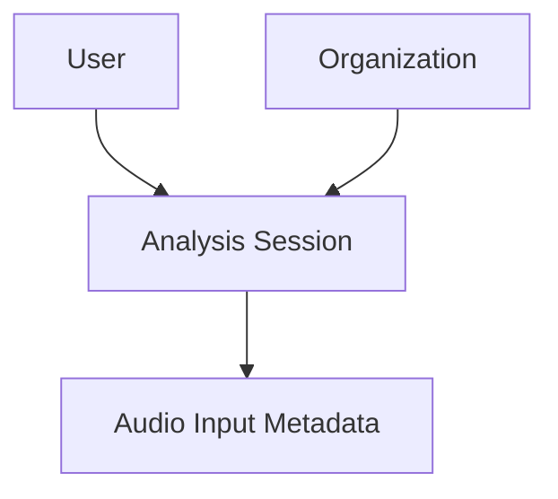

The exact persistence model must remain aligned with `DATABASE.md` and Phase 01.

---

# 18. API Requirements

Phase 03 must provide the API capabilities required for the documented workflow.

The API design must support the conceptual actions below.

| Capability                    | Authentication | Authorization              |
| ----------------------------- | -------------- | -------------------------- |
| Create analysis session       | Required       | Required                   |
| Submit audio input            | Required       | Session ownership required |
| View analysis session         | Required       | Authorized access required |
| View own organization session | Required       | Tenant boundary required   |

Exact endpoint paths, request schemas, and response schemas must follow the project's API documentation.

If Phase 03 requires new API contracts not already documented, those contracts must be formally defined before implementation rather than silently invented.

---

# 19. Error Handling Requirements

Phase 03 must provide predictable and safe error handling.

## Error Categories

| Category               | Example Situation              | Client Response      |
| ---------------------- | ------------------------------ | -------------------- |
| Authentication Failure | Missing or invalid identity    | Authentication error |
| Authorization Failure  | User lacks access              | Access denied        |
| Validation Failure     | Missing required input         | Validation error     |
| Unsupported Input      | Invalid media type             | Input rejected       |
| Size Violation         | Input exceeds configured limit | Input rejected       |
| Session Failure        | Invalid lifecycle state        | Request rejected     |
| Storage Failure        | Input cannot be stored         | Safe server error    |
| Database Failure       | Session persistence failure    | Safe server error    |

## Security Rule

Errors must not expose:

* Database credentials.
* Storage credentials.
* Internal server paths.
* Private infrastructure information.
* Stack traces.
* Sensitive implementation details.

---

# 20. Security Requirements

Phase 03 handles untrusted file input and must therefore follow strict security boundaries.

## Security Controls

| Security Area    | Requirement                                 |
| ---------------- | ------------------------------------------- |
| Authentication   | Require valid authenticated identity        |
| Authorization    | Verify user access to analysis resource     |
| Tenant Isolation | Prevent cross-organization access           |
| File Validation  | Validate input before acceptance            |
| Filename Safety  | Do not trust client filename                |
| Path Safety      | Prevent path traversal                      |
| Storage Safety   | Keep uploads separate from executable paths |
| Error Safety     | Do not expose infrastructure details        |
| Resource Control | Enforce documented upload limits            |
| Traceability     | Preserve session ownership                  |

---

# 21. Auditability and Traceability

The analysis workflow must remain traceable.

The system should be able to identify:

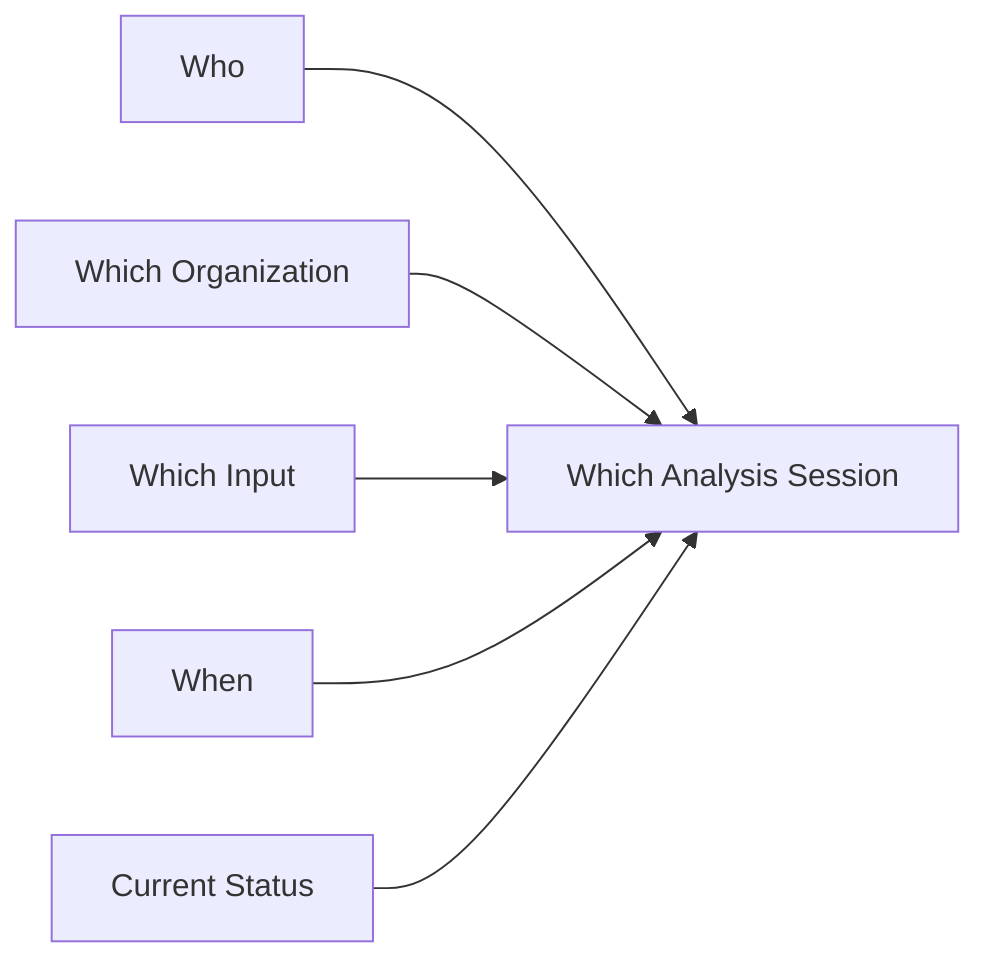

Phase 03 is responsible for establishing traceable session ownership and lifecycle information.

A broader security auditing system may be implemented in later phases depending on the overall architecture.

---

# 22. Frontend Requirements

Phase 03 frontend work must remain minimal and focused on audio intake.

## Included

* Analysis initiation entry point.
* Audio selection interface.
* Upload or submission progress indication.
* Validation feedback.
* Success confirmation.
* Safe error display.
* Session state indication.

## Not Included

* Full dashboard.
* Risk visualizations.
* Detection analytics.
* AI confidence visualizations.
* Alert center.
* Security investigation interface.
* Copilot interface.

## User Flow

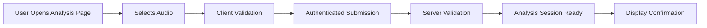

---

# 23. Testing Requirements

Phase 03 must include automated testing appropriate to its responsibilities.

## 23.1 Authentication Tests

* Valid authenticated request.
* Missing authentication.
* Invalid authentication.

---

## 23.2 Authorization Tests

* Authorized user can create analysis session.
* Unauthorized user cannot access protected session.
* User cannot access another organization's session where multi-tenancy applies.

---

## 23.3 Analysis Session Tests

* Session creation succeeds.
* User association is correct.
* Organization association is correct.
* Initial state is correct.
* Invalid lifecycle operations are rejected.

---

## 23.4 Input Validation Tests

* Valid input accepted.
* Missing file rejected.
* Unsupported media rejected.
* Empty file rejected.
* Oversized file rejected according to configured limits.
* Invalid input safely rejected.

---

## 23.5 File Safety Tests

* User filename does not control storage path.
* Path traversal attempts are rejected or neutralized.
* Upload cannot overwrite application files.
* Internal storage information is not exposed.

---

## 23.6 Regression Tests

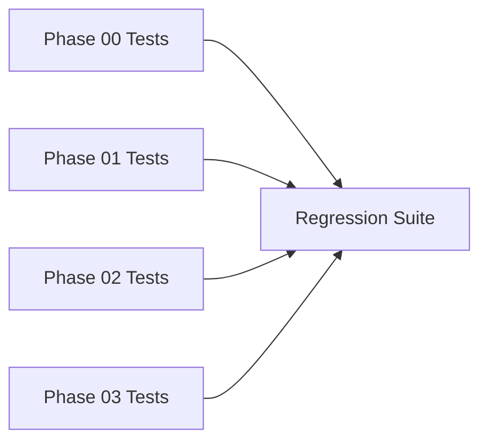

All previous phase functionality must remain operational.

---

# 24. Implementation Plan

The Phase 03 implementation should follow this order.

## Step 1 — Review Dependencies

* Review Phase 00 application structure.
* Review Phase 01 database foundation.
* Review Phase 02 authentication and authorization.

---

## Step 2 — Confirm Analysis Session Schema

* Confirm existing database entities.
* Confirm ownership relationships.
* Confirm organization relationships.
* Confirm status representation.

Do not create conflicting schema definitions.

---

## Step 3 — Confirm Storage Architecture

* Identify documented storage strategy.
* Confirm how audio references are represented.
* Confirm temporary and persistent storage requirements.

---

## Step 4 — Implement Analysis Session Management

Implementation should later support:

* Session creation.
* Ownership association.
* Organization association.
* Initial lifecycle state.

---

## Step 5 — Implement Audio Intake

Implementation should later support:

* Input submission.
* Request association.
* Session association.

---

## Step 6 — Implement Validation

Validate:

* Authentication.
* Authorization.
* Required fields.
* File presence.
* Supported input.
* Configured size limits.
* Safe input handling.

---

## Step 7 — Implement Storage Handling

Implement only the documented storage strategy.

Requirements:

* Controlled server-generated identifiers.
* Safe storage boundaries.
* Storage reference persistence.

---

## Step 8 — Update Session State

After successful intake:

```text
Created / InputPending
        ↓
Validation
        ↓
ReadyForProcessing
```

On failure:

```text
Validation / Storage Failure
        ↓
Rejected or Failed
```

---

## Step 9 — Implement Required API Contracts

Only implement documented API contracts.

---

## Step 10 — Implement Minimal Frontend Support

Only what is necessary to:

* Select audio.
* Submit analysis.
* Display validation.
* Display submission state.

---

## Step 11 — Add Automated Tests

Cover all Phase 03 boundaries.

---

## Step 12 — Security Validation

Test:

* Unauthorized access.
* Cross-tenant access.
* Invalid uploads.
* Path traversal attempts.
* Storage failure handling.

---

## Step 13 — Regression Validation

Verify Phase 00, Phase 01, and Phase 02 functionality.

---

# 25. Expected Repository Changes

Future Phase 03 implementation may require changes in the following categories.

```text
Backend
│
├── Analysis session modules
├── Audio intake modules
├── Validation utilities
├── Storage abstraction
├── API routes
└── Tests

Database
│
├── Existing session models
└── Migration updates only if required by approved schema

Frontend
│
├── Analysis submission interface
├── Upload interaction
└── Validation feedback

Tests
│
├── Session tests
├── Authorization tests
├── Input validation tests
└── Storage safety tests
```

Exact filenames should follow the repository architecture established in Phase 00.

---

# 26. Acceptance Criteria

## Analysis Session

* [ ] Authenticated users can initiate an analysis session.
* [ ] Session ownership is correctly recorded.
* [ ] Organization ownership is correctly recorded where applicable.
* [ ] Initial session state is correctly assigned.
* [ ] Invalid lifecycle transitions are rejected.

## Audio Intake

* [ ] Valid supported input can be submitted.
* [ ] Missing input is rejected.
* [ ] Unsupported input is rejected.
* [ ] Empty input is rejected.
* [ ] Configured size limits are enforced.
* [ ] Input metadata is recorded according to the schema.

## Security

* [ ] Authentication is enforced.
* [ ] Authorization is enforced.
* [ ] Tenant isolation is preserved.
* [ ] User-provided filenames do not control storage paths.
* [ ] Path traversal is prevented.
* [ ] Uploaded input cannot modify application code.
* [ ] Internal storage details are not exposed.

## Storage

* [ ] Input follows the documented storage architecture.
* [ ] Storage references are correctly associated with sessions.
* [ ] Storage failures are handled safely.

## Traceability

* [ ] Session initiator is identifiable.
* [ ] Organization ownership is identifiable.
* [ ] Session state is traceable.
* [ ] Relevant failure state is recorded safely.

## Testing

* [ ] Analysis session tests pass.
* [ ] Authentication tests pass.
* [ ] Authorization tests pass.
* [ ] Input validation tests pass.
* [ ] File safety tests pass.
* [ ] Regression tests for previous phases pass.

---

# 27. Validation Procedure

After implementation, validate Phase 03 using the following procedure.

## Step 1

Prepare an authenticated test user.

## Step 2

Prepare organization context where required.

## Step 3

Start the backend application.

## Step 4

Start the frontend application if Phase 03 includes the intake interface.

## Step 5

Create a valid analysis request.

## Step 6

Submit valid supported audio input.

## Step 7

Verify:

* Analysis session exists.
* Correct user ownership exists.
* Correct organization ownership exists.
* Input metadata is associated.
* Session reaches the expected ready state.

## Step 8

Test invalid scenarios:

* Missing authentication.
* Unauthorized access.
* Missing input.
* Unsupported input.
* Empty input.
* Configured size violation.
* Invalid path input.

## Step 9

Verify that no internal infrastructure details are exposed.

## Step 10

Run all Phase 03 automated tests.

## Step 11

Run regression tests for:

* Phase 00.
* Phase 01.
* Phase 02.

---

# 28. Expected Deliverables

After Phase 03 implementation, the project should contain:

* Analysis session workflow.
* Authenticated session creation.
* User ownership association.
* Organization association where applicable.
* Audio intake workflow.
* Input validation.
* Safe file handling.
* Documented storage integration.
* Session lifecycle tracking.
* Session metadata persistence.
* Required API support.
* Minimal intake frontend support where required.
* Automated tests.

---

# 29. Out of Scope

The following features are explicitly outside Phase 03.

## Audio Processing

* Audio normalization.
* Audio enhancement.
* Audio denoising.
* Audio resampling.
* Audio segmentation.
* Audio chunking.

## AI

* AI model loading.
* AI model initialization.
* Model inference.
* Deepfake detection.
* Voice clone detection.
* Synthetic speech classification.
* Confidence scoring.

## Risk

* Risk Engine.
* Risk score calculation.
* Threat classification.
* Risk aggregation.

## Prevention

* Policy Engine.
* Prevention decisions.
* Automatic blocking.
* Automatic mitigation.

## Alerts

* Alert generation.
* Alert escalation.
* Alert investigation.
* Notification systems.

## Real-Time

* WebSockets.
* Real-time event broadcasting.
* Live detection updates.

## AI Assistant

* Security Copilot.
* LangChain workflows.
* LangGraph workflows.
* Conversational AI analysis.

## Frontend

* Full dashboard.
* Detection analytics.
* Risk visualization.
* Alert dashboard.

## Infrastructure

* Production deployment.
* Production monitoring.
* Production scaling.

---

# 30. Dependencies

## Depends On

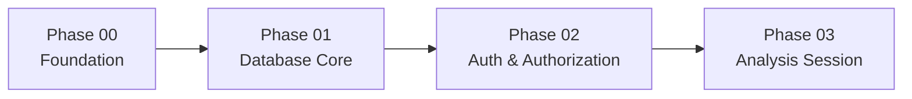

---

## Enables

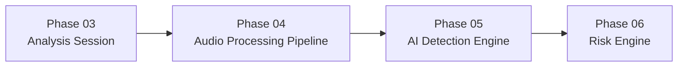

Phase 03 does not implement these phases.

It only prepares a controlled and validated input for them.

---

# 31. Risks and Design Considerations

## 31.1 Untrusted File Input

**Risk:** User-controlled files may contain malformed or malicious input.

**Requirement:** Treat every uploaded file as untrusted.

---

## 31.2 Cross-Tenant Access

**Risk:** A user could attempt to access another organization's analysis session.

**Requirement:** Enforce organization-level authorization.

---

## 31.3 Storage Exposure

**Risk:** Internal storage paths may expose infrastructure information.

**Requirement:** Never return sensitive storage details directly.

---

## 31.4 Filename Manipulation

**Risk:** User-controlled filenames may attempt path traversal or overwrite.

**Requirement:** Use controlled server-generated identifiers.

---

## 31.5 Scope Creep

**Risk:** AI implementation may begin audio processing during Phase 03.

**Requirement:** Stop the Phase 03 pipeline when validated input reaches `ReadyForProcessing`.

---

# 32. Phase Completion Checklist

## Required for Phase Completion

* [ ] Analysis session workflow is implemented.
* [ ] Authentication integration is functional.
* [ ] Authorization boundaries are functional.
* [ ] Tenant ownership is enforced where applicable.
* [ ] Audio input can be safely accepted.
* [ ] Input validation is implemented.
* [ ] Storage handling follows approved architecture.
* [ ] Session metadata is persisted.
* [ ] Session lifecycle state is functional.
* [ ] Required tests pass.
* [ ] Security boundaries are tested.
* [ ] Previous phase tests continue to pass.

---

## Recommended Before Moving to Phase 04

* [ ] Storage architecture has been verified.
* [ ] Session lifecycle is documented in implementation.
* [ ] Error responses are consistent.
* [ ] Input validation coverage is complete.
* [ ] Cross-tenant testing has been performed.
* [ ] Regression testing is automated.

---

## Explicitly Not Required Yet

* [ ] Audio preprocessing.
* [ ] Feature extraction.
* [ ] AI inference.
* [ ] Voice clone detection.
* [ ] Risk scoring.
* [ ] Policy decisions.
* [ ] Alerts.
* [ ] WebSockets.
* [ ] Security Copilot.
* [ ] Dashboard analytics.

---

# 33. AI Implementation Guardrails

When Phase 03 is implemented by an AI coding assistant, the following rules are mandatory.

1. Implement only Phase 03 scope.
2. Preserve Phase 00 functionality.
3. Preserve Phase 01 database functionality.
4. Preserve Phase 02 authentication and authorization functionality.
5. Reuse the existing authentication mechanism.
6. Reuse the existing authorization mechanism.
7. Do not create unauthenticated analysis intake unless explicitly required by project documentation.
8. Do not trust user-provided ownership identifiers.
9. Do not trust user-provided filenames.
10. Do not allow user input to construct arbitrary storage paths.
11. Do not expose internal storage paths.
12. Do not expose database credentials or infrastructure details.
13. Do not implement audio preprocessing.
14. Do not implement audio normalization.
15. Do not implement audio segmentation.
16. Do not implement feature extraction.
17. Do not load AI models.
18. Do not perform AI inference.
19. Do not implement voice cloning detection.
20. Do not calculate risk scores.
21. Do not implement the Risk Engine.
22. Do not implement the Policy Engine.
23. Do not generate alerts.
24. Do not implement WebSockets.
25. Do not implement real-time event broadcasting.
26. Do not implement Security Copilot functionality.
27. Do not introduce undocumented storage technologies.
28. Do not invent undocumented database fields.
29. Do not invent undocumented API contracts.
30. Preserve organization and tenant boundaries.
31. Validate untrusted input before accepting it.
32. Add automated tests for all implemented functionality.
33. Run regression tests before considering the phase complete.
34. If documentation is ambiguous, report the ambiguity instead of silently inventing architecture.
35. Stop implementation at the `ReadyForProcessing` boundary.

---

# Final Phase Boundary

```mermaid
flowchart LR

    A[Authenticated User]
        --> B[Authorized Request]
        --> C[Analysis Session]
        --> D[Audio Intake]
        --> E[Validation]
        --> F[Safe Storage]
        --> G[Metadata Persistence]
        --> H[Ready For Processing]

    H -. Phase 03 Ends .-> I[Audio Processing]
    I -. Future Phase .-> J[AI Detection]

    classDef phase3 fill:#dcfce7,stroke:#16a34a,stroke-width:2px;
    classDef future fill:#f3f4f6,stroke:#6b7280,stroke-dasharray: 5 5;

    class A,B,C,D,E,F,G,H phase3;
    class I,J future;
```

> **Phase 03 is complete only when a secure, authenticated, authorized, tenant-aware, validated analysis input can reach the `ReadyForProcessing` state without performing audio processing or AI inference.**
