# Phase 04 — Audio Processing Pipeline

## 📋 Phase Information

| Category | Details |
|---|---|
| **Project** | AI-Powered Real-Time Detection and Prevention of Voice Cloning Impersonation Attacks |
| **Phase** | 04 |
| **Phase Name** | Audio Processing Pipeline |
| **Status** | 🟡 Planning / Specification |
| **Dependencies** | Phase 00<br>Phase 01<br>Phase 02<br>Phase 03 |
| **Implementation Status** | ⚪ Not Started |
| **Document Type** | Phase Implementation Specification |

---

# Table of Contents

* [1. Phase Overview](#1-phase-overview)
* [2. Phase Objective](#2-phase-objective)
* [3. Background and Context](#3-background-and-context)
* [4. Scope](#4-scope)
* [5. High-Level Architecture](#5-high-level-architecture)
* [6. Phase Boundary](#6-phase-boundary)
* [7. Processing Pipeline Architecture](#7-processing-pipeline-architecture)
* [8. Pipeline Lifecycle and Status](#8-pipeline-lifecycle-and-status)
* [9. Input Contract](#9-input-contract)
* [10. Audio Loading](#10-audio-loading)
* [11. Audio Format Validation](#11-audio-format-validation)
* [12. Audio Standardization](#12-audio-standardization)
* [13. Channel Processing](#13-channel-processing)
* [14. Resampling](#14-resampling)
* [15. Audio Normalization](#15-audio-normalization)
* [16. Silence and Quality Validation](#16-silence-and-quality-validation)
* [17. Duration Validation](#17-duration-validation)
* [18. Segmentation and Chunking](#18-segmentation-and-chunking)
* [19. Processed Audio Output](#19-processed-audio-output)
* [20. Processing Metadata](#20-processing-metadata)
* [21. Database Interaction Requirements](#21-database-interaction-requirements)
* [22. Storage Requirements](#22-storage-requirements)
* [23. Processing Workflow](#23-processing-workflow)
* [24. Error Handling](#24-error-handling)
* [25. Security Requirements](#25-security-requirements)
* [26. Resource and Performance Controls](#26-resource-and-performance-controls)
* [27. Observability and Traceability](#27-observability-and-traceability)
* [28. Frontend Requirements](#28-frontend-requirements)
* [29. Testing Requirements](#29-testing-requirements)
* [30. Implementation Plan](#30-implementation-plan)
* [31. Expected Repository Changes](#31-expected-repository-changes)
* [32. Acceptance Criteria](#32-acceptance-criteria)
* [33. Validation Procedure](#33-validation-procedure)
* [34. Expected Deliverables](#34-expected-deliverables)
* [35. Out of Scope](#35-out-of-scope)
* [36. Dependencies](#36-dependencies)
* [37. Risks and Design Considerations](#37-risks-and-design-considerations)
* [38. Phase Completion Checklist](#38-phase-completion-checklist)
* [39. AI Implementation Guardrails](#39-ai-implementation-guardrails)

---

# 1. Phase Overview

Phase 04 is responsible for transforming a validated audio input from Phase 03 into a standardized and processing-ready audio representation.

The primary purpose of this phase is to ensure that audio entering the future AI detection pipeline is:

* Successfully readable.
* Structurally valid.
* In a supported processing format.
* Standardized according to the approved pipeline configuration.
* Suitable for downstream analysis.
* Free from invalid or unusable processing states.
* Properly associated with its originating analysis session.
* Traceable throughout the processing lifecycle.

Phase 04 begins only after Phase 03 has successfully completed secure analysis session creation and audio intake.

Phase 04 does not determine whether audio is human, synthetic, cloned, manipulated, or malicious.

It prepares audio for the AI Detection Engine implemented in Phase 05.

---

# 2. Phase Objective

The objective of Phase 04 is to create a controlled, reproducible, and secure audio preprocessing pipeline that converts validated raw audio into a standardized representation suitable for downstream AI detection.

After Phase 04 implementation, the system should be able to answer:

* Was the audio successfully loaded?
* Is the audio readable by the processing pipeline?
* Does the audio satisfy supported processing requirements?
* What was the original audio configuration?
* What processing transformations were applied?
* Was the audio successfully standardized?
* Did the audio pass minimum quality requirements?
* Was the audio segmented where required?
* Is the resulting output ready for AI processing?
* Did any processing step fail?
* Which analysis session owns the processed output?

---

# 3. Background and Context

The processing pipeline depends on the successful completion of previous phases.

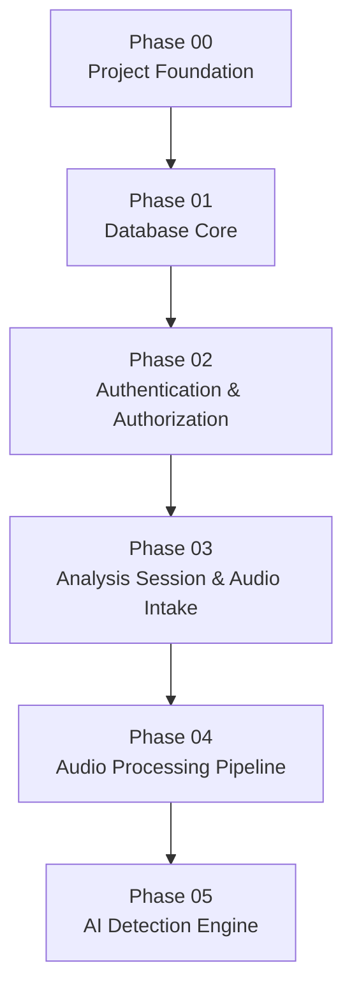

The input boundary for this phase is:

```text
Validated Analysis Session
        +
Validated Audio Input
        ↓
Phase 04
```

The output boundary is:

```text
Standardized Processed Audio
        +
Processing Metadata
        +
Ready for AI Detection Status
        ↓
Phase 05
```

---

# 4. Scope

## 4.1 Included

Phase 04 includes:

* Retrieving validated audio associated with an analysis session.
* Loading audio into the processing pipeline.
* Verifying that the audio can be decoded.
* Reading audio properties and metadata.
* Validating supported processing requirements.
* Standardizing audio configuration.
* Channel handling.
* Resampling where required.
* Audio normalization where required.
* Silence detection and validation where configured.
* Minimum audio quality checks where defined.
* Duration validation.
* Audio segmentation or chunking where required.
* Processed audio output generation.
* Processing metadata generation.
* Processing lifecycle tracking.
* Failure handling.
* Resource control.
* Traceability.
* Automated testing.

---

## 4.2 Scope Summary

```mermaid
flowchart LR

    INPUT[Validated Audio<br/>Phase 03]
        --> LOAD[Load Audio]
        --> DECODE[Decode / Verify]
        --> FORMAT[Validate Format]
        --> STANDARDIZE[Standardize Audio]
        --> QUALITY[Quality Validation]
        --> SEGMENT[Segment / Chunk]
        --> OUTPUT[Processed Audio]

    OUTPUT --> READY[Ready for AI Detection]

    READY -. Phase 04 Ends .-> AI[Phase 05<br/>AI Detection Engine]
```

---

# 5. High-Level Architecture

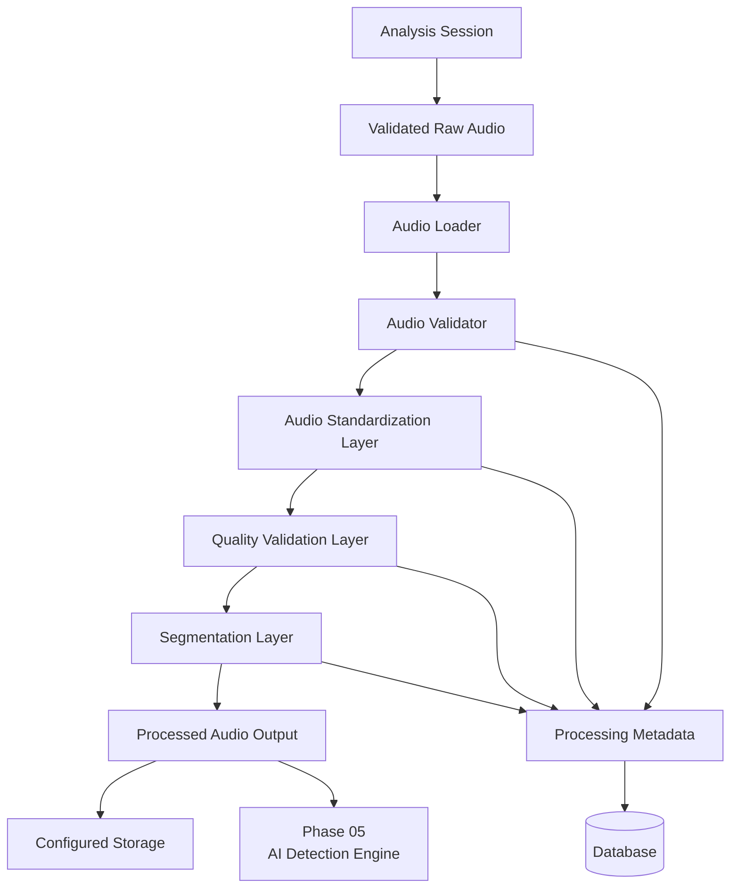

---

# 6. Phase Boundary

## Phase 04 Begins

Phase 04 begins only when:

* A valid analysis session exists.
* The audio belongs to that analysis session.
* The audio was successfully accepted by Phase 03.
* The session is in a state that allows processing.

---

## Phase 04 Ends

Phase 04 ends when:

* The audio has successfully passed processing validation.
* Required standardization has completed.
* Required segmentation has completed.
* Processing metadata has been recorded.
* The output is marked ready for AI detection.

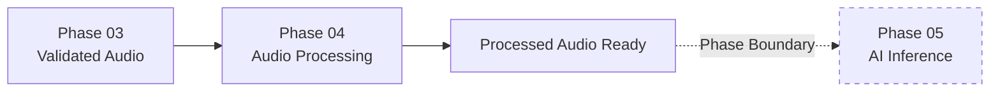

---

# 7. Processing Pipeline Architecture

The processing pipeline should follow a deterministic sequence.

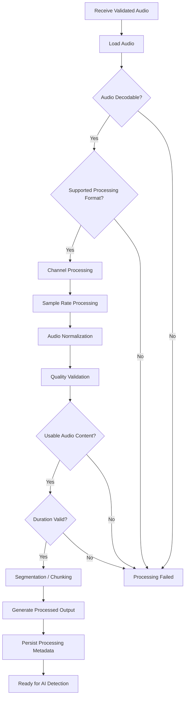

---

# 8. Pipeline Lifecycle and Status

The processing lifecycle must integrate with the analysis session lifecycle established in earlier phases.

A conceptual processing lifecycle is:

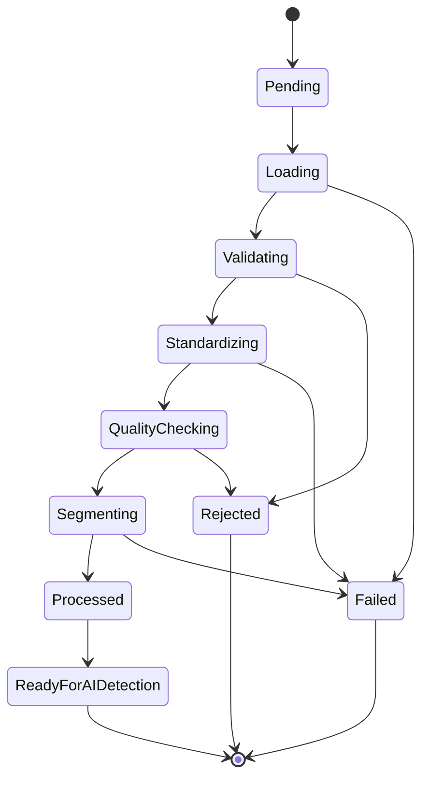

## Processing State Reference

| State               | Meaning                            | Expected Outcome   |
| ------------------- | ---------------------------------- | ------------------ |
| Pending             | Processing has not started         | Waiting            |
| Loading             | Audio is being retrieved           | Continue or fail   |
| Validating          | Audio properties are being checked | Continue or reject |
| Standardizing       | Audio is being transformed         | Continue or fail   |
| QualityChecking     | Audio usability is being evaluated | Continue or reject |
| Segmenting          | Audio is being divided if required | Continue or fail   |
| Processed           | Pipeline transformation completed  | Continue           |
| ReadyForAIDetection | Output is ready for Phase 05       | Phase 04 complete  |
| Rejected            | Audio cannot satisfy requirements  | Stop               |
| Failed              | System processing failure occurred | Stop               |

The exact status values must remain consistent with the approved database schema.

---

# 9. Input Contract

Phase 04 must accept input only from a valid Phase 03 analysis session.

The processing input must conceptually contain:

| Input Category             | Purpose                           |
| -------------------------- | --------------------------------- |
| Analysis Session Reference | Identify processing context       |
| Audio Storage Reference    | Locate approved input             |
| User Ownership Context     | Preserve traceability             |
| Organization Context       | Preserve tenant boundaries        |
| Original Input Metadata    | Understand source characteristics |
| Current Session State      | Validate processing eligibility   |

The processing layer must not accept arbitrary filesystem paths directly from the client.

---

# 10. Audio Loading

Audio loading is the first active processing operation.

The pipeline must:

1. Retrieve the audio using a trusted storage reference.
2. Confirm that the associated analysis session exists.
3. Confirm that the session is eligible for processing.
4. Attempt to load the audio using the approved processing library.
5. Detect decoding failures safely.
6. Record processing failure without exposing internal details.

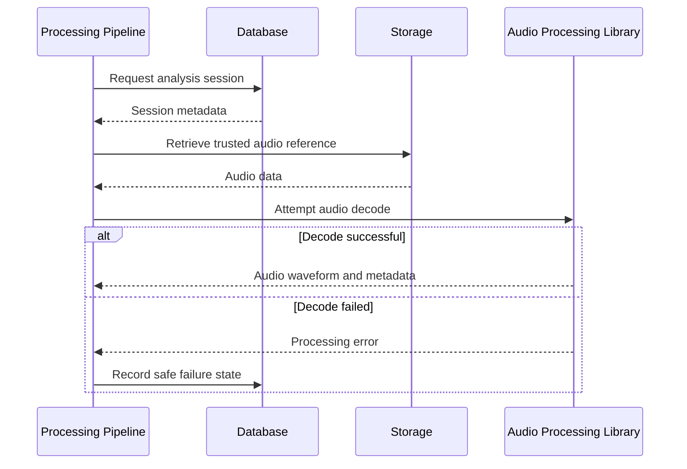

---

# 11. Audio Format Validation

The pipeline must validate the actual audio properties available after loading.

Validation must not rely exclusively on:

* File extension.
* User-provided filename.
* Client-provided content type.

The processing layer should validate the actual readable audio representation.

Relevant properties may include:

| Property         | Purpose                                      |
| ---------------- | -------------------------------------------- |
| Codec / Encoding | Determine decoder compatibility              |
| Container Format | Determine supported input                    |
| Sample Rate      | Determine standardization requirements       |
| Channel Count    | Determine channel processing                 |
| Duration         | Validate processing eligibility              |
| Frame Count      | Support duration and processing calculations |

Exact supported formats must be aligned with the project's technical and AI model requirements.

---

# 12. Audio Standardization

Audio standardization ensures that downstream components receive consistent input.

The exact target configuration must be determined by the AI model requirements defined for Phase 05.

Phase 04 must not select arbitrary production values that conflict with the model.

Conceptual processing:

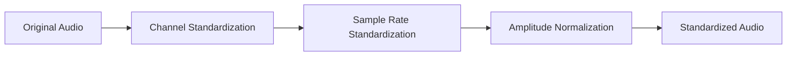

---

# 13. Channel Processing

Audio may contain one or more channels.

The pipeline must determine the channel configuration of the loaded audio.

Potential requirements include:

* Preserving the original configuration where required.
* Converting multi-channel input to the target channel configuration.
* Ensuring consistent channel representation for downstream processing.

The exact conversion policy must be aligned with the selected AI model.

No channel transformation should be performed without preserving the processing decision in metadata.

---

# 14. Resampling

Audio sources may use different sample rates.

The pipeline may resample audio to the target sample rate required by downstream models.

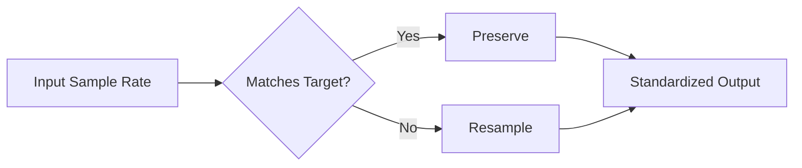

## Requirements

* The target rate must come from approved model or pipeline configuration.
* The original sample rate should remain available as metadata.
* The resulting sample rate should be recorded.
* Resampling failures must fail safely.

---

# 15. Audio Normalization

Normalization may be used to reduce inconsistent amplitude differences between audio inputs.

The pipeline must:

* Follow the approved normalization method.
* Avoid introducing undocumented transformations.
* Preserve processing metadata.
* Record whether normalization was applied.

Conceptual flow:

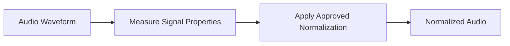

The exact normalization algorithm and target values must follow the AI model and technical architecture.

---

# 16. Silence and Quality Validation

Audio that contains insufficient usable voice content should not automatically continue into expensive AI processing.

Phase 04 may validate:

* Whether usable audio content exists.
* Whether the input is entirely silent.
* Whether the duration of meaningful audio satisfies requirements.
* Whether the audio can be successfully processed.

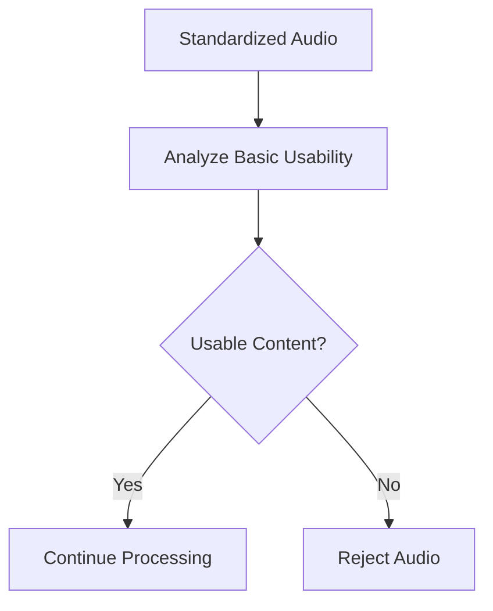

Phase 04 must not perform voice identity recognition or deepfake classification during these checks.

---

# 17. Duration Validation

The pipeline must verify whether audio duration is suitable for downstream processing.

Potential outcomes:

| Condition              | Result                                                        |
| ---------------------- | ------------------------------------------------------------- |
| Too short              | Reject or mark unsuitable                                     |
| Within supported range | Continue                                                      |
| Too long               | Reject, limit, or segment according to approved configuration |

The exact duration limits must be configuration-driven and based on approved technical requirements.

Hardcoded arbitrary values should not be introduced without documentation.

---

# 18. Segmentation and Chunking

Longer audio may require segmentation into processing units.

Segmentation exists to prepare audio for downstream processing.

It must not itself perform AI inference.

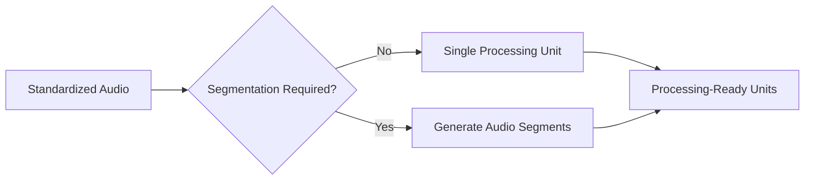

## Segment Metadata

Where segmentation occurs, metadata should identify:

* Parent analysis session.
* Segment identifier.
* Segment ordering.
* Relative timing or boundaries where required.
* Storage or in-memory reference.
* Processing status.

The exact persistence model must follow the database architecture.

---

# 19. Processed Audio Output

The output of Phase 04 must be suitable for consumption by the Phase 05 AI Detection Engine.

The processed output may conceptually include:

```text
Processed Audio
    +
Standardized Representation
    +
Processing Metadata
    +
Segment Information
    +
ReadyForAIDetection Status
```

Phase 04 must not convert this output into:

* A deepfake probability.
* A clone detection result.
* A confidence score.
* A risk score.

---

# 20. Processing Metadata

Processing metadata provides reproducibility and traceability.

Conceptual categories include:

| Category                  | Purpose                                 |
| ------------------------- | --------------------------------------- |
| Analysis Session          | Associate output with parent session    |
| Processing Status         | Track current lifecycle                 |
| Original Audio Properties | Preserve source characteristics         |
| Standardized Properties   | Record final processing characteristics |
| Transformations Applied   | Record pipeline operations              |
| Segment Information       | Identify generated processing units     |
| Processing Time           | Support observability                   |
| Failure Category          | Record safe failure information         |

The exact database fields must remain aligned with the approved schema.

---

# 21. Database Interaction Requirements

Phase 04 must interact with the database only through approved application architecture.

Required conceptual operations include:

* Retrieve analysis session.
* Verify ownership context.
* Verify processing eligibility.
* Record processing status.
* Record output references.
* Record processing metadata.
* Record safe failure state.

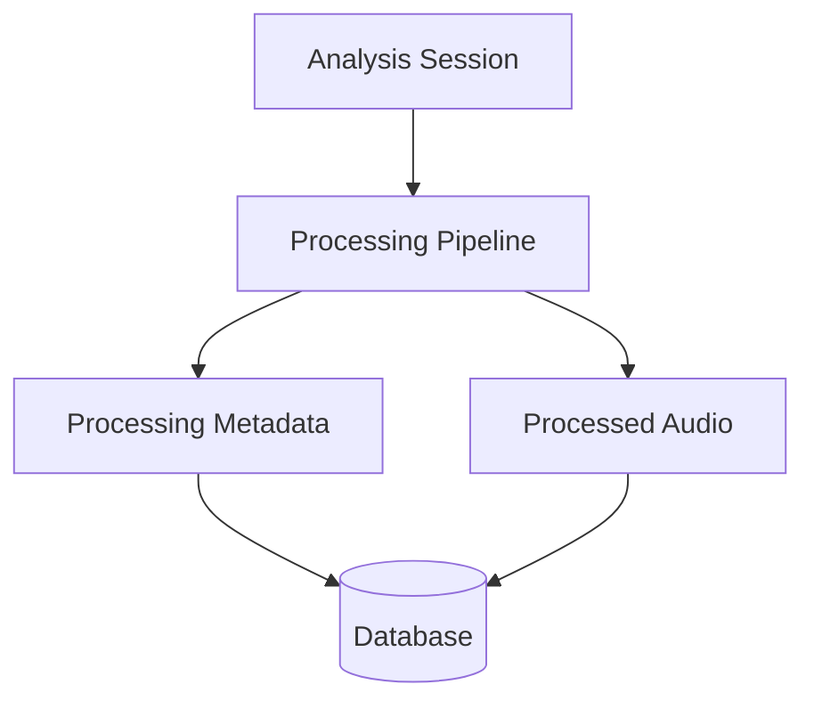

Phase 04 must not bypass tenant or session ownership boundaries.

---

# 22. Storage Requirements

The storage implementation must follow the architecture approved for the project.

Phase 04 must distinguish conceptually between:

```text
Raw Input
    ↓
Validated Source Audio
    ↓
Processing
    ↓
Processed Output
```

Storage requirements include:

* Trusted storage references.
* Controlled server-side paths.
* No user-controlled output paths.
* Separation from executable application files.
* Controlled access.
* Safe cleanup where required.
* Output association with the correct analysis session.

The phase must not introduce new storage providers unless already approved by project architecture.

---

# 23. Processing Workflow

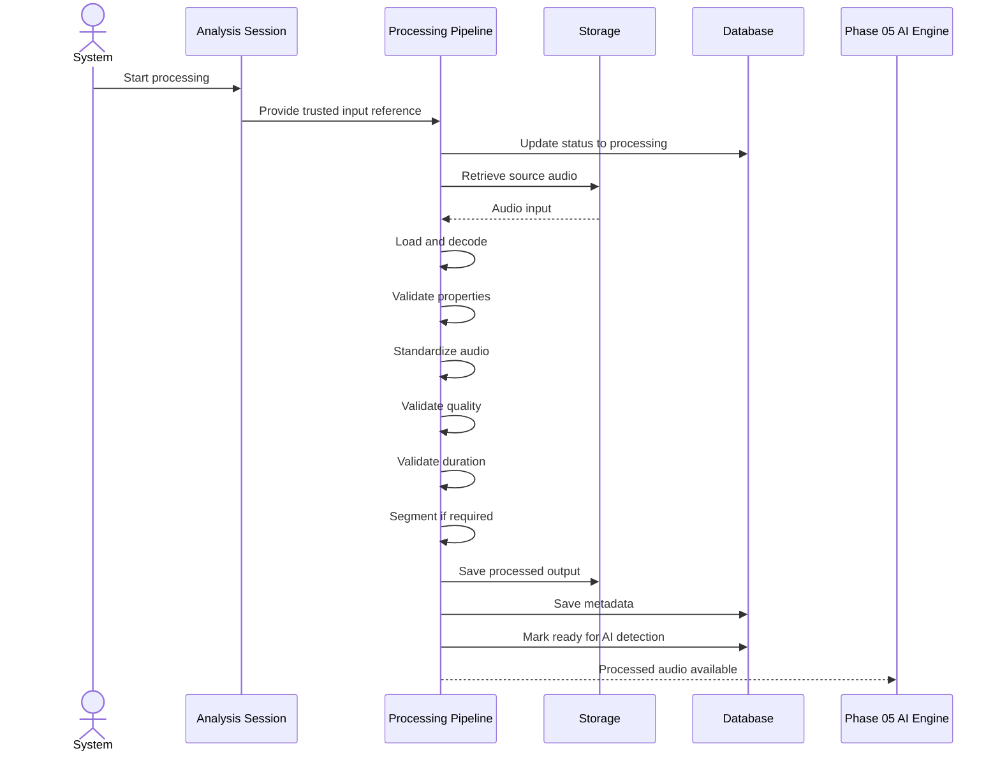

Phase 05 invocation itself is outside the implementation scope of Phase 04.

---

# 24. Error Handling

## Error Categories

| Category             | Example                       | Expected Result                    |
| -------------------- | ----------------------------- | ---------------------------------- |
| Session Error        | Session does not exist        | Stop safely                        |
| Authorization Error  | Invalid access context        | Reject                             |
| Storage Error        | Source unavailable            | Processing failure                 |
| Decode Error         | Audio unreadable              | Reject                             |
| Format Error         | Unsupported processing format | Reject                             |
| Quality Error        | No usable audio               | Reject                             |
| Duration Error       | Outside allowed limits        | Reject or follow configured policy |
| Transformation Error | Standardization fails         | Processing failure                 |
| Segmentation Error   | Segment generation fails      | Processing failure                 |
| Persistence Error    | Metadata cannot be saved      | Safe failure                       |

Errors returned externally must not expose:

* Stack traces.
* Internal file paths.
* Credentials.
* Private storage implementation details.

---

# 25. Security Requirements

Phase 04 processes untrusted user-originated audio.

## Security Controls

| Security Area        | Requirement                       |
| -------------------- | --------------------------------- |
| Input Trust          | Treat uploaded audio as untrusted |
| Session Access       | Require valid processing context  |
| Tenant Isolation     | Preserve organization boundaries  |
| Storage Access       | Use trusted references            |
| Path Safety          | Prevent user-controlled paths     |
| Resource Safety      | Enforce configured limits         |
| Error Safety         | Do not expose internals           |
| Processing Isolation | Do not execute uploaded content   |
| Traceability         | Associate processing with session |

Uploaded audio must never be treated as executable application content.

---

# 26. Resource and Performance Controls

Audio processing can consume significant resources.

The implementation should respect configured limits for:

* File size.
* Audio duration.
* Memory consumption.
* Concurrent processing.
* Processing time.

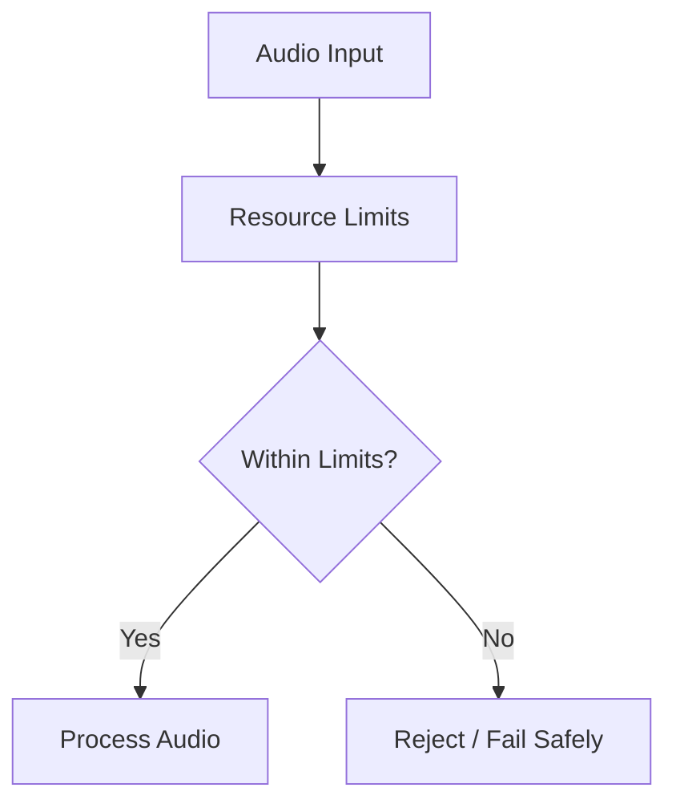

Exact thresholds must come from approved configuration.

---

# 27. Observability and Traceability

Processing must be traceable through safe lifecycle events.

The system should be able to determine:

* Which session was processed.
* When processing started.
* Which stages completed.
* Which transformations were applied.
* Whether processing succeeded.
* Why processing stopped at a high level.

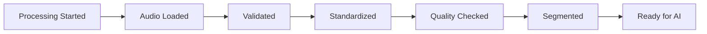

Sensitive audio content must not be unnecessarily written into logs.

---

# 28. Frontend Requirements

Phase 04 requires minimal frontend responsibility.

The frontend should not directly perform the authoritative server-side processing pipeline.

Potential frontend responsibilities:

* Display that processing has started.
* Display safe processing status.
* Display safe validation failure.
* Display that audio is ready for analysis.

The frontend must not display:

* AI detection results.
* Deepfake confidence.
* Clone probability.
* Risk score.

Those belong to future phases.

---

# 29. Testing Requirements

## 29.1 Audio Loading Tests

* Valid audio loads successfully.
* Missing storage reference fails safely.
* Corrupt audio fails safely.
* Unsupported decoders are handled safely.

---

## 29.2 Format Validation Tests

* Supported processing format accepted.
* Unsupported format rejected.
* Filename mismatch does not bypass validation.
* Client-provided media type alone is not trusted.

---

## 29.3 Channel Processing Tests

* Supported single-channel input.
* Supported multi-channel input.
* Correct target representation.
* Metadata correctly records transformation.

---

## 29.4 Resampling Tests

* Input already matching target.
* Input requiring resampling.
* Output sample rate matches approved target.
* Original metadata remains traceable.

---

## 29.5 Normalization Tests

* Normalization applies when configured.
* Output remains processable.
* Metadata records the transformation.

---

## 29.6 Quality Tests

* Usable audio continues.
* Silent input is handled according to policy.
* Unusable input is rejected safely.

---

## 29.7 Duration Tests

* Too-short input.
* Valid input.
* Long input.
* Segmentation behavior where configured.

---

## 29.8 Segmentation Tests

* Single-unit processing.
* Multiple segments.
* Segment ordering.
* Parent session association.
* Metadata persistence.

---

## 29.9 Failure Tests

* Storage failure.
* Decode failure.
* Validation failure.
* Transformation failure.
* Persistence failure.

---

## 29.10 Regression Tests

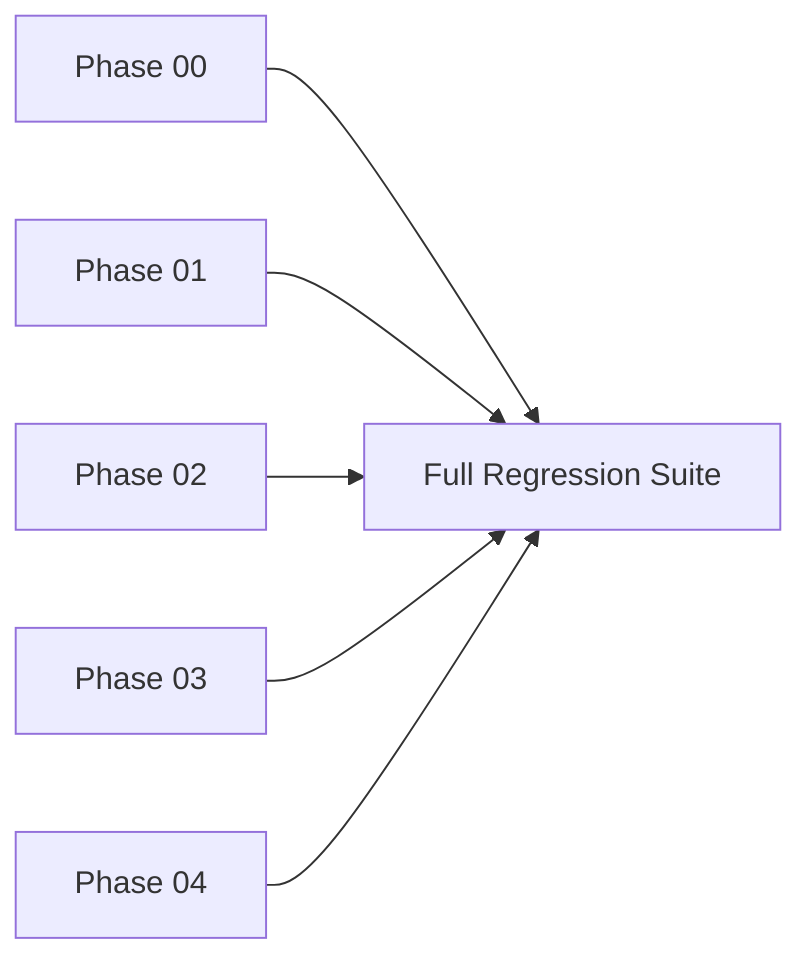

---

# 30. Implementation Plan

## Step 1 — Review Existing Phase Contracts

Review:

* Phase 00 foundation.
* Phase 01 database architecture.
* Phase 02 authorization.
* Phase 03 analysis session contract.

---

## Step 2 — Define Processing Input Boundary

Confirm:

* Session eligibility.
* Trusted audio reference.
* Ownership context.
* Storage access.

---

## Step 3 — Implement Audio Loading

Implement controlled loading using trusted references.

---

## Step 4 — Implement Decode and Format Validation

Confirm the audio can be decoded and processed.

---

## Step 5 — Implement Audio Property Extraction

Retrieve approved processing properties.

---

## Step 6 — Implement Standardization

Implement:

* Channel handling.
* Sample-rate handling.
* Approved normalization.

---

## Step 7 — Implement Quality Validation

Validate:

* Usable audio.
* Silence requirements.
* Duration requirements.

---

## Step 8 — Implement Segmentation

Generate processing units where required.

---

## Step 9 — Generate Processed Output

Prepare standardized audio for downstream AI consumption.

---

## Step 10 — Persist Processing Metadata

Store approved metadata and output references.

---

## Step 11 — Update Lifecycle Status

Mark processing as:

```text
ReadyForAIDetection
```

only after all required processing steps succeed.

---

## Step 12 — Add Tests

Test normal, invalid, boundary, and failure cases.

---

## Step 13 — Security Validation

Verify:

* Storage isolation.
* Trusted path usage.
* Resource limits.
* Error safety.

---

## Step 14 — Regression Testing

Verify all previous phases.

---

# 31. Expected Repository Changes

Future implementation may modify categories such as:

```text
Backend
│
├── Audio processing pipeline
├── Audio loading utilities
├── Audio validation
├── Audio standardization
├── Segmentation utilities
├── Processing services
└── Tests

Database
│
├── Processing metadata
├── Session state updates
└── Schema changes only where approved

Storage
│
├── Processed audio handling
└── Cleanup management

Configuration
│
├── Processing parameters
└── Resource limits

Tests
│
├── Unit tests
├── Pipeline tests
├── Failure tests
└── Regression tests
```

Exact filenames must follow the existing repository architecture.

---

# 32. Acceptance Criteria

## Audio Loading

* [ ] Audio is retrieved using trusted references.
* [ ] Invalid or missing sessions are handled safely.
* [ ] Unreadable audio is rejected safely.

## Validation

* [ ] Audio properties are validated.
* [ ] Unsupported processing formats are rejected.
* [ ] Client-provided filenames do not bypass validation.

## Standardization

* [ ] Channel processing follows approved configuration.
* [ ] Sample-rate handling follows approved configuration.
* [ ] Normalization follows approved configuration.
* [ ] Processing transformations are traceable.

## Quality

* [ ] Silence or unusable input is handled correctly.
* [ ] Duration validation is enforced.
* [ ] Invalid audio does not reach AI processing.

## Segmentation

* [ ] Audio is segmented when required.
* [ ] Segment ordering is preserved.
* [ ] Segment ownership is preserved.

## Output

* [ ] Processed audio is available through approved storage.
* [ ] Output references are correctly associated.
* [ ] Processing metadata is persisted.
* [ ] Successful processing reaches `ReadyForAIDetection`.

## Security

* [ ] User-controlled paths are not trusted.
* [ ] Tenant boundaries remain preserved.
* [ ] Uploaded audio is never executed.
* [ ] Internal infrastructure details are not exposed.
* [ ] Resource controls are enforced.

## Testing

* [ ] Audio loading tests pass.
* [ ] Validation tests pass.
* [ ] Standardization tests pass.
* [ ] Quality tests pass.
* [ ] Segmentation tests pass.
* [ ] Failure tests pass.
* [ ] Regression tests pass.

---

# 33. Validation Procedure

## Step 1

Create a valid analysis session through Phase 03.

## Step 2

Associate valid audio with the session.

## Step 3

Start Phase 04 processing.

## Step 4

Verify audio loading.

## Step 5

Verify decode and property validation.

## Step 6

Verify standardization.

## Step 7

Verify quality and duration checks.

## Step 8

Verify segmentation where required.

## Step 9

Verify processed output metadata.

## Step 10

Verify the session reaches:

```text
ReadyForAIDetection
```

## Step 11

Test failure cases.

## Step 12

Verify safe error handling.

## Step 13

Run automated tests.

## Step 14

Run regression tests for all previous phases.

---

# 34. Expected Deliverables

After Phase 04 implementation, the project should contain:

* Controlled audio loading.
* Audio decoding validation.
* Audio property extraction.
* Format validation.
* Channel processing.
* Sample-rate standardization.
* Approved audio normalization.
* Silence and quality validation.
* Duration validation.
* Segmentation where required.
* Processed audio output.
* Processing metadata.
* Processing lifecycle tracking.
* Safe failure handling.
* Automated tests.

---

# 35. Out of Scope

The following features are explicitly outside Phase 04.

## AI Detection

* AI model loading.
* Model initialization.
* Feature extraction for AI inference.
* Neural network inference.
* Deepfake detection.
* Voice cloning detection.
* Synthetic speech classification.
* Confidence calculation.

## Risk Analysis

* Risk Engine.
* Risk scoring.
* Threat scoring.
* Risk aggregation.

## Prevention

* Policy Engine.
* Automated blocking.
* Automated mitigation.
* Prevention decisions.

## Alerts

* Alert generation.
* Notifications.
* Escalation.
* Investigation workflows.

## Real-Time

* WebSockets.
* Live processing events.
* Real-time detection streams.

## AI Assistant

* Security Copilot.
* LangChain workflows.
* LangGraph workflows.
* Conversational investigation.

## Advanced Frontend

* Detection dashboard.
* Risk visualization.
* Alert center.
* Investigation workspace.

## Infrastructure

* Production deployment.
* Production scaling.
* Advanced monitoring infrastructure.

---

# 36. Dependencies

## Depends On

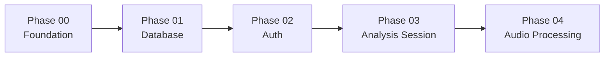

---

## Enables

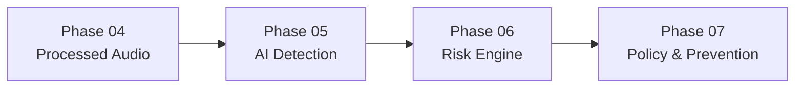

---

# 37. Risks and Design Considerations

## 37.1 Malformed Audio

**Risk:** Uploaded audio cannot be decoded.

**Mitigation:** Fail safely during loading.

---

## 37.2 Resource Exhaustion

**Risk:** Large or complex audio consumes excessive resources.

**Mitigation:** Enforce approved resource limits.

---

## 37.3 Inconsistent Input

**Risk:** Different sample rates and channel configurations create inconsistent downstream input.

**Mitigation:** Standardize according to model requirements.

---

## 37.4 Data Ownership

**Risk:** Processed output becomes disconnected from its original analysis session.

**Mitigation:** Preserve session and tenant associations throughout the pipeline.

---

## 37.5 Scope Creep

**Risk:** AI detection is accidentally implemented during preprocessing.

**Mitigation:** Phase 04 ends at `ReadyForAIDetection`.

---

# 38. Phase Completion Checklist

## Required for Phase Completion

* [ ] Trusted input retrieval is implemented.
* [ ] Audio loading is functional.
* [ ] Audio decoding is validated.
* [ ] Processing format validation is functional.
* [ ] Standardization is functional.
* [ ] Quality validation is functional.
* [ ] Duration validation is functional.
* [ ] Segmentation is functional where required.
* [ ] Processed output is generated.
* [ ] Metadata is recorded.
* [ ] Session reaches `ReadyForAIDetection`.
* [ ] Security boundaries are tested.
* [ ] Automated tests pass.
* [ ] Previous phase regression tests pass.

---

## Recommended Before Moving to Phase 05

* [ ] Target model input requirements are confirmed.
* [ ] Standardization parameters are configuration-driven.
* [ ] Processing metadata is reproducible.
* [ ] Failure states are documented.
* [ ] Performance behavior has been tested.

---

## Explicitly Not Required Yet

* [ ] AI model loading.
* [ ] AI inference.
* [ ] Voice cloning detection.
* [ ] Deepfake classification.
* [ ] Confidence scoring.
* [ ] Risk scoring.
* [ ] Policy decisions.
* [ ] Alerts.
* [ ] WebSockets.
* [ ] Security Copilot.
* [ ] Advanced dashboard.

---

# 39. AI Implementation Guardrails

When Phase 04 is implemented by an AI coding assistant, the following rules are mandatory.

1. Implement only Phase 04 scope.
2. Preserve all functionality from Phase 00.
3. Preserve all database behavior from Phase 01.
4. Preserve authentication and authorization from Phase 02.
5. Preserve analysis session behavior from Phase 03.
6. Accept audio only through trusted analysis-session context.
7. Do not accept arbitrary client filesystem paths.
8. Do not trust client-provided filenames.
9. Treat all uploaded audio as untrusted input.
10. Validate audio through actual processing or decoding mechanisms.
11. Do not rely exclusively on file extensions.
12. Preserve tenant and organization boundaries.
13. Record processing status safely.
14. Record processing metadata according to approved schema.
15. Do not introduce undocumented storage providers.
16. Do not hardcode undocumented production limits.
17. Make processing parameters configurable where architecture requires configuration.
18. Handle malformed audio safely.
19. Enforce configured resource limits.
20. Do not expose internal filesystem paths.
21. Do not expose stack traces to clients.
22. Do not expose credentials.
23. Do not execute uploaded audio.
24. Do not load AI detection models.
25. Do not perform feature extraction for AI inference unless explicitly defined as preprocessing output preparation.
26. Do not perform neural network inference.
27. Do not detect voice cloning.
28. Do not classify deepfake audio.
29. Do not calculate confidence scores.
30. Do not calculate risk scores.
31. Do not implement the Risk Engine.
32. Do not implement the Policy Engine.
33. Do not generate alerts.
34. Do not implement WebSockets.
35. Do not implement real-time broadcasting.
36. Do not implement Security Copilot features.
37. Do not implement LangChain workflows.
38. Do not implement LangGraph workflows.
39. Add automated tests for every implemented processing stage.
40. Add failure tests.
41. Run regression tests before phase completion.
42. Report architectural ambiguity instead of silently inventing behavior.
43. Stop implementation when processed audio reaches `ReadyForAIDetection`.

---

# Final Phase Boundary

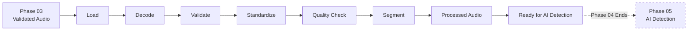

> **Phase 04 is complete only when validated audio can be transformed into a standardized, traceable, processing-ready representation and safely reach the `ReadyForAIDetection` boundary without performing AI inference, voice cloning detection, confidence scoring, or risk analysis.**
