# PHASE 05 — AI DETECTION ENGINE

## 📋 Phase Information

| Category | Details |
|---|---|
| **Project** | AI-Powered Voice Cloning Detection & Prevention System |
| **Phase** | 06 |
| **Phase Name** | Risk Engine |
| **Document Type** | Implementation Specification |
| **Status** | 🟡 Planned |
| **Dependencies** | Phase 03 → Phase 05 |
| **Primary Output** | Persisted Risk Assessment Result |
| **Next Phase** | Phase 07 — Prevention & Response Engine |

---

# TABLE OF CONTENTS

1. [Phase Objective](#1-phase-objective)
2. [Business and Technical Purpose](#2-business-and-technical-purpose)
3. [Phase Boundary](#3-phase-boundary)
4. [Mandatory Pre-Implementation Inspection](#4-mandatory-pre-implementation-inspection)
5. [System Context](#5-system-context)
6. [Phase 05 High-Level Architecture](#6-phase-05-high-level-architecture)
7. [Complete AI Detection Pipeline](#7-complete-ai-detection-pipeline)
8. [Input Contract](#8-input-contract)
9. [Input Eligibility Rules](#9-input-eligibility-rules)
10. [Model Selection Contract](#10-model-selection-contract)
11. [Model Architecture Boundary](#11-model-architecture-boundary)
12. [Model Lifecycle Management](#12-model-lifecycle-management)
13. [Model Manager](#13-model-manager)
14. [Model Loading](#14-model-loading)
15. [Runtime Device Management](#15-runtime-device-management)
16. [Feature Extraction](#16-feature-extraction)
17. [Model Input Preparation](#17-model-input-preparation)
18. [Inference Engine](#18-inference-engine)
19. [Raw Model Output Validation](#19-raw-model-output-validation)
20. [Output Interpretation](#20-output-interpretation)
21. [Detection Labels](#21-detection-labels)
22. [Confidence Handling](#22-confidence-handling)
23. [Segment-Level Detection](#23-segment-level-detection)
24. [Segment Aggregation](#24-segment-aggregation)
25. [Final Detection Result](#25-final-detection-result)
26. [Database Interaction Contract](#26-database-interaction-contract)
27. [Persistence Requirements](#27-persistence-requirements)
28. [Status Lifecycle](#28-status-lifecycle)
29. [Error Handling](#29-error-handling)
30. [Failure Matrix](#30-failure-matrix)
31. [Retry Rules](#31-retry-rules)
32. [Security Requirements](#32-security-requirements)
33. [Performance and Resource Controls](#33-performance-and-resource-controls)
34. [Observability](#34-observability)
35. [Model Versioning](#35-model-versioning)
36. [Explainability and Evidence](#36-explainability-and-evidence)
37. [API Integration Boundary](#37-api-integration-boundary)
38. [Frontend Boundary](#38-frontend-boundary)
39. [Repository Architecture Requirements](#39-repository-architecture-requirements)
40. [Detailed Implementation Order](#40-detailed-implementation-order)
41. [Testing Strategy](#41-testing-strategy)
42. [Test Matrix](#42-test-matrix)
43. [Acceptance Criteria](#43-acceptance-criteria)
44. [Validation Procedure](#44-validation-procedure)
45. [Explicit Out-of-Scope Features](#45-explicit-out-of-scope-features)
46. [Phase Completion Checklist](#46-phase-completion-checklist)
47. [Hard Stop Conditions](#47-hard-stop-conditions)
48. [AI Implementation Guardrails](#48-ai-implementation-guardrails)
49. [Final Phase Boundary](#49-final-phase-boundary)

---

# 1. Phase Objective

The objective of Phase 05 is to implement the system's authoritative AI inference layer responsible for analyzing standardized audio prepared by Phase 04 and producing a structured AI detection result.

Phase 05 transforms:

```text
Processed Audio
        ↓
AI-Compatible Input
        ↓
Feature / Representation Preparation
        ↓
Model Inference
        ↓
Raw Model Output
        ↓
Output Validation
        ↓
Detection Interpretation
        ↓
Segment Aggregation
        ↓
Final Detection Result
        ↓
Persisted AI Result
```

Phase 05 is the first phase responsible for making an AI-based determination about whether the analyzed audio is consistent with the classes supported by the approved detection model.

---

# 2. Business and Technical Purpose

The project requires a mechanism to detect potentially AI-generated, synthetic, cloned, or authentic voice content according to the approved AI model.

Phase 05 provides the technical intelligence layer.

The phase must answer:

* Was the AI model successfully loaded?
* Which model version analyzed the audio?
* Was inference performed successfully?
* What result did the model produce?
* Was the raw output structurally valid?
* How was the raw output interpreted?
* Were multiple audio segments analyzed?
* How were segment results handled?
* What final AI detection result was produced?
* Can the result be traced to the analysis session and model version?

Phase 05 must **not** determine business risk or prevention action.

---

# 3. Phase Boundary

## Phase 05 Input

Phase 05 begins only after Phase 04 has completed successfully.

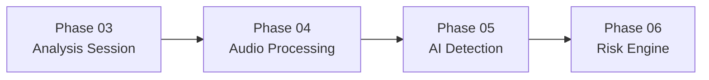

---

## Phase 05 Internal Boundary

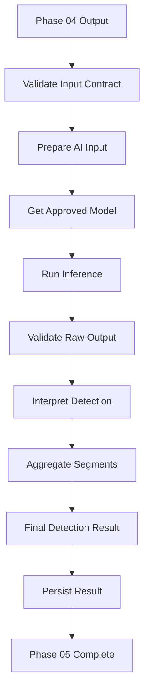

---

## Phase 05 Ends Here

```text
Persisted AI Detection Result
```

Immediately after this boundary:

```text
Phase 06 begins
↓
Risk Analysis
```

Phase 05 must not implement Phase 06 logic.

---

# 4. Mandatory Pre-Implementation Inspection

Before modifying code, the AI agent MUST perform an inspection.

## Mandatory Documents

```text
SRS.md
TECH_STACK.md
ARCHITECTURE.md
DATABASE.md
AI_MODEL.md
API.md
SECURITY.md

Phases/
├── PHASE_00_*.md
├── PHASE_01_*.md
├── PHASE_02_*.md
├── PHASE_03_*.md
└── PHASE_04_AUDIO_PROCESSING_PIPELINE.md
```

---

## Mandatory Repository Inspection

The AI agent MUST inspect:

```text
Project Root
│
├── Backend
├── Application Entry Point
├── Database Models
├── Database Migrations
├── Existing Services
├── Audio Processing Modules
├── Configuration
├── Authentication
├── API Routes
├── Tests
├── Environment Configuration
└── Existing AI-related Code
```

The agent MUST determine:

* Existing programming language.
* Existing framework.
* Existing dependency manager.
* Existing ORM.
* Existing service architecture.
* Existing configuration pattern.
* Existing dependency injection pattern, if any.
* Existing logging pattern.
* Existing testing framework.
* Existing exception pattern.
* Existing database transaction pattern.

---

# 5. System Context

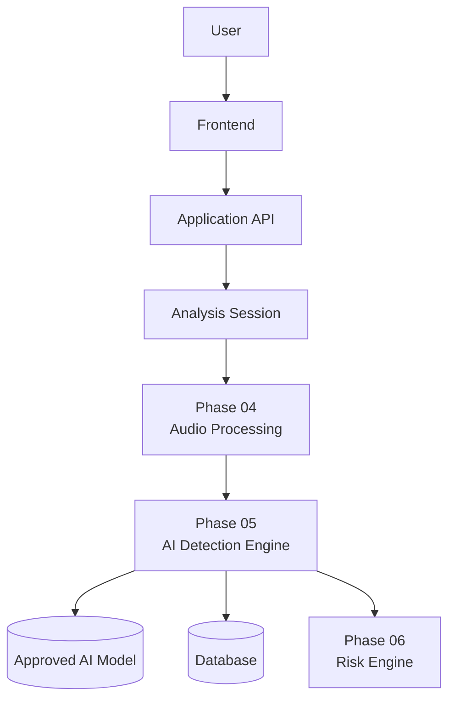

The arrow from Phase 05 to Phase 06 represents an available downstream result.

It does **not** authorize implementation of Phase 06.

---

# 6. Phase 05 High-Level Architecture

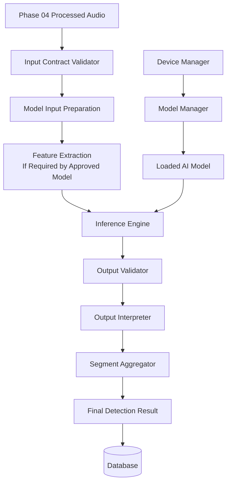

---

# 7. Complete AI Detection Pipeline

The pipeline must execute in deterministic order.

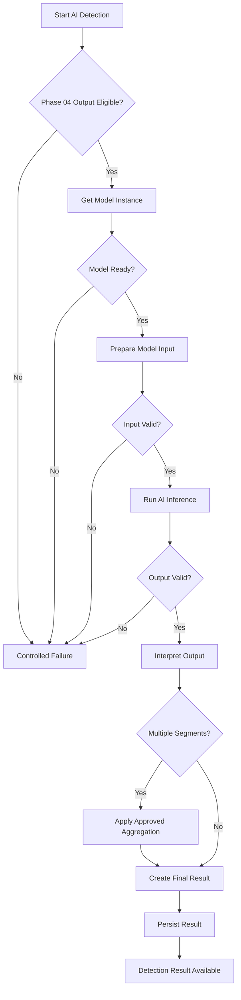

---

# 8. Input Contract

Phase 05 must accept only processing-ready audio produced by Phase 04.

The exact application schema must follow existing models.

Conceptually, the AI detection engine requires:

| Field / Concept           | Purpose                             |
| ------------------------- | ----------------------------------- |
| Analysis Session ID       | Identify parent analysis            |
| Processed Audio Reference | Access standardized audio           |
| Processing Status         | Confirm eligibility                 |
| Audio Metadata            | Validate AI compatibility           |
| Segment Information       | Support multi-segment inference     |
| Organization Context      | Preserve tenant isolation           |
| User Context              | Preserve ownership and traceability |

Conceptual example only:

```json
{
  "analysis_session_id": "approved-session-id",
  "processed_audio_reference": "trusted-server-side-reference",
  "processing_status": "READY_FOR_AI_DETECTION",
  "audio_metadata": {},
  "segments": []
}
```

This example is not permission to create a new API contract.

---

# 9. Input Eligibility Rules

AI inference MUST NOT begin unless all mandatory eligibility requirements are satisfied.

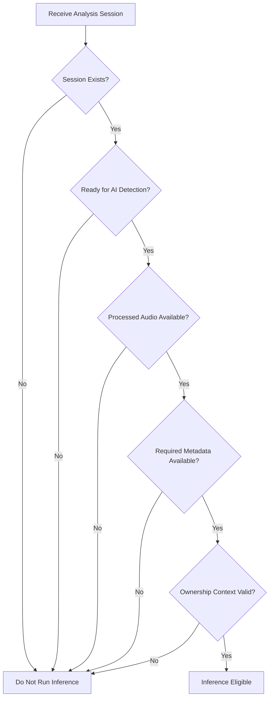

## Mandatory Rule

```text
IF processing_status != READY_FOR_AI_DETECTION

THEN:

DO NOT LOAD INPUT
DO NOT EXTRACT FEATURES
DO NOT RUN INFERENCE
DO NOT CREATE A DETECTION RESULT
```

---

# 10. Model Selection Contract

The AI agent must not randomly select a model.

The decision order is mandatory.

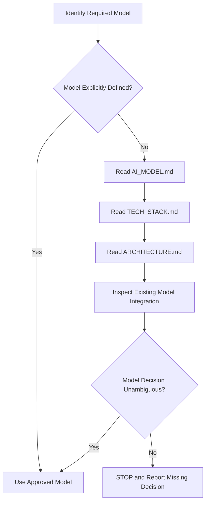

---

## Prohibited Model Behavior

The AI agent MUST NOT:

* Search for and select a random model.
* Replace the approved model.
* Use a different model because it is easier to integrate.
* Use a larger model because it appears more accurate.
* Use a smaller model because it is faster.
* Add multiple models unless architecture explicitly requires them.
* Train a new model unless explicitly required.
* Fine-tune a model unless explicitly required.
* Change the model input pipeline without checking model requirements.

---

# 11. Model Architecture Boundary

Phase 05 must respect the approved AI model architecture.

Possible model types may include:

```text
Binary classifier
Multi-class classifier
Embedding-based detector
Spectrogram-based model
Raw waveform model
Transformer-based model
CNN-based model
Hybrid architecture
```

However:

> The implementation MUST use the architecture actually approved by project documentation.

Do not implement multiple possible approaches "just in case."

---

# 12. Model Lifecycle Management

The model lifecycle must be controlled.

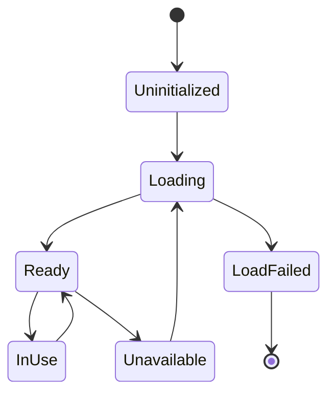

The implementation must define how the approved model is:

* Located.
* Loaded.
* Validated.
* Stored in application memory.
* Reused.
* Released if architecture requires release.

---

# 13. Model Manager

The Model Manager is responsible for model lifecycle ownership.

Conceptual responsibilities:

| Responsibility           | Required                                    |
| ------------------------ | ------------------------------------------- |
| Locate approved model    | Yes                                         |
| Load model               | Yes                                         |
| Validate successful load | Yes                                         |
| Track model state        | Yes                                         |
| Provide model instance   | Yes                                         |
| Track version            | Yes                                         |
| Reload model per request | No, unless architecture explicitly requires |
| Perform risk scoring     | No                                          |
| Perform policy decisions | No                                          |

The Model Manager should not contain API-specific business logic.

---

# 14. Model Loading

The model must be loaded using the approved runtime and dependency stack.

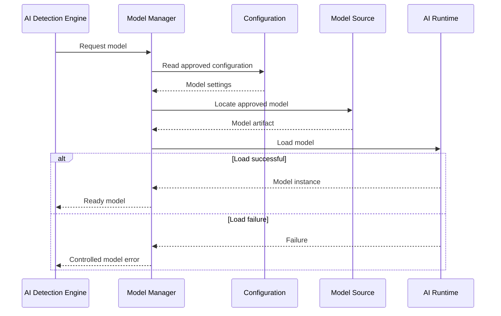

---

## Mandatory Model Loading Rules

* Do not download random models at runtime.
* Do not silently replace missing model artifacts.
* Do not fall back to a different model without approval.
* Do not mark the engine ready before model validation succeeds.
* Do not reload the model for every request unless architecture explicitly requires this.
* Record the approved model identifier and version.

---

# 15. Runtime Device Management

The implementation must use centralized device selection.

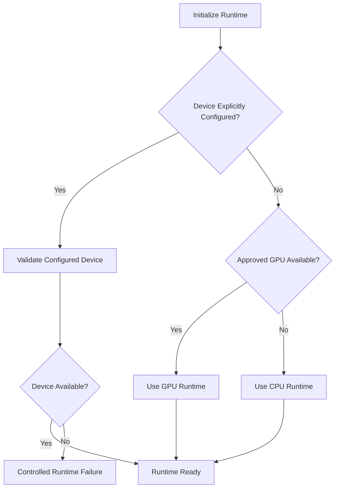

---

## Device Rules

* Device selection must be centralized.
* Individual inference calls must not independently select random devices.
* GPU availability must be verified.
* CPU fallback is permitted only if compatible with approved architecture.
* Device selection must be observable.
* Model tensors and input tensors must use compatible devices.
* Device mismatch errors must be handled safely.

---

# 16. Feature Extraction

Feature extraction depends entirely on the approved model.

Possible representations include:

* Mel spectrograms.
* MFCC.
* Raw waveform.
* Learned embeddings.
* Spectral representations.
* Model-specific tensors.

However:

> Feature extraction MUST NOT be implemented generically based on assumptions.

---

## Feature Extraction Decision

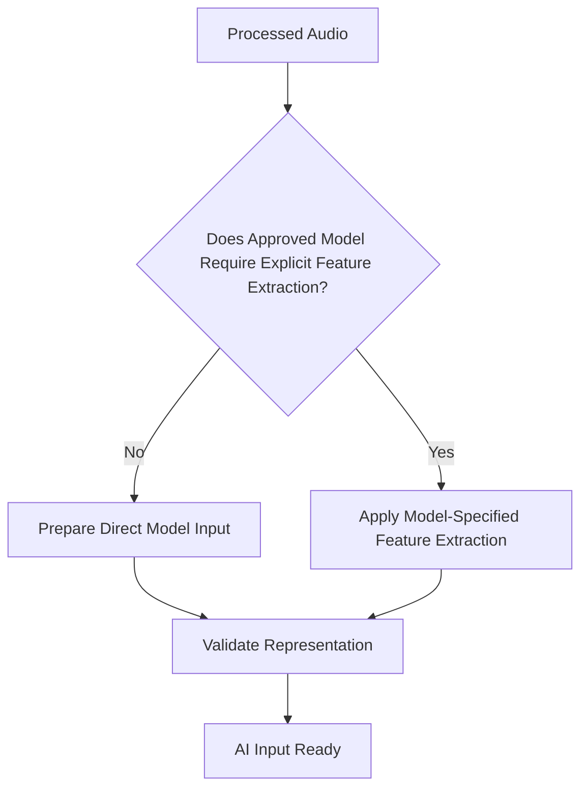

---

## Feature Extraction Rules

The implementation MUST:

* Follow the exact model input specification.
* Use required sample rate.
* Use required channel configuration.
* Use required tensor dimensions.
* Use required normalization.
* Validate generated representation.
* Avoid duplicate preprocessing already performed by Phase 04.

The implementation MUST NOT:

* Apply MFCC and Mel Spectrogram together unless required.
* Add arbitrary audio augmentations.
* Randomly crop input.
* Randomly pad input.
* Normalize twice without model specification.
* Change sample rate without understanding Phase 04 output.

---

# 17. Model Input Preparation

Before inference, the AI engine must prepare a valid model-compatible input.

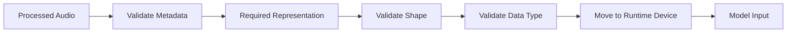

The engine must validate:

* Input exists.
* Input is readable.
* Required representation exists.
* Tensor dimensions are valid.
* Data type is compatible.
* Device placement is compatible.

---

# 18. Inference Engine

The Inference Engine is responsible only for model execution.

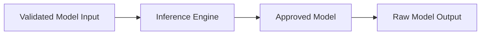

---

## Inference Engine Responsibilities

| Responsibility                | Allowed |
| ----------------------------- | ------- |
| Receive validated model input | Yes     |
| Execute model                 | Yes     |
| Return raw output             | Yes     |
| Validate raw output           | Yes     |
| Generate business risk        | No      |
| Block user                    | No      |
| Generate alert                | No      |
| Make policy decision          | No      |

---

# 19. Raw Model Output Validation

Raw model output must never be trusted automatically.

The system must validate:

* Output exists.
* Output type is expected.
* Output dimensions are expected.
* Output values are numerically valid.
* No NaN values exist where prohibited.
* No invalid infinite values exist.
* Output structure matches approved model expectations.

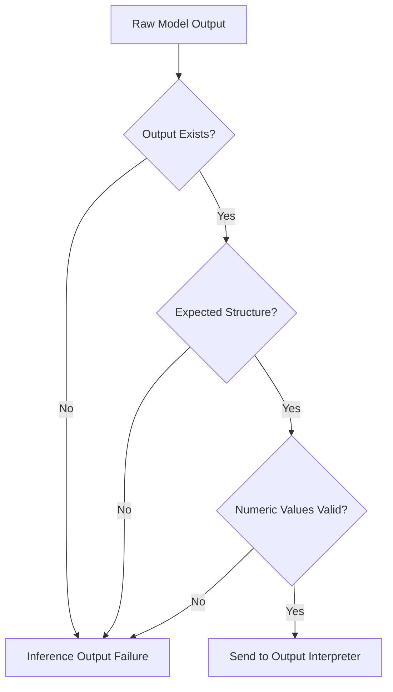

---

# 20. Output Interpretation

Raw model output is not automatically a final user-facing result.

Output interpretation must follow the approved model contract.

```text
Raw Model Output
        ↓
Model-Specific Interpretation
        ↓
Approved Score Representation
        ↓
Detection Label Mapping
        ↓
Segment Detection Result
```

The Output Interpreter must not invent:

* Thresholds.
* Labels.
* Probability conversions.
* Calibration logic.

If required interpretation logic is missing from the approved model documentation:

```text
STOP IMPLEMENTATION
REPORT THE MISSING MODEL OUTPUT CONTRACT
```

---

# 21. Detection Labels

Detection labels must originate from approved model requirements.

Conceptual examples:

```text
AUTHENTIC
SYNTHETIC
CLONED
SUSPICIOUS
INCONCLUSIVE
```

These labels are examples only.

The AI agent MUST NOT create database enums or API responses based solely on these examples.

The final label contract must follow:

```text
AI_MODEL.md
+
SRS.md
+
DATABASE.md
+
Existing Repository Schema
```

---

# 22. Confidence Handling

Confidence represents model output interpretation.

Confidence is NOT:

* Business risk.
* Threat severity.
* Fraud probability.
* User trust score.
* Policy score.

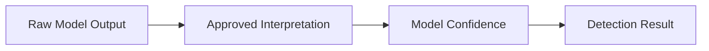

---

## Mandatory Confidence Rules

The AI agent MUST NOT:

* Invent confidence thresholds.
* Convert logits to probabilities without model requirements.
* Apply softmax or sigmoid automatically.
* Apply calibration without approved configuration.
* Treat confidence as risk.
* Use confidence directly for blocking.

---

# 23. Segment-Level Detection

Phase 04 may provide multiple audio segments.

Each segment must be treated according to the approved model and aggregation contract.

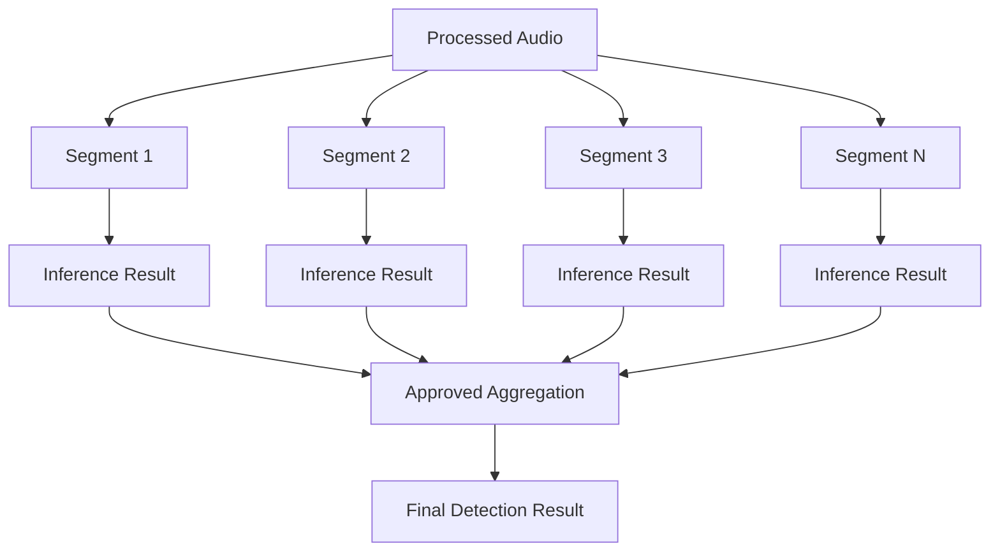

---

# 24. Segment Aggregation

Segment aggregation is a critical decision.

The AI agent MUST NOT automatically:

* Average scores.
* Select maximum probability.
* Select minimum probability.
* Use majority voting.
* Use weighted averaging.

unless explicitly approved.

---

## Aggregation Decision Contract

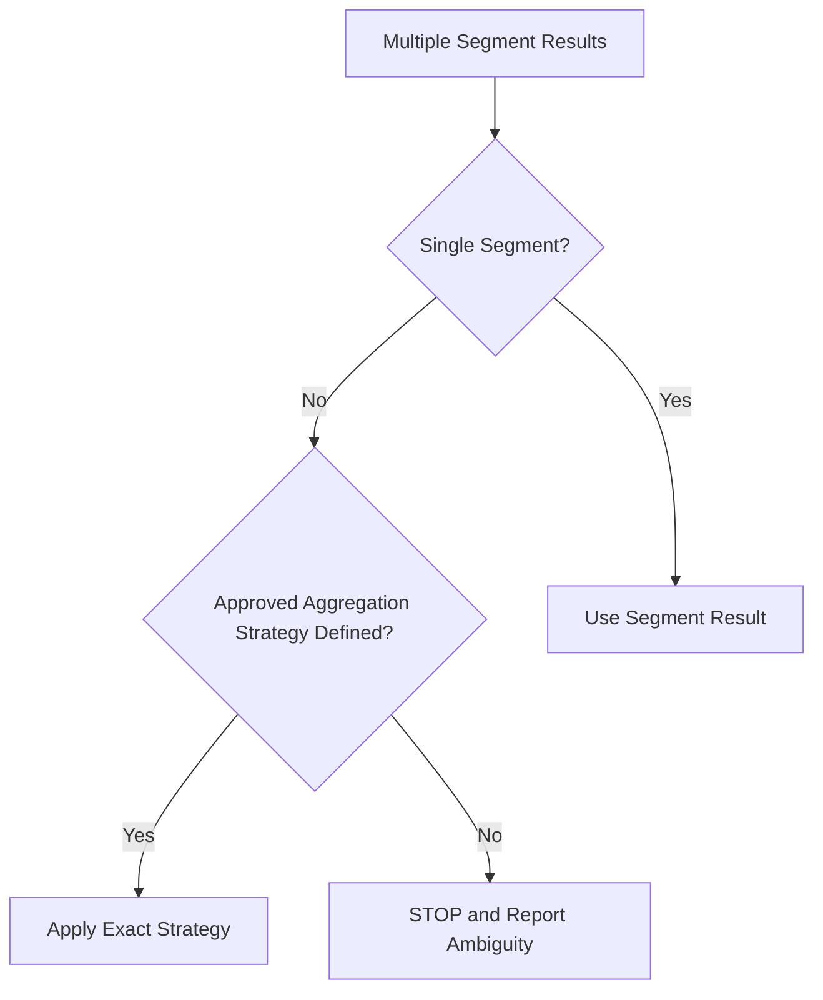

---

# 25. Final Detection Result

A successful Phase 05 result should conceptually include:

| Information             | Purpose                     |
| ----------------------- | --------------------------- |
| Analysis Session        | Parent analysis             |
| Model Identifier        | Traceability                |
| Model Version           | Reproducibility             |
| Detection Label         | AI determination            |
| Model Confidence        | Model output interpretation |
| Segment Information     | Multi-part traceability     |
| Aggregation Information | Reproducibility             |
| Inference Status        | Lifecycle tracking          |
| Timestamp               | Auditability                |

Conceptual structure:

```json
{
  "analysis_session_id": "approved-session-id",
  "model_identifier": "approved-model",
  "model_version": "approved-version",
  "detection_label": "approved-label",
  "confidence": "approved-model-confidence",
  "inference_status": "completed"
}
```

This example must not be used to invent database or API fields.

---

# 26. Database Interaction Contract

Before modifying database code:

```text
READ DATABASE.md
↓
INSPECT EXISTING MODELS
↓
CHECK EXISTING MIGRATIONS
↓
CHECK EXISTING PHASE CONTRACTS
```

---

## Prohibited Database Actions

The AI agent MUST NOT:

* Delete existing tables.
* Rename existing tables.
* Rename existing columns.
* Change existing primary keys.
* Remove tenant relationships.
* Remove foreign keys.
* Create duplicate detection tables.
* Store duplicate session references.
* Add random enums.

---

## Database Flow

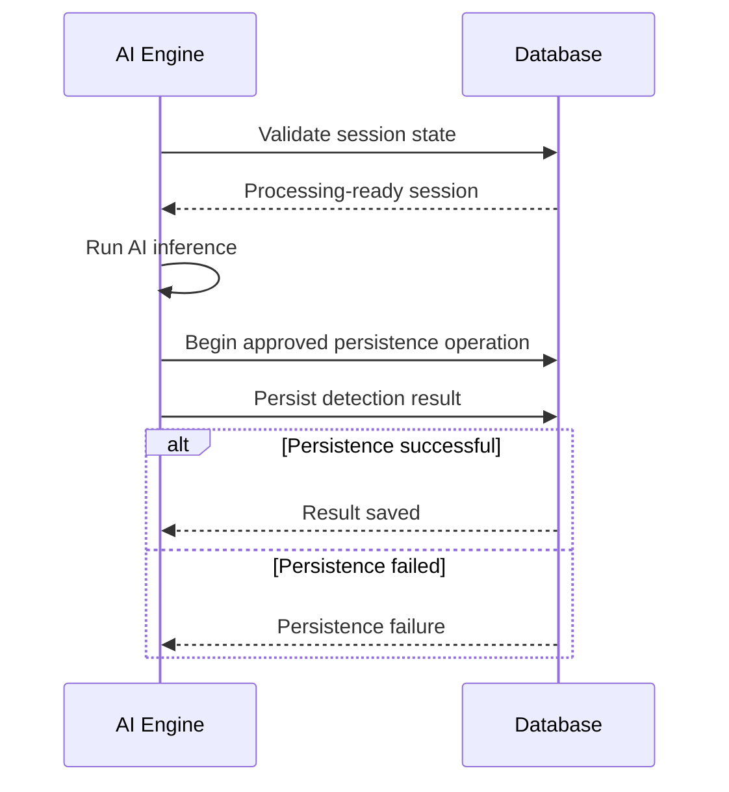

---

# 27. Persistence Requirements

The detection result must be persisted according to the approved database architecture.

Persistence must maintain:

* Session relationship.
* Organization relationship where applicable.
* Model traceability.
* Result traceability.
* Status integrity.

The persistence layer must use the application's existing transaction conventions.

---

# 28. Status Lifecycle

The exact values must follow the existing project schema.

Conceptual lifecycle:

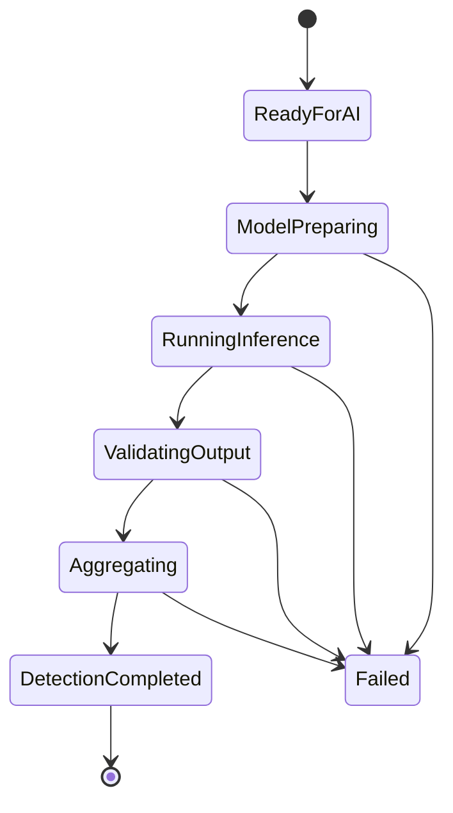

Do not create these exact statuses unless approved by the existing schema.

---

# 29. Error Handling

All failures must be categorized safely.

The client must receive:

* A safe error category.
* A safe status.
* A request/session correlation where architecture supports it.

The client must NOT receive:

* Python stack traces.
* Internal model paths.
* Environment variables.
* Database connection details.
* GPU internals unless safe and approved.
* Private server paths.

---

# 30. Failure Matrix

| Stage              | Failure                 | Required Action          | Retry Policy              | Final Outcome |
| ------------------ | ----------------------- | ------------------------ | ------------------------- | ------------- |
| Session Validation | Session missing         | Stop                     | No                        | Rejected      |
| Input Validation   | Invalid Phase 04 state  | Stop                     | No                        | Rejected      |
| Audio Access       | Processed audio missing | Stop                     | Controlled                | Failed        |
| Model Lookup       | Artifact unavailable    | Stop                     | Controlled                | Failed        |
| Model Load         | Runtime load failure    | Stop                     | Controlled                | Failed        |
| Device Setup       | Device unavailable      | Follow approved fallback | Controlled                | Continue/Fail |
| Input Preparation  | Invalid shape/type      | Stop                     | No                        | Failed        |
| Feature Extraction | Processing failure      | Stop                     | Controlled                | Failed        |
| Inference          | Runtime exception       | Stop                     | Controlled                | Failed        |
| Raw Output         | Invalid output          | Stop                     | No                        | Failed        |
| Aggregation        | Strategy unavailable    | Stop                     | No                        | Blocked       |
| Persistence        | Database failure        | Safe failure             | Follow transaction policy | Failed        |

The exact retry policy must not be invented.

---

# 31. Retry Rules

Retries can create duplicate inference and persistence operations.

Therefore:

```text
NO GENERIC AUTOMATIC RETRY LOOP
```

Retry behavior must follow approved architecture.

Before retrying:

* Determine whether inference is idempotent.
* Determine whether persistence can duplicate results.
* Determine whether the failure is transient.
* Follow existing retry conventions.

If no retry policy exists:

```text
FAIL SAFELY
REPORT THE FAILURE
DO NOT CREATE YOUR OWN RETRY ARCHITECTURE
```

---

# 32. Security Requirements

The AI Detection Engine must preserve all existing security boundaries.

## Mandatory Security Controls

| Control          | Requirement                                        |
| ---------------- | -------------------------------------------------- |
| Authentication   | Preserve existing requirements                     |
| Authorization    | Validate session access                            |
| Tenant Isolation | Never cross organization boundaries                |
| Input Trust      | Treat processed references as controlled resources |
| Model Integrity  | Use approved model artifacts                       |
| Error Safety     | Do not expose internals                            |
| Logging          | Avoid sensitive audio content                      |
| Persistence      | Maintain ownership relationships                   |

---

# 33. Performance and Resource Controls

Inference may consume significant CPU, GPU, RAM, and VRAM.

The implementation must not introduce unlimited resource consumption.

Controls may include:

* Approved concurrency limits.
* Model reuse.
* Input duration limits inherited from Phase 04.
* Segment count limits inherited from Phase 04.
* Runtime timeout where architecture supports it.

The AI agent must not invent production values.

---

# 34. Observability

The system should provide safe traceability.

Relevant events may include:

```text
AI detection started
↓
Model resolved
↓
Model ready
↓
Input prepared
↓
Inference started
↓
Inference completed
↓
Output validated
↓
Result persisted
↓
AI detection completed
```

Logs should identify safe technical context without storing unnecessary sensitive audio content.

---

# 35. Model Versioning

Every detection result must remain reproducible.

Conceptually:

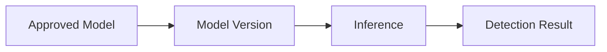

If model version information exists in project architecture, it must be persisted or referenced according to that architecture.

Do not invent semantic version values.

---

# 36. Explainability and Evidence

Phase 05 may provide technical traceability.

Potential evidence categories:

* Model identifier.
* Model version.
* Inference status.
* Segment count.
* Input configuration.
* Output representation metadata.
* Aggregation strategy identifier.

Phase 05 must not fabricate explanations such as:

> "The voice is cloned because of unnatural pitch."

unless the approved model explicitly provides such explainability output.

Never generate fake technical reasoning from a classifier score.

---

# 37. API Integration Boundary

Phase 05 must integrate through the existing API architecture.

Before creating:

* New routes.
* New request schemas.
* New response schemas.
* New controllers.

the AI agent MUST inspect `API.md`.

Do not create duplicate endpoints.

Do not expose raw tensors or raw model internals through public APIs.

---

# 38. Frontend Boundary

Phase 05 may expose an approved detection result through existing API flows.

Phase 05 frontend responsibility is limited to displaying approved AI detection information where architecture already supports it.

Do not implement:

* Full risk dashboards.
* Threat analytics.
* Alert center.
* Prevention controls.
* Security Copilot UI.

---

# 39. Repository Architecture Requirements

The AI Detection Engine should be logically separated.

Conceptual architecture:

```text
AI Detection Layer
│
├── Model Lifecycle
│   ├── Model Manager
│   ├── Model Loader
│   └── Device Management
│
├── Input Processing
│   ├── Input Validation
│   ├── Feature Extraction
│   └── Model Input Preparation
│
├── Inference
│   ├── Inference Engine
│   └── Output Validation
│
├── Interpretation
│   ├── Output Interpreter
│   └── Segment Aggregation
│
├── Persistence
│   └── Detection Result Storage
│
└── Testing
    ├── Unit Tests
    ├── Integration Tests
    └── Failure Tests
```

This is a logical separation.

The AI agent must adapt to the existing repository rather than blindly creating duplicate folders.

---

# 40. Detailed Implementation Order

## STEP 00 — READ EVERYTHING

Read all mandatory documentation.

Do not write code.

---

## STEP 01 — INSPECT THE REPOSITORY

Identify actual architecture.

Do not restructure prematurely.

---

## STEP 02 — VERIFY PHASE 04

Confirm:

```text
Processed Audio Exists
AND
Processing Completed
AND
Ready for AI Detection
```

If Phase 04 is incomplete:

```text
STOP
DO NOT BUILD WORKAROUNDS
DO NOT BYPASS PHASE 04
```

---

## STEP 03 — IDENTIFY APPROVED MODEL

Use:

```text
AI_MODEL.md
TECH_STACK.md
ARCHITECTURE.md
Existing Repository
```

If ambiguous:

```text
STOP AND REPORT
```

---

## STEP 04 — DEFINE MODEL CONTRACT

Confirm:

* Required audio format.
* Sample rate.
* Channels.
* Input representation.
* Input tensor shape.
* Output format.
* Output interpretation.
* Labels.
* Confidence representation.
* Segment policy.

---

## STEP 05 — IMPLEMENT MODEL LIFECYCLE

Implement approved loading and reuse strategy.

---

## STEP 06 — IMPLEMENT DEVICE MANAGEMENT

Centralize device handling.

---

## STEP 07 — IMPLEMENT INPUT VALIDATION

Reject invalid Phase 04 output.

---

## STEP 08 — IMPLEMENT FEATURE / INPUT PREPARATION

Only according to approved model requirements.

---

## STEP 09 — IMPLEMENT INFERENCE

Run model safely.

---

## STEP 10 — VALIDATE RAW OUTPUT

Reject malformed output.

---

## STEP 11 — IMPLEMENT OUTPUT INTERPRETATION

Follow approved output contract exactly.

---

## STEP 12 — IMPLEMENT SEGMENT HANDLING

Follow approved aggregation contract.

---

## STEP 13 — PERSIST RESULT

Use approved database architecture.

---

## STEP 14 — IMPLEMENT SAFE FAILURE HANDLING

No stack traces to users.

---

## STEP 15 — WRITE TESTS

Test every layer.

---

## STEP 16 — RUN TESTS

Fix failures.

---

## STEP 17 — RUN REGRESSION TESTS

Verify Phases 00–04.

---

## STEP 18 — VERIFY BOUNDARY

Confirm no Phase 06 code exists.

---

## STEP 19 — STOP

Phase 05 ends after persisted detection result.

---

# 41. Testing Strategy

Testing is mandatory.

---

## 41.1 Model Loading Tests

Test:

* Approved model loads.
* Missing model fails safely.
* Corrupt model fails safely.
* Invalid model configuration fails safely.
* Model is not unnecessarily reloaded.

---

## 41.2 Device Tests

Test:

* CPU runtime.
* Approved GPU runtime.
* Device mismatch handling.
* Approved fallback behavior.

---

## 41.3 Input Validation Tests

Test:

* Valid Phase 04 output.
* Missing session.
* Incorrect processing status.
* Missing processed audio.
* Invalid metadata.

---

## 41.4 Feature Extraction Tests

Test according to actual model requirements:

* Valid input.
* Invalid input.
* Expected representation.
* Expected shape.
* Invalid shape.
* Invalid numeric data.

---

## 41.5 Inference Tests

Test:

* Valid inference.
* Runtime failure.
* Invalid model input.
* Device failure.
* Controlled inference exception.

---

## 41.6 Output Validation Tests

Test:

* Valid output.
* Missing output.
* Invalid shape.
* NaN output.
* Infinite output.
* Unsupported output structure.

---

## 41.7 Output Interpretation Tests

Test:

* Every approved output category.
* Boundary conditions defined by model contract.
* Invalid output.

Do not invent thresholds purely for tests.

---

## 41.8 Segment Tests

Test:

* Single segment.
* Multiple segments.
* Ordered segments.
* Missing segment.
* Failed segment.
* Aggregation according to approved strategy.

---

## 41.9 Persistence Tests

Test:

* Result saved.
* Correct session association.
* Correct model traceability.
* Transaction failure.
* Duplicate prevention according to architecture.

---

# 42. Test Matrix

| Test Category       | Valid | Invalid | Boundary | Failure |
| ------------------- | ----: | ------: | -------: | ------: |
| Model Loading       |     ✓ |       ✓ |        ✓ |       ✓ |
| Device Management   |     ✓ |       ✓ |        ✓ |       ✓ |
| Input Validation    |     ✓ |       ✓ |        ✓ |       ✓ |
| Feature Preparation |     ✓ |       ✓ |        ✓ |       ✓ |
| Inference           |     ✓ |       ✓ |        ✓ |       ✓ |
| Output Validation   |     ✓ |       ✓ |        ✓ |       ✓ |
| Interpretation      |     ✓ |       ✓ |        ✓ |       ✓ |
| Segmentation        |     ✓ |       ✓ |        ✓ |       ✓ |
| Aggregation         |     ✓ |       ✓ |        ✓ |       ✓ |
| Persistence         |     ✓ |       ✓ |        ✓ |       ✓ |
| Security            |     ✓ |       ✓ |        ✓ |       ✓ |
| Regression          |     ✓ |       ✓ |        ✓ |       ✓ |

---

# 43. Acceptance Criteria

Phase 05 is accepted only when all required conditions are satisfied.

## Model

* [ ] Approved model identified.
* [ ] Model loads successfully.
* [ ] Model failure handled safely.
* [ ] Model reuse follows approved architecture.
* [ ] Model identity is traceable.
* [ ] Model version is traceable.

## Device

* [ ] Device selection is centralized.
* [ ] CPU execution works if supported.
* [ ] GPU execution works if supported.
* [ ] Approved fallback works.
* [ ] Device mismatch is prevented or handled.

## Input

* [ ] Only Phase 04-ready audio reaches inference.
* [ ] Invalid processing states are rejected.
* [ ] Input representation matches model requirements.
* [ ] Tensor dimensions are validated.

## Inference

* [ ] AI inference executes.
* [ ] Runtime failures are handled safely.
* [ ] Raw output is validated.

## Interpretation

* [ ] Output interpretation follows approved model contract.
* [ ] Detection labels are approved.
* [ ] Confidence is not confused with risk.

## Segments

* [ ] Segment processing works.
* [ ] Ordering is preserved.
* [ ] Aggregation follows approved policy.
* [ ] No aggregation strategy is invented.

## Persistence

* [ ] Result persists successfully.
* [ ] Session association is correct.
* [ ] Tenant association is preserved.
* [ ] Model traceability is preserved.

## Security

* [ ] Authorization boundaries remain intact.
* [ ] Internal details are not exposed.
* [ ] Sensitive audio data is not unnecessarily logged.

## Testing

* [ ] Unit tests pass.
* [ ] Integration tests pass.
* [ ] Failure tests pass.
* [ ] Regression tests pass.

---

# 44. Validation Procedure

Perform validation in this exact order.

```mermaid
flowchart TD

    A[Create Valid Analysis Session]

    B[Complete Phase 04 Processing]

    C[Verify READY_FOR_AI_DETECTION]

    D[Initialize AI Engine]

    E[Verify Model Loaded]

    F[Prepare Model Input]

    G[Run Inference]

    H[Validate Output]

    I[Interpret Detection]

    J[Aggregate Segments if Required]

    K[Persist Result]

    L[Verify Database State]

    M[Run Automated Tests]

    N[Run Regression Tests]

    O[Verify No Phase 06 Scope]

    A --> B
    B --> C
    C --> D
    D --> E
    E --> F
    F --> G
    G --> H
    H --> I
    I --> J
    J --> K
    K --> L
    L --> M
    M --> N
    N --> O
```

---

# 45. Explicit Out-of-Scope Features

The following are forbidden in Phase 05.

## Phase 06

```text
❌ Risk Engine
❌ Risk Score
❌ Threat Score
❌ Threat Severity
❌ Fraud Decision
```

---

## Phase 07

```text
❌ Policy Engine
❌ Prevention Logic
❌ Automatic Blocking
❌ Mitigation Actions
```

---

## Phase 08

```text
❌ Alert Engine
❌ Notifications
❌ Escalation
```

---

## Phase 09

```text
❌ WebSockets
❌ Live Detection Streams
❌ Real-Time Broadcasting
```

---

## Phase 10

```text
❌ Security Copilot
❌ LangChain
❌ LangGraph
❌ Conversational Investigation
```

---

## Advanced Frontend

```text
❌ Threat Dashboard
❌ Risk Analytics
❌ Investigation Dashboard
❌ Alert Center
```

---

# 46. Phase Completion Checklist

```text
MODEL
[ ] Approved model confirmed
[ ] Model loads
[ ] Model lifecycle tested
[ ] Version traceability exists

INPUT
[ ] Phase 04 contract enforced
[ ] Invalid input rejected
[ ] Input preparation tested

INFERENCE
[ ] Model inference works
[ ] Runtime failures handled
[ ] Raw output validated

INTERPRETATION
[ ] Output contract implemented
[ ] Labels approved
[ ] Confidence correctly represented

SEGMENTS
[ ] Segment inference works
[ ] Aggregation policy implemented only if approved

PERSISTENCE
[ ] Results saved
[ ] Session relationship correct
[ ] Model traceability saved

TESTING
[ ] Unit tests pass
[ ] Integration tests pass
[ ] Failure tests pass
[ ] Regression tests pass

BOUNDARY
[ ] No Risk Engine
[ ] No Prevention Engine
[ ] No Alerts
[ ] No WebSockets
[ ] No Copilot
```

---

# 47. Hard Stop Conditions

The AI agent MUST stop implementation when any of these conditions occur.

## STOP CONDITION 1 — Model Not Defined

```text
No approved model exists.

ACTION:
STOP
REPORT
DO NOT RANDOMLY SELECT ONE
```

---

## STOP CONDITION 2 — Input Contract Missing

```text
Phase 04 output contract is unclear.

ACTION:
STOP
REPORT
DO NOT CREATE A PARALLEL CONTRACT
```

---

## STOP CONDITION 3 — Output Contract Missing

```text
Model output interpretation is unclear.

ACTION:
STOP
REPORT
DO NOT INVENT LABELS OR THRESHOLDS
```

---

## STOP CONDITION 4 — Aggregation Undefined

```text
Multiple segments exist
AND
No aggregation strategy exists.

ACTION:
STOP
REPORT
DO NOT AVERAGE RANDOMLY
```

---

## STOP CONDITION 5 — Database Conflict

```text
Required persistence conflicts with DATABASE.md.

ACTION:
STOP
REPORT
DO NOT MODIFY SCHEMA BLINDLY
```

---

## STOP CONDITION 6 — Phase Boundary Reached

When this exists:

```text
Processed Audio
        ↓
Validated AI Input
        ↓
Model Inference
        ↓
Validated Output
        ↓
Detection Result
        ↓
Persisted Result
```

Then:

```text
PHASE 05 COMPLETE

STOP IMPLEMENTATION.
```

---

# 48. AI Implementation Guardrails

The following instructions are mandatory.

1. Read all required documents before implementation.
2. Inspect the repository before creating modules.
3. Reuse existing architecture where possible.
4. Do not rewrite unrelated code.
5. Do not break Phases 00–04.
6. Do not bypass Phase 04.
7. Accept only eligible processed audio.
8. Validate processing status.
9. Do not use arbitrary file paths.
10. Use trusted storage references.
11. Identify the approved AI model.
12. Do not randomly select a model.
13. Do not replace the approved model.
14. Do not download an unapproved model at runtime.
15. Centralize model lifecycle management.
16. Do not reload models unnecessarily.
17. Centralize device management.
18. Follow exact model input requirements.
19. Do not duplicate preprocessing.
20. Do not invent feature extraction.
21. Do not invent tensor shapes.
22. Validate model input.
23. Validate model output.
24. Reject NaN or invalid numeric output where model contract prohibits it.
25. Do not invent label mappings.
26. Do not invent confidence thresholds.
27. Do not confuse confidence with risk.
28. Do not invent calibration.
29. Process segments according to the approved contract.
30. Do not invent aggregation logic.
31. Preserve segment ordering.
32. Preserve session association.
33. Preserve organization boundaries.
34. Preserve model traceability.
35. Follow existing database conventions.
36. Do not create duplicate tables.
37. Do not modify unrelated migrations.
38. Use safe transactions.
39. Do not expose internal errors.
40. Do not expose model paths.
41. Do not expose secrets.
42. Do not log unnecessary audio content.
43. Add unit tests.
44. Add integration tests.
45. Add failure tests.
46. Run regression tests.
47. Do not implement Risk Engine.
48. Do not implement Risk Scoring.
49. Do not implement Prevention Logic.
50. Do not implement Blocking.
51. Do not implement Alerts.
52. Do not implement Notifications.
53. Do not implement WebSockets.
54. Do not implement Security Copilot.
55. Do not implement LangChain.
56. Do not implement LangGraph.
57. Do not implement Phase 06.
58. Stop when persisted detection result exists.

---

# 49. Final Phase Boundary

```mermaid
flowchart LR

    A[Phase 04<br/>Processed Audio]

    B[Validate Input]

    C[Prepare Model Input]

    D[Load / Reuse Approved Model]

    E[AI Inference]

    F[Validate Output]

    G[Interpret Detection]

    H[Aggregate Segments]

    I[Final Detection Result]

    J[Persist Result]

    K[Phase 05 Complete]

    L[Phase 06<br/>Risk Engine]

    A --> B
    B --> C
    C --> D
    D --> E
    E --> F
    F --> G
    G --> H
    H --> I
    I --> J
    J --> K

    K -. STOP PHASE 05 HERE .-> L

    style L stroke-dasharray: 5 5
```

---

# FINAL IMPLEMENTATION CONTRACT

Phase 05 is complete only when:

```text
A valid Phase 04 processed audio output
        ↓
is validated against the AI input contract
        ↓
is transformed only according to approved model requirements
        ↓
is processed by the approved AI model
        ↓
produces a structurally valid model output
        ↓
is interpreted according to the approved model contract
        ↓
is aggregated according to an explicitly approved strategy
        ↓
produces a traceable final detection result
        ↓
is safely persisted
```

At this point:

```text
PHASE 05 = COMPLETE
```

The AI agent must stop.

No Risk Engine.

No Threat Score.

No Prevention.

No Blocking.

No Alerts.

No WebSockets.

No Copilot.

No Phase 06 implementation.

---

> **PRIMARY RULE**
>
> When documentation is explicit, follow it exactly.
>
> When documentation is ambiguous, do not invent production behavior.
>
> When Phase 05 produces a persisted AI detection result, stop.
