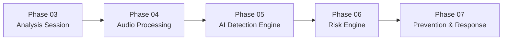
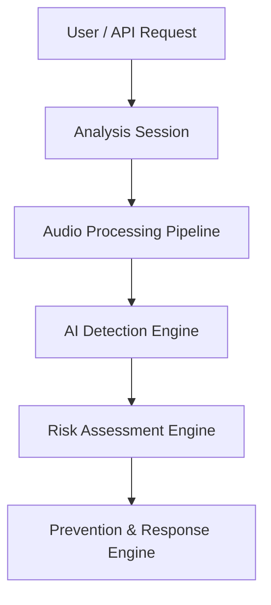
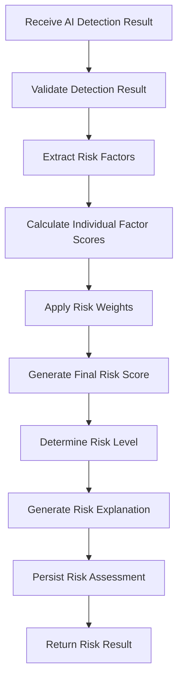
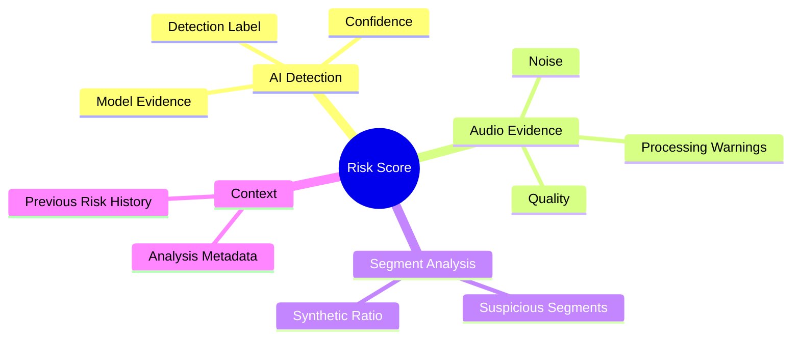
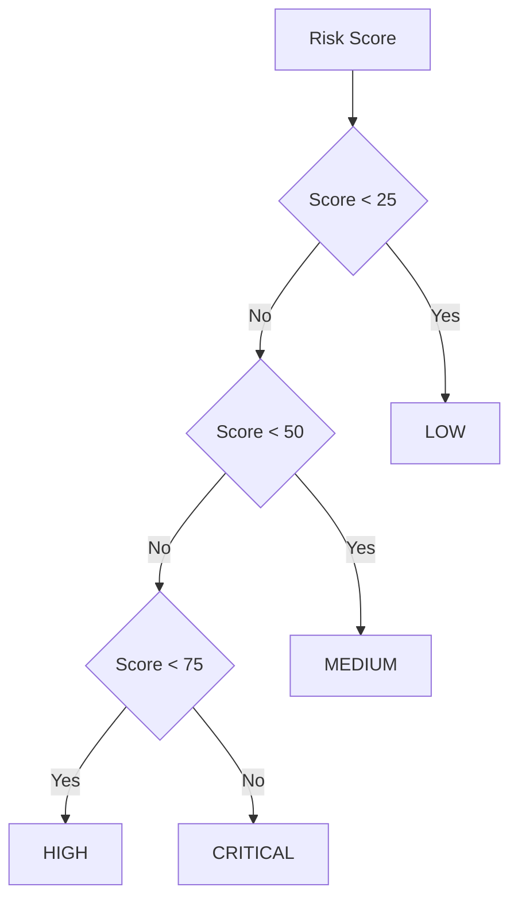
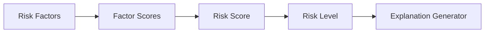
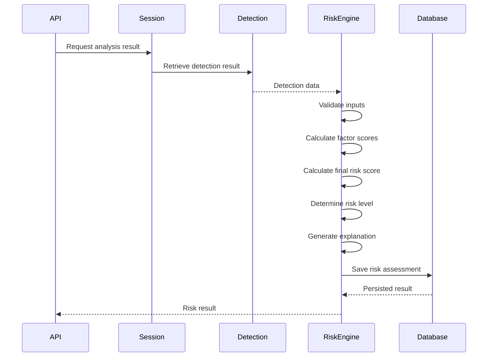
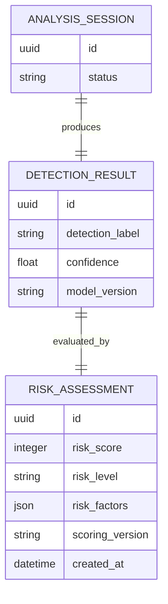
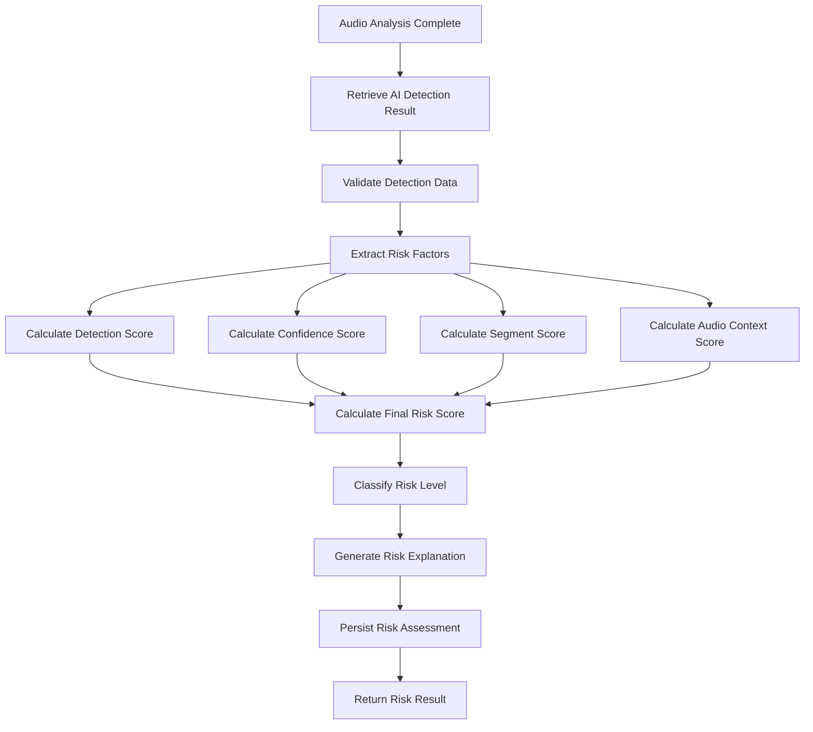
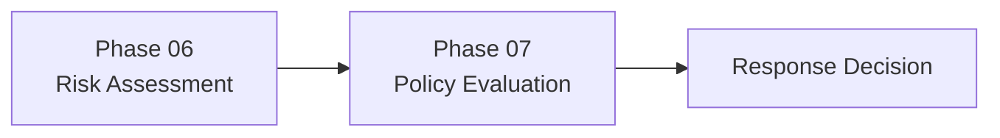

# PHASE 06 — RISK ENGINE

## 📋 Phase Information

| Category | Details |
|---|---|
| **Project** | AI-Powered Voice Cloning Detection & Prevention System |
| **Phase Number** | 06 |
| **Phase Name** | Risk Engine |
| **Module** | Risk Assessment Engine |
| **Status** | 🟡 Planned |
| **Dependencies** | Phase 03 — Analysis Session<br>Phase 04 — Audio Processing Pipeline<br>Phase 05 — AI Detection Engine |
| **Next Phase** | Phase 07 — Prevention & Response Engine |

---

# 1. Phase Overview

Phase 06 introduces the **Risk Assessment Engine**.

The AI Detection Engine in Phase 05 determines whether an audio sample is likely to contain:

* Authentic human voice
* Synthetic voice
* AI-generated voice
* Voice cloning indicators
* Suspicious audio characteristics

However, detection alone is not enough for a real security system.

The system must convert technical detection results into a meaningful **security risk assessment**.

Phase 06 is responsible for:

```text
AI Detection Result
        +
Audio Analysis Metadata
        +
Confidence & Detection Evidence
        +
Session Context
        ↓
Risk Assessment Engine
        ↓
Risk Score
        ↓
Risk Level
        ↓
Risk Explanation
```

The final output of this phase will be consumed by the **Prevention & Response Engine** in Phase 07.

---

# 2. Phase Objective

The primary objective of Phase 06 is to build a centralized engine capable of evaluating the results generated by previous phases and assigning a measurable security risk.

The Risk Engine must answer:

> **How dangerous or suspicious is this audio analysis result?**

Instead of returning only:

```text
Synthetic Voice Detected
```

The system should produce a structured result such as:

```text
Detection Result: Synthetic / Cloned Voice
Detection Confidence: 94.2%

Risk Score: 88/100
Risk Level: HIGH

Primary Factors:
- High synthetic voice probability
- Strong voice cloning indicators
- High model confidence

Recommended Response:
Forward to Prevention Engine
```

> The prevention action itself is handled in Phase 07.

---

# 3. Phase Scope

## Included in Phase 06

* Risk score calculation
* Risk factor evaluation
* Detection confidence evaluation
* Audio evidence evaluation
* Contextual risk evaluation
* Risk level classification
* Risk explanation generation
* Risk result persistence
* Risk assessment history
* Risk scoring configuration
* API integration
* Testing

---

## Not Included in Phase 06

The following features belong to later phases:

* Automatic blocking
* User account suspension
* Audio rejection
* Notification delivery
* Email alerts
* SMS alerts
* WebSocket alerts
* Prevention policy execution
* Automated mitigation

---

# 4. Phase Dependencies

Phase 06 depends on the successful completion of previous phases.



---

# 5. System Position

The Risk Engine sits between AI detection and security response.



---

# 6. Core Risk Assessment Pipeline



---

# 7. Risk Assessment Inputs

The Risk Engine receives structured information from previous phases.

## 7.1 AI Detection Result

Primary inputs:

| Field                | Description                        |
| -------------------- | ---------------------------------- |
| Detection Label      | Authentic / Synthetic / Suspicious |
| Detection Confidence | Model confidence                   |
| Model Name           | AI model used                      |
| Model Version        | Model version                      |
| Inference Timestamp  | Detection execution time           |

---

## 7.2 Audio Analysis Data

Potential audio-related risk signals:

| Signal              | Purpose                     |
| ------------------- | --------------------------- |
| Audio Duration      | Detect unusual samples      |
| Audio Quality       | Assess reliability          |
| Noise Level         | Confidence adjustment       |
| Speech Presence     | Validate speech content     |
| Processing Warnings | Reduce analysis reliability |

---

## 7.3 Segment-Level Evidence

If Phase 05 supports segmented detection:

```text
Audio
  │
  ├── Segment 1 → Authentic
  ├── Segment 2 → Authentic
  ├── Segment 3 → Synthetic
  ├── Segment 4 → Synthetic
  │
  ▼
Risk Engine
```

Segment evidence can help identify:

* Partial voice manipulation
* Edited audio
* Mixed authentic/synthetic content
* Suspicious sections

---

# 8. Risk Factors

The Risk Score is calculated using multiple factors.

## Risk Factor Categories



---

# 9. Proposed Risk Scoring Model

The system uses a weighted scoring approach.

```text
Final Risk Score =

AI Detection Score
+
Confidence Score
+
Segment Evidence Score
+
Audio Context Score
```

Each category contributes a defined maximum number of points.

---

## 9.1 Risk Score Distribution

| Risk Factor              | Maximum Points |
| ------------------------ | -------------: |
| AI Detection Result      |             40 |
| Detection Confidence     |             25 |
| Suspicious Segment Ratio |             20 |
| Audio Context & Quality  |             15 |
| **Total**                |        **100** |

---

# 10. AI Detection Risk Score

Maximum contribution:

```text
40 Points
```

Suggested scoring:

| Detection Result     | Score |
| -------------------- | ----: |
| Authentic            |     0 |
| Mostly Authentic     |    10 |
| Suspicious           |    25 |
| Synthetic            |    35 |
| Voice Clone Detected |    40 |

Example:

```text
Detection: Synthetic

AI Detection Score = 35
```

---

# 11. Detection Confidence Score

Maximum contribution:

```text
25 Points
```

The system maps model confidence into risk contribution.

## Formula

```text
Confidence Risk Score

=
Detection Confidence × 25
```

Where confidence is normalized between:

```text
0.0 → 1.0
```

Example:

```text
Detection Confidence = 0.92

Confidence Risk Score:

0.92 × 25 = 23
```

---

# 12. Suspicious Segment Score

Maximum contribution:

```text
20 Points
```

Formula:

```text
Suspicious Segment Ratio

=

Suspicious Segments
-------------------
Total Segments
```

Then:

```text
Segment Risk Score

=

Suspicious Segment Ratio × 20
```

Example:

```text
Total Segments = 10
Suspicious Segments = 7

Ratio = 0.7

Segment Risk Score:

0.7 × 20 = 14
```

---

# 13. Audio Context Score

Maximum contribution:

```text
15 Points
```

This factor evaluates suspicious or unreliable audio characteristics.

Potential scoring:

| Condition                         | Risk Points |
| --------------------------------- | ----------: |
| Normal audio                      |           0 |
| Minor processing warnings         |           3 |
| Moderate audio anomalies          |           7 |
| Multiple anomalies                |          12 |
| Severe suspicious characteristics |          15 |

Audio anomalies may include:

* Unexpected processing artifacts
* Extreme audio manipulation
* Inconsistent segments
* Unusual synthetic artifacts

---

# 14. Final Risk Score Formula

The final formula:

```text
FINAL RISK SCORE

=

Detection Risk Score
+
Confidence Risk Score
+
Segment Risk Score
+
Audio Context Score
```

Maximum:

```text
100
```

Minimum:

```text
0
```

---

# 15. Complete Calculation Example

Assume:

```text
Detection Result: Synthetic
Detection Confidence: 0.92

Total Segments: 10
Suspicious Segments: 7

Audio Context: Moderate Anomalies
```

Calculation:

| Factor           |      Score |
| ---------------- | ---------: |
| AI Detection     |         35 |
| Confidence       |         23 |
| Segment Evidence |         14 |
| Audio Context    |          7 |
| **Final Score**  | **79/100** |

Final result:

```text
Risk Score: 79
Risk Level: HIGH
```

---

# 16. Risk Classification

The system converts the numeric score into a human-readable risk level.

| Score  | Risk Level |
| ------ | ---------- |
| 0–24   | LOW        |
| 25–49  | MEDIUM     |
| 50–74  | HIGH       |
| 75–100 | CRITICAL   |

---

## Risk Classification Flow



---

# 17. Risk Levels

## LOW

```text
Score: 0–24
```

Meaning:

* No significant synthetic indicators.
* AI detection strongly supports authenticity.
* Minimal suspicious evidence.

---

## MEDIUM

```text
Score: 25–49
```

Meaning:

* Some suspicious characteristics detected.
* Detection confidence may be uncertain.
* Manual review may be appropriate.

---

## HIGH

```text
Score: 50–74
```

Meaning:

* Strong suspicious indicators.
* AI detection suggests synthetic or manipulated voice.
* Significant risk evidence exists.

---

## CRITICAL

```text
Score: 75–100
```

Meaning:

* Strong evidence of synthetic or cloned voice.
* Multiple high-risk factors present.
* Requires immediate downstream evaluation.

---

# 18. Risk Explanation Engine

The system must explain why a risk level was assigned.

Example:

```text
Risk Level: HIGH
Risk Score: 68/100

Contributing Factors:

• AI model detected synthetic voice characteristics.
• Detection confidence was 89%.
• 60% of analyzed audio segments were suspicious.
• Audio analysis detected multiple anomalies.
```

---

## Explanation Architecture



---

# 19. Risk Assessment Sequence Diagram



---

# 20. Database Requirements

Phase 06 requires persistent risk assessment data.

The exact implementation must follow `DATABASE.md`.

Conceptual relationship:



---

# 21. Risk Assessment Data Structure

Conceptual structure:

```json
{
  "id": "risk-assessment-id",
  "analysis_session_id": "session-id",
  "detection_result_id": "detection-result-id",

  "risk_score": 79,
  "risk_level": "HIGH",

  "factor_scores": {
    "ai_detection": 35,
    "confidence": 23,
    "segment_evidence": 14,
    "audio_context": 7
  },

  "scoring_version": "1.0",

  "created_at": "timestamp"
}
```

---

# 22. Risk Factor Persistence

The system should preserve the individual factor contributions.

Example:

```json
{
  "ai_detection_score": 35,
  "confidence_score": 23,
  "segment_score": 14,
  "audio_context_score": 7
}
```

This allows:

* Debugging
* Risk explanation
* Future analytics
* Scoring model improvements
* Auditability

---

# 23. Risk Scoring Versioning

The scoring system must support versioning.

Example:

```text
Risk Scoring Version: 1.0
```

Future changes might include:

```text
1.0 → Initial weighted scoring

1.1 → Improved audio anomaly scoring

2.0 → Context-aware risk engine
```

Historical assessments should preserve the scoring version used during calculation.

---

# 24. API Requirements

Phase 06 should integrate with the API architecture defined in `API.md`.

Potential operations:

## Retrieve Risk Assessment

```text
GET /analysis/{analysis_id}/risk
```

Returns:

```json
{
  "analysis_id": "uuid",
  "risk_score": 79,
  "risk_level": "HIGH",
  "factors": {
    "ai_detection": 35,
    "confidence": 23,
    "segment_evidence": 14,
    "audio_context": 7
  }
}
```

---

## Recalculate Risk

If supported by project architecture:

```text
POST /analysis/{analysis_id}/risk/recalculate
```

Recalculation must preserve scoring version information.

---

# 25. Service Architecture

Suggested logical structure:

```text
risk/
│
├── risk_engine
│   ├── calculate_risk
│   ├── validate_inputs
│   └── classify_risk
│
├── factor_calculator
│   ├── detection_score
│   ├── confidence_score
│   ├── segment_score
│   └── context_score
│
├── explanation_service
│
├── repository
│
└── tests
```

Actual project structure should remain consistent with the main application architecture.

---

# 26. Error Handling

The Risk Engine must handle:

| Error                    | Expected Behavior                 |
| ------------------------ | --------------------------------- |
| Detection result missing | Return controlled error           |
| Confidence invalid       | Reject calculation                |
| Segment data unavailable | Handle according to scoring rules |
| Invalid risk score       | Reject persistence                |
| Database failure         | Preserve transaction safety       |

---

# 27. Validation Rules

Before saving a risk assessment:

```text
Risk Score must be numeric.

Risk Score must be between 0 and 100.

Risk Level must match the score.

Required source data must exist.

Analysis session relationship must be valid.

Detection result relationship must be valid.
```

---

# 28. Performance Considerations

The Risk Engine should be lightweight.

Phase 06 must not:

* Reload AI models.
* Re-run model inference.
* Reprocess audio.
* Recreate analysis sessions.

Risk calculation should operate only on already available structured results.

Expected workflow:

```text
Stored Detection Result
        ↓
Risk Calculation
        ↓
Database Save
```

---

# 29. Security Considerations

The Risk Engine must maintain:

* Organization isolation.
* User authorization.
* Analysis ownership validation.
* Safe database queries.
* Safe error handling.
* Risk result auditability.

A user must never access another organization's risk assessments.

---

# 30. Testing Strategy

## Unit Tests

Test individual components.

### Detection Score

```text
Authentic → Expected score

Suspicious → Expected score

Synthetic → Expected score

Voice Clone → Expected score
```

### Confidence Score

```text
0.0 → 0

0.5 → 12.5

1.0 → 25
```

### Segment Score

```text
0% suspicious → 0

50% suspicious → 10

100% suspicious → 20
```

### Final Score

Test multiple combinations.

---

# 31. Integration Tests

Verify:

```text
Detection Result
        ↓
Risk Engine
        ↓
Risk Assessment
        ↓
Database
```

Test:

* Valid analysis.
* Missing detection.
* Synthetic detection.
* Authentic detection.
* Mixed segments.
* High confidence.
* Low confidence.

---

# 32. Edge Case Tests

| Scenario           | Expected Result              |
| ------------------ | ---------------------------- |
| No segments        | Segment score handled safely |
| One segment        | Correct ratio                |
| All suspicious     | Maximum segment score        |
| All authentic      | Zero segment score           |
| Invalid confidence | Validation error             |
| Score > 100        | Validation failure           |
| Missing detection  | Controlled failure           |

---

# 33. Acceptance Criteria

Phase 06 is complete when:

## Risk Engine

* [ ] Detection results can be consumed.
* [ ] Risk factors are extracted.
* [ ] Factor scores are calculated.
* [ ] Final risk score is calculated.
* [ ] Score is constrained between 0 and 100.

## Classification

* [ ] LOW classification works.
* [ ] MEDIUM classification works.
* [ ] HIGH classification works.
* [ ] CRITICAL classification works.

## Explanation

* [ ] Risk explanation is generated.
* [ ] Contributing factors are visible.

## Database

* [ ] Risk assessment persists.
* [ ] Risk assessment links to analysis session.
* [ ] Risk assessment links to detection result.
* [ ] Scoring version is stored.

## API

* [ ] Risk result can be retrieved.
* [ ] Authorization is enforced.
* [ ] Tenant isolation is enforced.

## Testing

* [ ] Unit tests pass.
* [ ] Integration tests pass.
* [ ] Edge cases are tested.

---

# 34. Phase Deliverables

At the end of Phase 06, the system must provide:

```text
✓ Risk Assessment Engine

✓ Weighted Risk Scoring

✓ Detection-Based Risk Evaluation

✓ Confidence Evaluation

✓ Segment-Level Risk Evaluation

✓ Audio Context Risk Evaluation

✓ Risk Score (0–100)

✓ Risk Level Classification

✓ Risk Explanation

✓ Persistent Risk History

✓ Risk Scoring Versioning

✓ API Integration

✓ Unit Tests

✓ Integration Tests
```

---

# 35. Complete End-to-End Flow



---

# 36. Example Final Output

```json
{
  "analysis_id": "a8f3c9d2",

  "detection": {
    "label": "SYNTHETIC",
    "confidence": 0.92
  },

  "risk": {
    "score": 79,
    "level": "CRITICAL",

    "factors": {
      "ai_detection": 35,
      "confidence": 23,
      "segment_evidence": 14,
      "audio_context": 7
    },

    "scoring_version": "1.0"
  }
}
```

---

# 37. Phase Completion Boundary

Phase 06 ends when:

```text
AI Detection Result
        ↓
Risk Factors Evaluated
        ↓
Risk Score Calculated
        ↓
Risk Level Assigned
        ↓
Risk Explanation Generated
        ↓
Risk Assessment Persisted
```

---

# 38. Next Phase

# PHASE 07 — PREVENTION & RESPONSE ENGINE

Phase 07 will consume:

```text
Risk Score
+
Risk Level
+
Risk Factors
+
Risk Assessment
```

And determine the appropriate downstream response.

Conceptually:



Possible future responses may include:

```text
ALLOW
MONITOR
FLAG
REQUIRE_REVIEW
RESTRICT
BLOCK
```

The actual prevention and response logic begins in Phase 07.

---

# PHASE 06 FINAL SUMMARY

```text
INPUT

AI Detection Result
+
Audio Analysis Metadata
+
Segment Evidence

        ↓

RISK ENGINE

        ↓

Factor Evaluation

        ↓

Weighted Scoring

        ↓

Risk Score (0–100)

        ↓

Risk Classification

        ↓

LOW / MEDIUM / HIGH / CRITICAL

        ↓

Risk Explanation

        ↓

Database Persistence

        ↓

PHASE 06 COMPLETE
```

---

> **Phase 06 converts AI detection intelligence into a measurable security risk assessment.**
>
> **The output of this phase becomes the decision input for the Prevention & Response Engine in Phase 07.**
