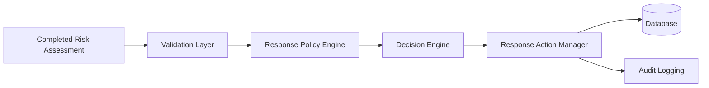
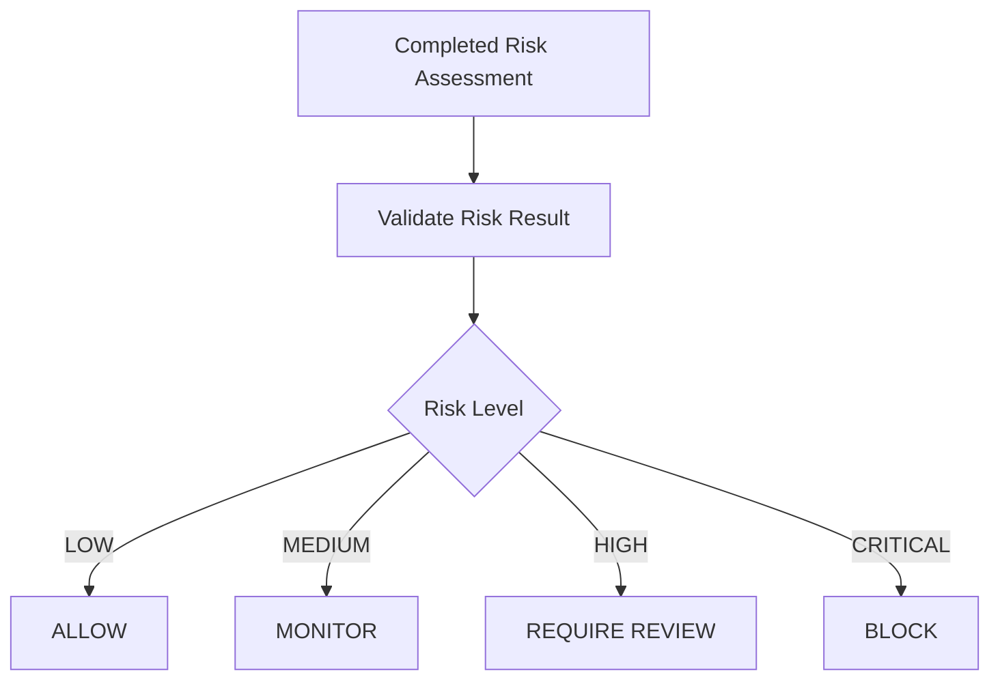
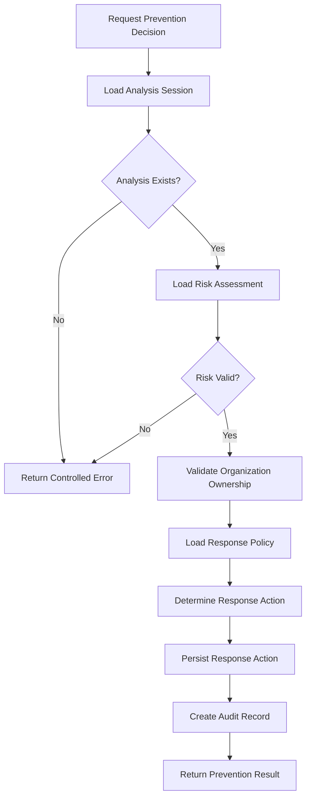
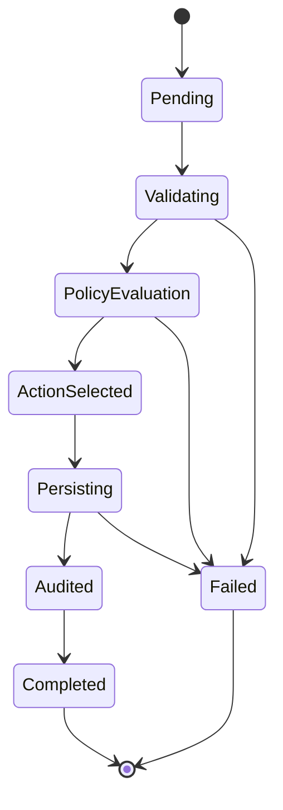
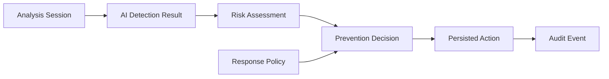
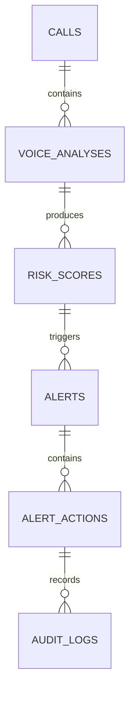
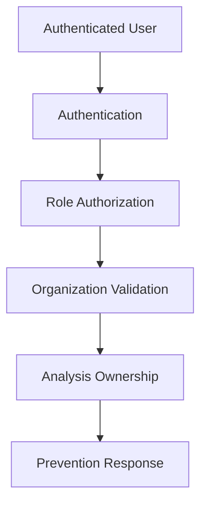
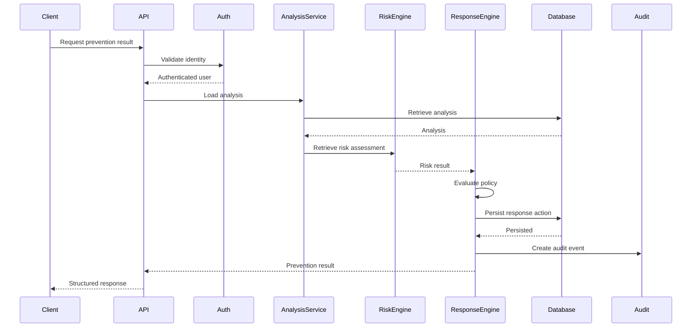
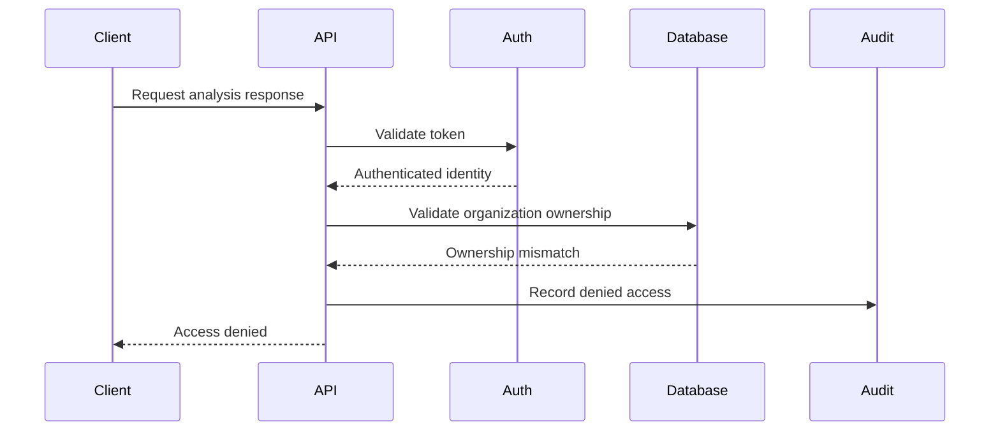
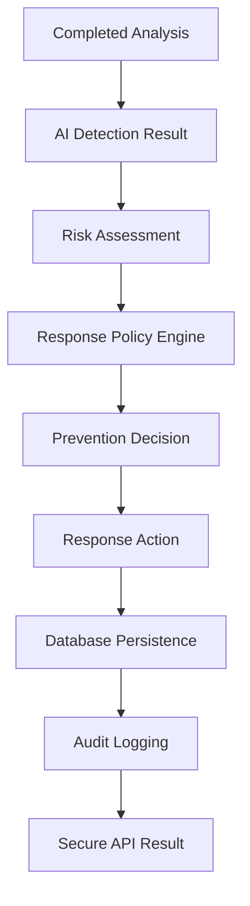

# Phase 07 — Prevention & Response Engine

## 📋 Phase Information

| Category | Details |
|---|---|
| **Project** | AI-Powered Real-Time Detection and Prevention of Voice Cloning Impersonation Attacks |
| **Phase Number** | 07 |
| **Phase Name** | Prevention & Response Engine |
| **Status** | 🟡 Planning / Specification |
| **Dependencies** | Phase 00<br>Phase 01<br>Phase 02<br>Phase 03<br>Phase 04<br>Phase 05<br>Phase 06 |
| **Implementation Status** | Not Started |
| **Document Type** | Phase Implementation Specification |

---

# Table of Contents

- [1. Phase Overview](#1-phase-overview)
- [2. Phase Objective](#2-phase-objective)
- [3. Scope](#3-scope)
- [4. Phase Boundaries](#4-phase-boundaries)
- [5. Prevention & Response Architecture](#5-prevention--response-architecture)
- [6. Inputs and Outputs](#6-inputs-and-outputs)
- [7. Response Actions](#7-response-actions)
- [8. Risk-to-Response Policy](#8-risk-to-response-policy)
- [9. Response Policy Engine](#9-response-policy-engine)
- [10. Prevention Decision Flow](#10-prevention-decision-flow)
- [11. Response Decision Lifecycle](#11-response-decision-lifecycle)
- [12. Data Flow](#12-data-flow)
- [13. Database Integration](#13-database-integration)
- [14. API Integration](#14-api-integration)
- [15. Authorization and Tenant Isolation](#15-authorization-and-tenant-isolation)
- [16. Audit Logging](#16-audit-logging)
- [17. Error Handling and Fail-Safe Behavior](#17-error-handling-and-fail-safe-behavior)
- [18. Sequence Diagrams](#18-sequence-diagrams)
- [19. Implementation Architecture](#19-implementation-architecture)
- [20. Testing Strategy](#20-testing-strategy)
- [21. Edge Cases](#21-edge-cases)
- [22. Security Requirements](#22-security-requirements)
- [23. AI Guardrails](#23-ai-guardrails)
- [24. Acceptance Criteria](#24-acceptance-criteria)
- [25. Phase Deliverables](#25-phase-deliverables)
- [26. Definition of Done](#26-definition-of-done)

---

# 1. Phase Overview

Phase 07 introduces the **Prevention & Response Engine**.

The previous phases establish the complete detection and risk assessment pipeline:

```text
Phase 03 — Analysis Session
        ↓
Phase 04 — Audio Processing Pipeline
        ↓
Phase 05 — AI Detection Engine
        ↓
Phase 06 — Risk Engine
        ↓
Risk Score + Risk Level
```

Phase 07 converts the completed risk assessment into a structured security response.

The central question answered by this phase is:

> **The system has identified a potential voice cloning or impersonation risk. What should happen next?**

The Prevention & Response Engine evaluates the completed risk assessment against predefined response policies and determines the appropriate action.

Possible responses include:

- `ALLOW`
- `MONITOR`
- `FLAG`
- `REQUIRE_REVIEW`
- `RESTRICT`
- `BLOCK`

The selected response must be deterministic, explainable, auditable, organization-scoped, and persistable.

Phase 07 does not perform audio processing, feature extraction, AI inference, or risk-score calculation. It consumes completed upstream results and determines the appropriate prevention or response action.

---

# 2. Phase Objective

The objective of Phase 07 is to transform a completed risk assessment into a deterministic and auditable prevention decision.

The implementation must:

- Consume a completed risk assessment.
- Validate the associated analysis.
- Validate organization ownership.
- Validate the risk result.
- Evaluate the applicable response policy.
- Select the appropriate response action.
- Persist the prevention decision.
- Preserve the policy version used.
- Generate a human-readable response reason.
- Record response-related audit events.
- Return a structured response through the application API.

The responsibilities of the pipeline must remain clearly separated:

```text
AI Detection Engine
        ↓
Detection Evidence
        ↓
Risk Engine
        ↓
Risk Score + Risk Level
        ↓
Prevention & Response Engine
        ↓
Response Decision
        ↓
Response Action
```

The AI Detection Engine determines suspicious characteristics.

The Risk Engine determines the level of risk.

The Prevention & Response Engine determines what action should be taken.

---

# 3. Scope

## Included

Phase 07 includes:

- Risk-to-response policy mapping.
- Deterministic response policy evaluation.
- Prevention decision generation.
- Response action selection.
- Response action persistence.
- Response history.
- Policy version tracking.
- Response explanation generation.
- Analysis status integration where supported.
- Authorization checks.
- Organization tenant isolation.
- Audit event integration.
- API integration.
- Unit testing.
- Integration testing.
- Authorization testing.
- Tenant-isolation testing.
- Regression testing.

## Not Included

The following features are outside the scope of Phase 07:

- Audio recording.
- Audio upload processing.
- Audio segmentation.
- Audio normalization.
- Feature extraction.
- AI model inference.
- Voice-cloning model training.
- Risk score calculation.
- Email notification delivery.
- SMS notification delivery.
- Push notification delivery.
- WebSocket notification delivery.
- SIEM integration.
- External security platform integration.
- Automatic call termination.
- Automatic account suspension.

Later phases may consume the prevention decisions produced by this phase.

---

# 4. Phase Boundaries

Phase 07 begins only after a valid risk assessment is available.

```text
Phase 03
Analysis Session
      │
      ▼
Phase 04
Audio Processing
      │
      ▼
Phase 05
AI Detection
      │
      ▼
Phase 06
Risk Assessment
      │
      ▼
═══════════════════════════════
        PHASE 07
═══════════════════════════════
      │
      ▼
Response Policy Evaluation
      │
      ▼
Prevention Decision
      │
      ▼
Response Action
```

Phase 07 must not:

- Re-run AI inference.
- Recalculate risk scores.
- Reinterpret raw audio.
- Invent missing risk values.
- Silently modify upstream risk levels.

If an upstream result is missing or invalid, the Prevention & Response Engine must return a controlled failure rather than generating an arbitrary action.

---

# 5. Prevention & Response Architecture



## Architectural Responsibilities

| Component | Responsibility |
|---|---|
| Risk Assessment Input | Provides risk score and risk level |
| Validation Layer | Validates analysis, risk result, and ownership |
| Response Policy Engine | Evaluates applicable prevention rules |
| Decision Engine | Selects the appropriate action |
| Response Action Manager | Persists and manages response actions |
| Database Layer | Stores decisions and action history |
| Audit Layer | Records security-relevant events |

---

# 6. Inputs and Outputs

## Required Inputs

Phase 07 consumes completed upstream results.

| Input | Description |
|---|---|
| Analysis Session ID | Identifies the analysis |
| Organization ID | Establishes tenant ownership |
| Risk Assessment ID | Identifies the completed risk result |
| Risk Score | Numeric risk value |
| Risk Level | Classified risk severity |
| Detection Context | Supporting upstream context where required |
| Policy Context | Applicable response policy |

## Primary Output

The primary output is a structured prevention decision.

```json
{
  "analysis_session_id": "uuid",
  "risk_assessment_id": "uuid",
  "risk_score": 88,
  "risk_level": "CRITICAL",
  "response_action": "BLOCK",
  "policy_version": "1.0",
  "reason": "Critical risk policy threshold exceeded.",
  "created_at": "timestamp"
}
```

---

# 7. Response Actions

Phase 07 defines the following conceptual response actions.

| Action | Description |
|---|---|
| `ALLOW` | No prevention restriction is required |
| `MONITOR` | Continue while marking for additional observation |
| `FLAG` | Mark the analysis as suspicious |
| `REQUIRE_REVIEW` | Require manual or administrative review |
| `RESTRICT` | Restrict the associated workflow |
| `BLOCK` | Prevent continuation of the associated workflow |

## Response Severity

```text
ALLOW
  │
  ▼
MONITOR
  │
  ▼
FLAG
  │
  ▼
REQUIRE_REVIEW
  │
  ▼
RESTRICT
  │
  ▼
BLOCK
```

| Severity | Action |
|---:|---|
| 1 | ALLOW |
| 2 | MONITOR |
| 3 | FLAG |
| 4 | REQUIRE_REVIEW |
| 5 | RESTRICT |
| 6 | BLOCK |

---

# 8. Risk-to-Response Policy

The response engine must use centralized policy rules.

The API layer must not independently determine prevention actions.

The initial conceptual policy mapping is:

| Risk Level | Conceptual Risk Range | Default Response |
|---|---:|---|
| LOW | 0–24 | ALLOW |
| MEDIUM | 25–49 | MONITOR |
| HIGH | 50–74 | REQUIRE_REVIEW |
| CRITICAL | 75–100 | BLOCK |

The exact thresholds must remain consistent with the Risk Engine implementation defined in Phase 06.

Phase 07 must not silently redefine upstream risk thresholds.

## Policy Flow



---

# 9. Response Policy Engine

The Response Policy Engine must be deterministic.

The same valid risk assessment evaluated under the same policy version must produce the same response.

Conceptual evaluation:

```text
IF risk_level == LOW
    response = ALLOW

ELSE IF risk_level == MEDIUM
    response = MONITOR

ELSE IF risk_level == HIGH
    response = REQUIRE_REVIEW

ELSE IF risk_level == CRITICAL
    response = BLOCK

ELSE
    return controlled validation failure
```

The implementation may later support configurable policies, but policy evaluation must remain centralized.

## Policy Requirements

The policy system must:

- Be deterministic.
- Be explainable.
- Be versionable.
- Be testable.
- Reject invalid configurations.
- Avoid hidden fallback actions.
- Preserve the policy version used for every decision.

---

# 10. Prevention Decision Flow



---

# 11. Response Decision Lifecycle



---

# 12. Data Flow



---

# 13. Database Integration

Phase 07 must use the database foundation established in Phase 01.

Existing documented entities relevant to this phase include:

- `calls`
- `voice_analyses`
- `risk_scores`
- `alerts`
- `alert_actions`
- `audit_logs`

Phase 07 should remain consistent with the logical schema defined in `DATABASE.md`.

## Conceptual Relationship



## Response Persistence Requirements

A persisted response must retain enough information to reconstruct why an action occurred.

| Field | Purpose |
|---|---|
| Response ID | Unique response identity |
| Analysis Session ID | Source analysis |
| Risk Assessment ID | Source risk result |
| Organization ID | Tenant ownership |
| Selected Action | Prevention result |
| Policy Version | Decision traceability |
| Reason | Human-readable explanation |
| Created At | Event timestamp |

---

# 14. API Integration

Phase 07 API behavior must remain consistent with `API.md`.

A conceptual response capability may be:

```text
GET /analysis/{analysis_id}/response
```

Example response:

```json
{
  "analysis_id": "uuid",
  "risk": {
    "score": 88,
    "level": "CRITICAL"
  },
  "response": {
    "action": "BLOCK",
    "policy_version": "1.0",
    "reason": "Critical risk policy threshold exceeded."
  }
}
```

Final endpoint names must remain consistent with the authoritative API contract.

## Response Request Validation

Before generating or retrieving a response:

- Authentication must succeed.
- Analysis ownership must be validated.
- Organization membership must be validated.
- The analysis must exist.
- The risk assessment must exist.
- The risk assessment must be complete.
- Invalid risk states must be rejected.

---

# 15. Authorization and Tenant Isolation

Phase 07 operates on security-sensitive results.

Authorization must be enforced server-side.



The client must not be trusted to provide the authoritative organization context.

Organization identity must be derived from the authenticated server-side identity.

## Cross-Tenant Access

The following access attempt must fail:

```text
Organization A User
        │
        ▼
Request Organization B Analysis
        │
        ▼
DENY
```

Response actions and prevention decisions must remain organization-scoped.

---

# 16. Audit Logging

Security-relevant prevention events must be auditable.

Examples include:

- Prevention decision generated.
- Analysis flagged.
- Review requirement generated.
- Restriction applied.
- Block decision generated.
- Response retrieval denied.
- Cross-organization access attempt detected.
- Policy evaluation failure.

Audit records must preserve sufficient context without unnecessarily exposing sensitive data.

---

# 17. Error Handling and Fail-Safe Behavior

Phase 07 must distinguish between:

```text
ALLOW
```

and:

```text
PREVENTION DECISION COULD NOT BE GENERATED
```

These are not equivalent states.

## Error Handling Matrix

| Condition | Required Behavior |
|---|---|
| Analysis not found | Return controlled not-found response |
| Risk assessment missing | Reject prevention evaluation |
| Invalid risk level | Reject evaluation |
| Policy configuration invalid | Fail safely |
| Unauthorized access | Deny request |
| Cross-tenant access | Deny request |
| Database persistence failure | Roll back safely |
| Audit failure | Handle according to audit policy |
| Unexpected error | Return safe internal error |

## Fail-Safe Requirement

The system must never silently convert an evaluation failure into `ALLOW`.

---

# 18. Sequence Diagrams

## Prevention Decision Generation



## Unauthorized Access Attempt



---

# 19. Implementation Architecture

Suggested logical backend organization:

```text
backend/
│
├── app/
│
│   ├── api/
│   │   └── routes/
│   │       └── prevention.py
│   │
│   ├── services/
│   │   ├── response_policy_service.py
│   │   ├── prevention_service.py
│   │   └── audit_service.py
│   │
│   ├── schemas/
│   │   └── prevention.py
│   │
│   ├── models/
│   │   ├── alert.py
│   │   └── alert_action.py
│   │
│   └── tests/
│       ├── test_prevention_policy.py
│       ├── test_prevention_service.py
│       ├── test_prevention_api.py
│       └── test_prevention_authorization.py
```

The final implementation must remain consistent with the project architecture established in previous phases.

---

# 20. Testing Strategy

Phase 07 must include automated testing.

## Unit Tests

Test:

- LOW risk mapping.
- MEDIUM risk mapping.
- HIGH risk mapping.
- CRITICAL risk mapping.
- Invalid risk levels.
- Invalid policy configuration.
- Policy version persistence.
- Response explanation generation.

## Integration Tests

```text
Analysis
    ↓
Risk Assessment
    ↓
Policy Evaluation
    ↓
Response Action
    ↓
Database Persistence
    ↓
Audit Record
```

## Authorization Tests

Verify:

- Unauthenticated users are denied.
- Unauthorized users are denied.
- Server-side authorization cannot be bypassed.
- Organization ownership is validated.
- Cross-tenant access is rejected.

## Regression Tests

Phase 07 must not break:

- Phase 00 application startup.
- Phase 01 database behavior.
- Phase 02 authentication.
- Phase 03 analysis sessions.
- Phase 04 audio processing.
- Phase 05 AI detection.
- Phase 06 risk assessment.

## Test Matrix

| Test Area | Required |
|---|---|
| Policy Mapping | Yes |
| Invalid Risk State | Yes |
| Response Persistence | Yes |
| Policy Versioning | Yes |
| Audit Logging | Yes |
| Authentication | Yes |
| Authorization | Yes |
| Tenant Isolation | Yes |
| Database Failure | Yes |
| Regression Testing | Yes |

---

# 21. Edge Cases

The implementation must explicitly handle the following scenarios.

## Missing Risk Assessment

An analysis exists but no completed risk assessment exists.

Expected result:

```text
Controlled failure
No prevention action generated
```

## Invalid Risk Level

A stored or upstream risk level is invalid.

Expected result:

```text
Reject evaluation
Do not select fallback ALLOW action
```

## Duplicate Evaluation

The same analysis is evaluated repeatedly.

The implementation must explicitly define whether:

- Existing decisions are reused.
- Historical decisions are preserved.
- A new decision version is created.

The behavior must be deterministic and testable.

## Policy Change

A policy changes after a previous response decision exists.

Historical responses must retain the policy version that produced them.

## Partial Persistence Failure

If response persistence partially fails:

- Database transaction safety must be preserved.
- No incomplete response should appear as successful.
- Failure must be observable.

---

# 22. Security Requirements

Phase 07 must comply with the security architecture established in `SECURITY.md`.

Requirements include:

- Server-side authorization.
- Default-deny access.
- Organization isolation.
- No client-controlled policy bypass.
- Safe error responses.
- No secret exposure.
- Auditability.
- Transaction integrity.
- Policy validation.
- Controlled failure handling.

---

# 23. AI Guardrails

Phase 07 must not introduce new AI inference behavior.

The Prevention & Response Engine must treat AI Detection and Risk Engine outputs as upstream inputs.

The engine must not:

- Reinterpret raw audio.
- Override AI model predictions.
- Invent detection confidence.
- Invent missing risk scores.
- Silently modify risk levels.
- Re-run inference without entering the appropriate upstream workflow.

The Prevention & Response Engine is a deterministic policy layer.

```text
AI Detection Engine
        ↓
Detection Evidence
        ↓
Risk Engine
        ↓
Risk Score + Risk Level
        ↓
Prevention & Response Engine
        ↓
Response Action
```

These responsibilities must remain separated.

---

# 24. Acceptance Criteria

Phase 07 is complete when:

- A completed risk assessment can be consumed.
- Analysis ownership is validated.
- Organization isolation is enforced.
- Risk levels map to defined response policies.
- Policy evaluation is deterministic.
- Invalid risk states are rejected.
- A prevention decision can be persisted.
- Response action history is available.
- Policy version is preserved.
- Response explanations are generated.
- Relevant events are auditable.
- Unauthorized access is denied.
- Cross-organization access is denied.
- Failure does not silently result in `ALLOW`.
- Unit tests pass.
- Integration tests pass.
- Authorization tests pass.
- Tenant-isolation tests pass.
- Previous phase regression tests pass.

---

# 25. Phase Deliverables

The completed Phase 07 implementation should provide:

| Deliverable | Expected Result |
|---|---|
| Response Policy Engine | Centralized risk-to-response evaluation |
| Prevention Service | Generates prevention decisions |
| Response Action Handling | Structured action management |
| Persistence Integration | Stored response actions and history |
| API Integration | Authorized response access |
| Authorization Controls | Protected server-side access |
| Tenant Isolation | Organization-scoped results |
| Audit Integration | Recorded security events |
| Test Suite | Unit, integration, authorization, and regression tests |
| Documentation | Updated implementation documentation |

---

# 26. Definition of Done

Phase 07 is considered complete only when the following end-to-end workflow succeeds:

```text
Completed Analysis
        ↓
Completed AI Detection
        ↓
Completed Risk Assessment
        ↓
Risk Validation
        ↓
Organization Validation
        ↓
Response Policy Evaluation
        ↓
Prevention Decision
        ↓
Response Action Persistence
        ↓
Audit Event
        ↓
Authorized API Response
```

The Prevention & Response Engine must produce a deterministic, explainable, secure, organization-scoped, and auditable response based on completed risk assessments.

---

# Final Phase Summary



> **Phase 07 converts detection intelligence into actionable prevention decisions.**

> **Detection identifies suspicious behavior. Risk quantifies the threat. Prevention determines the response.**