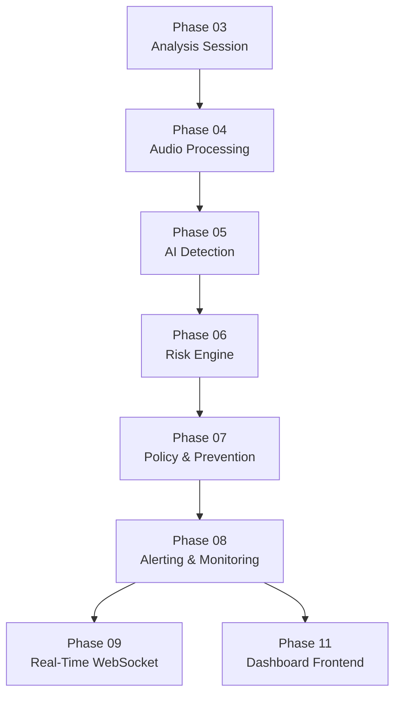
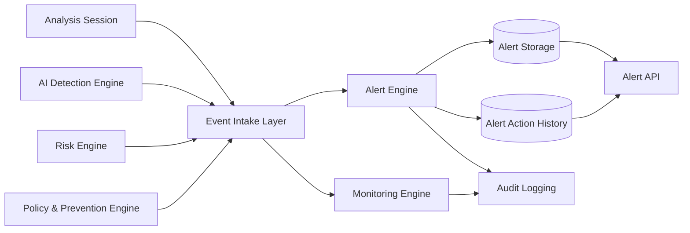
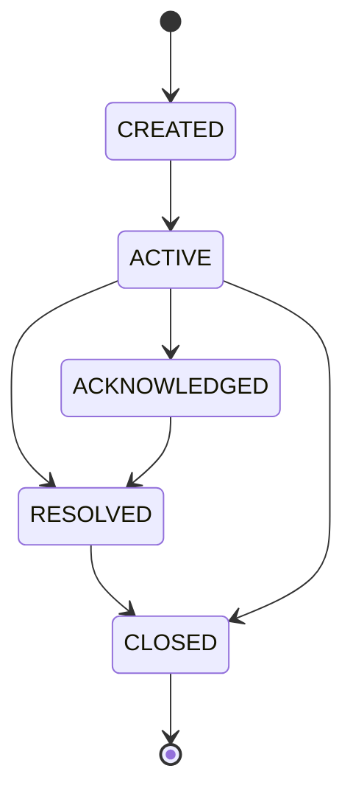
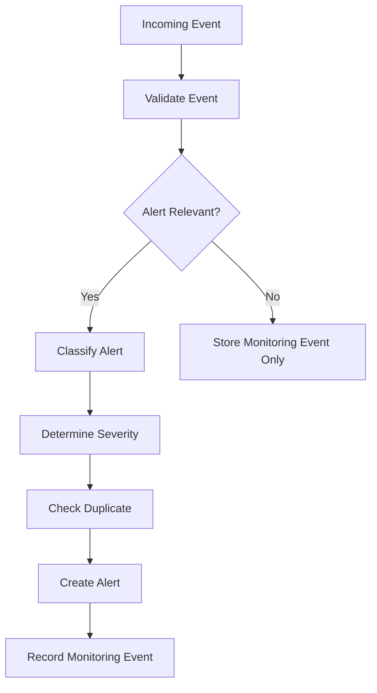
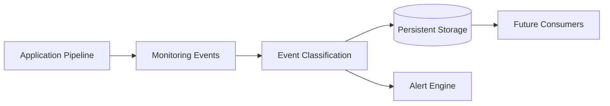
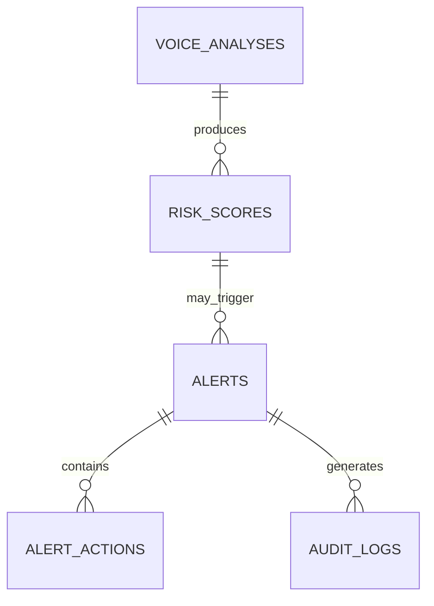
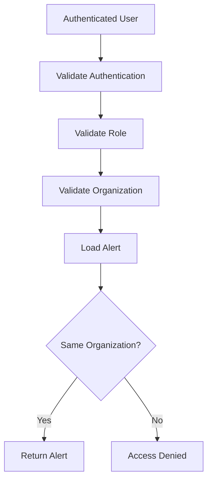
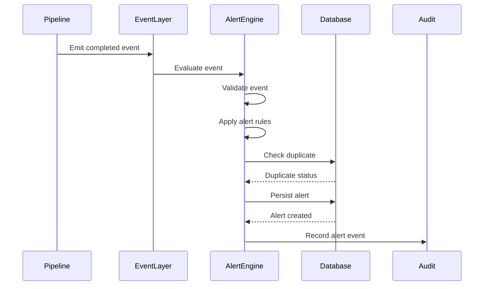
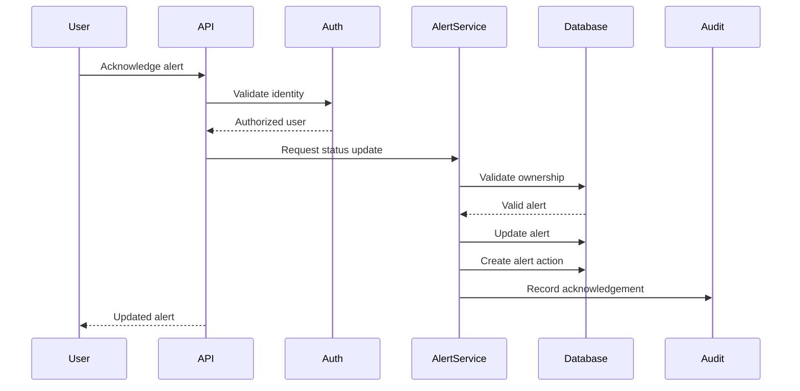
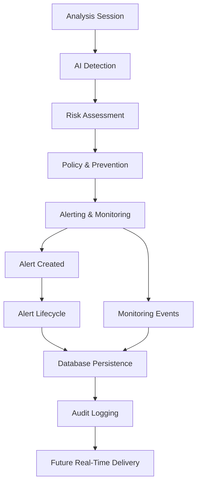

# Phase 08 — Alerting & Monitoring

## 📋 Phase Information

| Category | Details |
|---|---|
| **Project** | AI-Powered Real-Time Detection and Prevention of Voice Cloning Impersonation Attacks |
| **Phase Number** | 08 |
| **Phase Name** | Alerting & Monitoring |
| **Status** | 🟡 Planning / Specification |
| **Dependencies** | Phase 00 — Foundation<br>Phase 01 — Database Core<br>Phase 02 — Authentication & Security<br>Phase 03 — Analysis Session<br>Phase 04 — Audio Processing Pipeline<br>Phase 05 — AI Detection Engine<br>Phase 06 — Risk Engine<br>Phase 07 — Policy & Prevention Engine |
| **Implementation Status** | Not Started |
| **Primary Output** | Persisted Alerts, Alert Events, Monitoring Records, and Observable System State |
| **Next Phase** | Phase 09 — Real-Time WebSocket |
| **Document Type** | Phase Implementation Specification |

---

# Table of Contents

- [1. Phase Overview](#1-phase-overview)
- [2. Phase Objective](#2-phase-objective)
- [3. Scope](#3-scope)
- [4. Out of Scope](#4-out-of-scope)
- [5. Phase Dependencies](#5-phase-dependencies)
- [6. Alerting & Monitoring Architecture](#6-alerting--monitoring-architecture)
- [7. Core Concepts](#7-core-concepts)
- [8. Alert Lifecycle](#8-alert-lifecycle)
- [9. Alert Classification](#9-alert-classification)
- [10. Alert Generation Rules](#10-alert-generation-rules)
- [11. Alert Deduplication and Idempotency](#11-alert-deduplication-and-idempotency)
- [12. Monitoring Architecture](#12-monitoring-architecture)
- [13. Monitoring Events](#13-monitoring-events)
- [14. Alert Data Model](#14-alert-data-model)
- [15. Alert Action Model](#15-alert-action-model)
- [16. Database Integration](#16-database-integration)
- [17. API Integration](#17-api-integration)
- [18. Authorization and Tenant Isolation](#18-authorization-and-tenant-isolation)
- [19. Audit Logging](#19-audit-logging)
- [20. Error Handling and Failure Behavior](#20-error-handling-and-failure-behavior)
- [21. Sequence Diagrams](#21-sequence-diagrams)
- [22. Implementation Architecture](#22-implementation-architecture)
- [23. Testing Strategy](#23-testing-strategy)
- [24. Edge Cases](#24-edge-cases)
- [25. Security Requirements](#25-security-requirements)
- [26. AI Guardrails](#26-ai-guardrails)
- [27. Acceptance Criteria](#27-acceptance-criteria)
- [28. Phase Deliverables](#28-phase-deliverables)
- [29. Definition of Done](#29-definition-of-done)

---

# 1. Phase Overview

Phase 08 introduces the **Alerting & Monitoring Layer**.

The previous phases establish the core intelligence and prevention pipeline:

```text
Phase 03 — Analysis Session
        ↓
Phase 04 — Audio Processing Pipeline
        ↓
Phase 05 — AI Detection Engine
        ↓
Phase 06 — Risk Engine
        ↓
Phase 07 — Policy & Prevention Engine
        ↓
══════════════════════════════════════
Phase 08 — Alerting & Monitoring
══════════════════════════════════════
        ↓
Alert Generation
        ↓
Alert Classification
        ↓
Alert Persistence
        ↓
Alert Lifecycle Management
        ↓
Monitoring Events
        ↓
Observable System State
```

Phase 08 answers two critical questions:

> **What security-relevant events should create an alert?**

and:

> **How can the application observe and track what is happening across the detection and prevention pipeline?**

This phase converts security-relevant outcomes into structured alerts and creates a monitoring foundation that later phases can expose through real-time communication and dashboard interfaces.

Phase 08 does not independently perform AI detection, risk calculation, or prevention-policy decisions.

Instead, it consumes validated outputs from previous phases.

---

# 2. Phase Objective

The objective of Phase 08 is to implement a reliable, deterministic, organization-scoped, auditable alerting and monitoring foundation.

The implementation must:

- Receive relevant upstream events.
- Determine whether an alert should be generated.
- Classify the alert.
- Assign an alert severity.
- Persist the alert.
- Prevent accidental duplicate alerts.
- Maintain alert lifecycle state.
- Record alert actions.
- Record monitoring events.
- Support authorized retrieval of alerts.
- Enforce organization isolation.
- Generate audit records for security-relevant alert activity.
- Provide a clean integration boundary for Phase 09 Real-Time WebSocket.
- Provide structured data suitable for Phase 11 Dashboard Frontend.

---

# 3. Scope

## Included

Phase 08 includes:

- Alert generation.
- Alert classification.
- Alert severity assignment.
- Alert persistence.
- Alert lifecycle management.
- Alert status management.
- Alert action history.
- Alert deduplication.
- Idempotent alert generation where required.
- Monitoring event recording.
- Security event observability.
- Pipeline event observability.
- Organization-scoped alert access.
- Authorized alert retrieval.
- Alert API integration.
- Audit logging integration.
- Unit tests.
- Integration tests.
- Authorization tests.
- Tenant-isolation tests.
- Regression tests.

## Primary Alert Sources

Alerts may originate from validated events produced by:

- Phase 03 — Analysis Session.
- Phase 04 — Audio Processing Pipeline.
- Phase 05 — AI Detection Engine.
- Phase 06 — Risk Engine.
- Phase 07 — Policy & Prevention Engine.
- Authentication and authorization failures where documented.
- Application monitoring events where alert generation is explicitly configured.

---

# 4. Out of Scope

The following are not implemented directly in Phase 08:

- WebSocket alert delivery.
- Browser push notifications.
- Mobile push notifications.
- Email delivery.
- SMS delivery.
- External SIEM delivery.
- Slack delivery.
- Microsoft Teams delivery.
- PagerDuty delivery.
- Automated call termination.
- Automated account suspension.
- AI model retraining.
- AI inference.
- Risk score recalculation.
- Dashboard UI implementation.

These capabilities may consume Phase 08 alert data in later phases.

```text
Phase 08
Persisted Alert
      ↓
Phase 09
Real-Time WebSocket
      ↓
Live Alert Delivery
      ↓
Phase 11
Dashboard Frontend
      ↓
Alert Visualization
```

---

# 5. Phase Dependencies

## Required Previous Phase Outputs

| Phase | Required Output |
|---|---|
| Phase 00 | Application and configuration foundation |
| Phase 01 | Database models, sessions, migrations, audit foundation |
| Phase 02 | Authentication, authorization, RBAC, tenant isolation |
| Phase 03 | Analysis session lifecycle |
| Phase 04 | Audio processing status and processing results |
| Phase 05 | AI detection result |
| Phase 06 | Risk score and risk level |
| Phase 07 | Prevention and policy response decision |

## Dependency Flow



---

# 6. Alerting & Monitoring Architecture



## Architectural Principle

The alerting layer must remain separated from the systems that generate detection and risk results.

```text
Detection Layer
        ↓
Risk Layer
        ↓
Prevention Layer
        ↓
Alerting Layer
```

Phase 08 consumes events and results.

It must not silently modify upstream AI or risk decisions.

---

# 7. Core Concepts

## Alert

An alert is a persisted representation of an event that requires visibility, tracking, investigation, review, or security awareness.

An alert must have:

- Unique identity.
- Organization ownership.
- Source context.
- Severity.
- Status.
- Classification.
- Creation timestamp.

## Monitoring Event

A monitoring event represents an observable system or pipeline occurrence.

A monitoring event does not necessarily create an alert.

```text
Monitoring Event
       │
       ├── Informational only
       │
       └── Alert-worthy
                ↓
              Alert
```

## Alert Action

An alert action represents an interaction or lifecycle change associated with an alert.

Examples:

- Alert created.
- Alert acknowledged.
- Alert reviewed.
- Alert resolved.
- Alert closed.
- Alert status changed.

---

# 8. Alert Lifecycle



## Alert Statuses

| Status | Meaning |
|---|---|
| `CREATED` | Alert record has been generated |
| `ACTIVE` | Alert currently requires visibility or attention |
| `ACKNOWLEDGED` | An authorized user has acknowledged the alert |
| `RESOLVED` | The underlying issue has been marked resolved |
| `CLOSED` | Alert lifecycle is complete |

The final database enum and naming must remain consistent with `DATABASE.md`.

---

# 9. Alert Classification

Alerts must be classified using centralized definitions.

Example conceptual categories:

| Category | Description |
|---|---|
| `VOICE_CLONING_DETECTED` | Detection result indicates suspicious synthetic or cloned voice characteristics |
| `HIGH_RISK_ANALYSIS` | Risk Engine produced a high-risk result |
| `CRITICAL_RISK_ANALYSIS` | Risk Engine produced a critical-risk result |
| `POLICY_RESTRICTION` | Policy engine applied a restriction |
| `POLICY_BLOCK` | Policy engine selected a blocking response |
| `PROCESSING_FAILURE` | Critical pipeline processing failed |
| `SECURITY_EVENT` | Security-relevant application event |
| `AUTHORIZATION_EVENT` | Unauthorized or cross-tenant access attempt |

Classification must not be hardcoded independently across API routes.

---

# 10. Alert Generation Rules

Alert generation must be deterministic.

Conceptual examples:

```text
IF risk_level == CRITICAL
    CREATE CRITICAL_RISK_ANALYSIS ALERT

IF prevention_action == BLOCK
    CREATE POLICY_BLOCK ALERT

IF prevention_action == REQUIRE_REVIEW
    CREATE HIGH_PRIORITY REVIEW ALERT

IF processing fails in a configured critical stage
    CREATE PROCESSING_FAILURE ALERT
```

The final implementation must centralize alert rules.

## Alert Decision Flow



---

# 11. Alert Deduplication and Idempotency

The alerting system must avoid creating accidental duplicate alerts for the same security event.

Example:

```text
Risk Assessment Completed
        ↓
CRITICAL
        ↓
Alert Generated
```

If the same event is processed again due to retry behavior:

```text
Same Event
        ↓
Duplicate Detection
        ↓
Existing Alert Identified
        ↓
Do Not Create Duplicate Alert
```

## Deduplication Context

A conceptual deduplication key may include:

```text
organization_id
+
analysis_id
+
alert_type
+
source_event_identifier
```

The exact database strategy must remain consistent with the existing schema and implementation.

---

# 12. Monitoring Architecture

Monitoring must provide structured visibility into important system activity.



Future consumers may include:

- Phase 09 Real-Time WebSocket.
- Phase 10 Security Copilot.
- Phase 11 Dashboard Frontend.
- Phase 12 Integration Testing.
- Phase 13 Demo & Hardening.

---

# 13. Monitoring Events

Monitoring events should provide visibility into important lifecycle changes.

Examples:

```text
ANALYSIS_CREATED

AUDIO_PROCESSING_STARTED
AUDIO_PROCESSING_COMPLETED
AUDIO_PROCESSING_FAILED

AI_DETECTION_STARTED
AI_DETECTION_COMPLETED
AI_DETECTION_FAILED

RISK_ASSESSMENT_CREATED

POLICY_DECISION_CREATED

ALERT_CREATED
ALERT_ACKNOWLEDGED
ALERT_RESOLVED
ALERT_CLOSED

UNAUTHORIZED_ACCESS_ATTEMPT
CROSS_TENANT_ACCESS_ATTEMPT
```

The event naming strategy must remain centralized.

---

# 14. Alert Data Model

Phase 08 builds on the alert-related schema established in Phase 01.

Conceptual alert information:

| Field | Purpose |
|---|---|
| Alert ID | Unique alert identity |
| Organization ID | Tenant ownership |
| Analysis ID | Related analysis context |
| Alert Type | Classification |
| Severity | Importance level |
| Status | Lifecycle state |
| Source | Originating module |
| Title | Human-readable summary |
| Description | Alert explanation |
| Created At | Creation timestamp |
| Updated At | Last modification timestamp |

Sensitive audio or unnecessary raw AI data should not be copied into alerts unless explicitly required by the documented schema.

---

# 15. Alert Action Model

Alert actions preserve lifecycle history.

```text
Alert
   │
   ├── Created
   │
   ├── Acknowledged
   │
   ├── Reviewed
   │
   ├── Resolved
   │
   └── Closed
```

Conceptual action fields:

| Field | Purpose |
|---|---|
| Action ID | Unique action identity |
| Alert ID | Parent alert |
| Organization ID | Tenant scope |
| Action Type | Lifecycle event |
| Actor ID | Authorized user where applicable |
| Metadata | Structured non-sensitive context |
| Created At | Action timestamp |

---

# 16. Database Integration

Phase 08 must integrate with the database layer from Phase 01.

Relevant documented entities include:

- `alerts`
- `alert_actions`
- `audit_logs`
- `voice_analyses`
- `risk_scores`

## Conceptual Relationship



## Persistence Requirements

Alert persistence must:

- Be transaction-safe.
- Preserve organization ownership.
- Preserve source context.
- Record timestamps.
- Prevent invalid state transitions.
- Support authorized retrieval.
- Preserve lifecycle history.

---

# 17. API Integration

Phase 08 must expose alert information through authenticated and authorized API capabilities.

Conceptual capabilities may include:

```text
GET /alerts
GET /alerts/{alert_id}
GET /alerts/{alert_id}/actions
```

Conceptual lifecycle operations may include:

```text
POST /alerts/{alert_id}/acknowledge

POST /alerts/{alert_id}/resolve

POST /alerts/{alert_id}/close
```

Final route names and request contracts must remain consistent with the authoritative `API.md`.

## Example Alert Response

```json
{
  "id": "uuid",
  "analysis_id": "uuid",
  "type": "CRITICAL_RISK_ANALYSIS",
  "severity": "CRITICAL",
  "status": "ACTIVE",
  "title": "Critical voice impersonation risk detected",
  "created_at": "timestamp"
}
```

---

# 18. Authorization and Tenant Isolation

Alert access must follow Phase 02 authentication and authorization rules.



## Mandatory Rule

A client must never be able to access another organization's alerts by changing an alert ID.

```text
Organization A User
        ↓
Request Organization B Alert
        ↓
Server-Side Ownership Validation
        ↓
DENY
```

---

# 19. Audit Logging

Security-relevant alert activity must be auditable.

Examples include:

- Alert generated.
- Alert acknowledged.
- Alert resolved.
- Alert closed.
- Alert access denied.
- Cross-tenant alert access attempt.
- Invalid lifecycle transition.
- Alert policy evaluation failure.

Audit logs must not unnecessarily duplicate sensitive audio content.

---

# 20. Error Handling and Failure Behavior

The system must distinguish between:

```text
NO ALERT REQUIRED
```

and:

```text
ALERT EVALUATION FAILED
```

These states are not equivalent.

## Error Matrix

| Condition | Required Behavior |
|---|---|
| Source analysis missing | Controlled failure |
| Risk result missing | Do not generate risk-based alert |
| Invalid alert type | Reject operation |
| Invalid severity | Reject operation |
| Invalid lifecycle transition | Reject operation |
| Duplicate event | Apply idempotent behavior |
| Unauthorized user | Deny access |
| Cross-tenant access | Deny access |
| Database failure | Roll back safely |
| Unexpected error | Return safe internal error |

## Fail-Safe Rule

The application must not silently treat an alert-generation failure as:

```text
No alert required
```

---

# 21. Sequence Diagrams

## Alert Generation



## Alert Acknowledgement



---

# 22. Implementation Architecture

Suggested logical structure:

```text
backend/

├── app/

│   ├── api/
│   │   └── routes/
│   │       └── alerts.py
│   │
│   ├── services/
│   │   ├── alert_service.py
│   │   ├── alert_policy_service.py
│   │   ├── monitoring_service.py
│   │   └── alert_action_service.py
│   │
│   ├── schemas/
│   │   └── alerts.py
│   │
│   ├── models/
│   │   ├── alert.py
│   │   └── alert_action.py
│   │
│   └── tests/
│       ├── test_alert_generation.py
│       ├── test_alert_lifecycle.py
│       ├── test_alert_deduplication.py
│       ├── test_alert_authorization.py
│       └── test_monitoring.py
```

The final structure must remain consistent with the architecture defined by previous phases.

---

# 23. Testing Strategy

## Unit Tests

Test:

- Alert classification.
- Severity mapping.
- Alert generation rules.
- Duplicate detection.
- Idempotency behavior.
- Lifecycle transitions.
- Invalid lifecycle transitions.
- Monitoring event classification.

## Integration Tests

```text
Pipeline Event
      ↓
Alert Rule Evaluation
      ↓
Duplicate Check
      ↓
Alert Persistence
      ↓
Action History
      ↓
Audit Record
```

## Authorization Tests

Verify:

- Unauthenticated users are denied.
- Unauthorized users are denied.
- Role restrictions are enforced.
- Organization ownership is validated.
- Cross-tenant alert access is rejected.

## Regression Tests

Phase 08 must not break:

- Phase 00 application startup.
- Phase 01 database behavior.
- Phase 02 authentication.
- Phase 03 analysis sessions.
- Phase 04 audio processing.
- Phase 05 AI detection.
- Phase 06 risk assessment.
- Phase 07 prevention policy behavior.

## Test Matrix

| Test Area | Required |
|---|---|
| Alert Generation | Yes |
| Classification | Yes |
| Severity Mapping | Yes |
| Deduplication | Yes |
| Idempotency | Yes |
| Lifecycle Management | Yes |
| Persistence | Yes |
| Audit Logging | Yes |
| Authentication | Yes |
| Authorization | Yes |
| Tenant Isolation | Yes |
| Monitoring Events | Yes |
| Regression Testing | Yes |

---

# 24. Edge Cases

## Duplicate Event Processing

The same upstream event arrives multiple times.

Expected behavior:

```text
Detect duplicate
      ↓
Identify existing alert
      ↓
Do not create accidental duplicate
```

---

## Alert for Deleted or Invalid Resource

If a source resource no longer exists:

```text
Do not create orphaned alert
Return controlled failure
```

---

## Invalid Status Transition

Example:

```text
CLOSED
   ↓
ACKNOWLEDGED
```

Expected behavior:

```text
Reject invalid transition
```

---

## Policy Change After Alert Creation

Historical alerts must preserve the context used when they were generated.

A later rule change must not silently rewrite historical alert meaning.

---

## Partial Transaction Failure

If an alert is created but action history fails:

```text
Transaction rollback
        OR
Explicit controlled recovery strategy
```

No partial state should be presented as a successful completed operation.

---

# 25. Security Requirements

Phase 08 must comply with `SECURITY.md`.

Requirements include:

- Authentication required for protected alert access.
- Server-side authorization.
- Default-deny behavior.
- Organization tenant isolation.
- No client-controlled organization switching.
- No alert ID enumeration access.
- Safe error responses.
- Audit logging.
- Transaction integrity.
- Input validation.
- Controlled lifecycle transitions.

---

# 26. AI Guardrails

Phase 08 is not an AI inference phase.

The Alerting & Monitoring Layer must not:

- Re-run AI models.
- Modify AI confidence.
- Invent AI results.
- Recalculate risk scores.
- Modify risk levels.
- Override prevention decisions.

Its responsibility is:

```text
Observe
        ↓
Evaluate Alert Rules
        ↓
Create Alert
        ↓
Track Lifecycle
        ↓
Expose Monitoring State
```

The responsibility boundaries must remain clear:

```text
Phase 05
AI Detection
        ↓
Phase 06
Risk Assessment
        ↓
Phase 07
Policy & Prevention
        ↓
Phase 08
Alerting & Monitoring
```

---

# 27. Acceptance Criteria

Phase 08 is complete when:

- Relevant upstream events can be consumed.
- Alert rules are centralized.
- Alert generation is deterministic.
- Alert classification is consistent.
- Alert severity is assigned correctly.
- Alerts are persisted successfully.
- Duplicate alerts are prevented according to defined rules.
- Alert lifecycle transitions are validated.
- Alert actions are recorded.
- Monitoring events are recorded.
- Alert retrieval is authenticated.
- Authorization is enforced server-side.
- Cross-organization alert access is denied.
- Security-relevant alert events are auditable.
- Failure does not silently become "no alert required".
- Unit tests pass.
- Integration tests pass.
- Authorization tests pass.
- Tenant-isolation tests pass.
- Regression tests pass.

---

# 28. Phase Deliverables

| Deliverable | Expected Result |
|---|---|
| Alert Engine | Centralized alert generation |
| Alert Policy Rules | Deterministic event-to-alert mapping |
| Alert Classification | Consistent alert categories |
| Severity Mapping | Structured severity assignment |
| Deduplication | Duplicate prevention |
| Lifecycle Management | Controlled alert states |
| Alert Actions | Historical lifecycle records |
| Monitoring Service | Structured observable events |
| Database Integration | Persisted alert data |
| API Integration | Authorized alert access |
| Audit Integration | Security event history |
| Test Suite | Unit, integration, authorization and regression coverage |

---

# 29. Definition of Done

Phase 08 is considered complete when the following end-to-end workflow succeeds:

```text
Pipeline Event
        ↓
Event Validation
        ↓
Alert Relevance Check
        ↓
Alert Classification
        ↓
Severity Assignment
        ↓
Duplicate Detection
        ↓
Alert Persistence
        ↓
Alert Lifecycle Management
        ↓
Monitoring Event Recording
        ↓
Audit Logging
        ↓
Authorized API Access
```

---

# Final Phase Summary



> **Phase 08 makes security events visible, trackable, auditable, and ready for real-time delivery.**

> **Detection finds the threat. Risk measures the threat. Prevention decides the action. Alerting makes the action visible.**