# Phase 09 — Real-Time WebSocket

## 📋 Phase Information

| Category | Details |
|---|---|
| **Project** | AI-Powered Real-Time Detection and Prevention of Voice Cloning Impersonation Attacks |
| **Phase Number** | 09 |
| **Phase Name** | Real-Time WebSocket |
| **Status** | 🟡 Planning / Specification |
| **Dependencies** | Phase 00 — Foundation<br>Phase 01 — Database Core<br>Phase 02 — Authentication & Security<br>Phase 03 — Analysis Session<br>Phase 04 — Audio Processing Pipeline<br>Phase 05 — AI Detection Engine<br>Phase 06 — Risk Engine<br>Phase 07 — Policy & Prevention Engine<br>Phase 08 — Alerting & Monitoring |
| **Implementation Status** | Not Started |
| **Primary Output** | Authenticated, Organization-Scoped Real-Time Event Delivery |
| **Next Phase** | Phase 10 — Security Copilot |
| **Document Type** | Phase Implementation Specification |

---

# Table of Contents

- [1. Phase Overview](#1-phase-overview)
- [2. Phase Objective](#2-phase-objective)
- [3. Scope](#3-scope)
- [4. Out of Scope](#4-out-of-scope)
- [5. Phase Dependencies](#5-phase-dependencies)
- [6. Real-Time Architecture](#6-real-time-architecture)
- [7. Core Concepts](#7-core-concepts)
- [8. WebSocket Connection Lifecycle](#8-websocket-connection-lifecycle)
- [9. Authentication Strategy](#9-authentication-strategy)
- [10. Authorization and Tenant Isolation](#10-authorization-and-tenant-isolation)
- [11. Connection Management](#11-connection-management)
- [12. Event Publishing Architecture](#12-event-publishing-architecture)
- [13. Real-Time Event Types](#13-real-time-event-types)
- [14. Event Contract](#14-event-contract)
- [15. Alert Integration](#15-alert-integration)
- [16. Monitoring Integration](#16-monitoring-integration)
- [17. Event Delivery Flow](#17-event-delivery-flow)
- [18. Reconnection Strategy](#18-reconnection-strategy)
- [19. Heartbeat and Connection Health](#19-heartbeat-and-connection-health)
- [20. Error Handling](#20-error-handling)
- [21. API and WebSocket Boundaries](#21-api-and-websocket-boundaries)
- [22. Sequence Diagrams](#22-sequence-diagrams)
- [23. Implementation Architecture](#23-implementation-architecture)
- [24. Security Requirements](#24-security-requirements)
- [25. Testing Strategy](#25-testing-strategy)
- [26. Edge Cases](#26-edge-cases)
- [27. AI Guardrails](#27-ai-guardrails)
- [28. Acceptance Criteria](#28-acceptance-criteria)
- [29. Phase Deliverables](#29-phase-deliverables)
- [30. Definition of Done](#30-definition-of-done)

---

# 1. Phase Overview

Phase 09 introduces the **Real-Time WebSocket Layer**.

The previous phases establish the security and intelligence pipeline:

```text
Phase 03 — Analysis Session
        ↓
Phase 04 — Audio Processing Pipeline
        ↓
Phase 05 — AI Detection Engine
        ↓
Phase 06 — Risk Engine
        ↓
Phase 07 — Policy & Prevention Engine
        ↓
Phase 08 — Alerting & Monitoring
        ↓
══════════════════════════════════════
Phase 09 — Real-Time WebSocket
══════════════════════════════════════
        ↓
Authenticated Connections
        ↓
Organization-Based Event Routing
        ↓
Real-Time Event Delivery
        ↓
Live Client Updates
```

Phase 08 creates and persists alerts and monitoring events.

Phase 09 provides the communication layer that delivers relevant events to authorized connected clients without requiring continuous polling.

The core responsibility of this phase is:

> **Deliver authorized application events to the correct connected clients in real time.**

Phase 09 must not independently generate AI results, calculate risk scores, create prevention decisions, or modify persisted alerts.

---

# 2. Phase Objective

The objective of Phase 09 is to establish a secure, authenticated, scalable, organization-scoped real-time communication foundation.

The implementation must:

- Accept WebSocket connections.
- Authenticate the connection.
- Resolve the authenticated user.
- Resolve the user's organization.
- Reject invalid or unauthorized connections.
- Track active connections.
- Route events only to authorized organization members.
- Publish structured real-time events.
- Integrate with persisted alerts.
- Integrate with monitoring events.
- Support multiple simultaneous connections.
- Handle disconnections safely.
- Support reconnection behavior.
- Detect unhealthy connections.
- Avoid cross-organization event leakage.
- Provide a stable event contract for future frontend consumers.
- Support testing and observability.

---

# 3. Scope

## Included

Phase 09 includes:

- WebSocket server endpoint.
- Connection establishment.
- Connection authentication.
- Authenticated identity resolution.
- Organization context resolution.
- Connection registration.
- Connection cleanup.
- Event publishing.
- Organization-scoped event routing.
- Structured event contracts.
- Alert event delivery.
- Monitoring event delivery where applicable.
- Connection lifecycle handling.
- Reconnection support strategy.
- Heartbeat strategy.
- Error handling.
- Authorization enforcement.
- Tenant isolation.
- Unit tests.
- Integration tests.
- WebSocket security tests.
- Cross-tenant isolation tests.
- Regression tests.

---

# 4. Out of Scope

The following are not implemented directly in Phase 09:

- AI inference.
- Audio processing.
- Risk score calculation.
- Prevention policy decisions.
- Alert generation rules.
- Alert lifecycle business logic.
- Dashboard UI implementation.
- Browser push notifications.
- Mobile push notifications.
- Email notifications.
- SMS notifications.
- External messaging services.
- Persistent chat.
- Security Copilot conversation functionality.

Phase 09 is a transport and real-time delivery layer.

```text
Business Event
      ↓
Authorization Check
      ↓
WebSocket Routing
      ↓
Connected Client
```

---

# 5. Phase Dependencies

## Required Previous Phase Outputs

| Phase | Required Output |
|---|---|
| Phase 00 | Backend application foundation |
| Phase 01 | Database and persistence foundation |
| Phase 02 | JWT authentication and organization authorization |
| Phase 03 | Analysis session state |
| Phase 04 | Audio processing events and status |
| Phase 05 | AI detection results |
| Phase 06 | Risk results |
| Phase 07 | Prevention decisions |
| Phase 08 | Persisted alerts and monitoring events |

## Dependency Flow

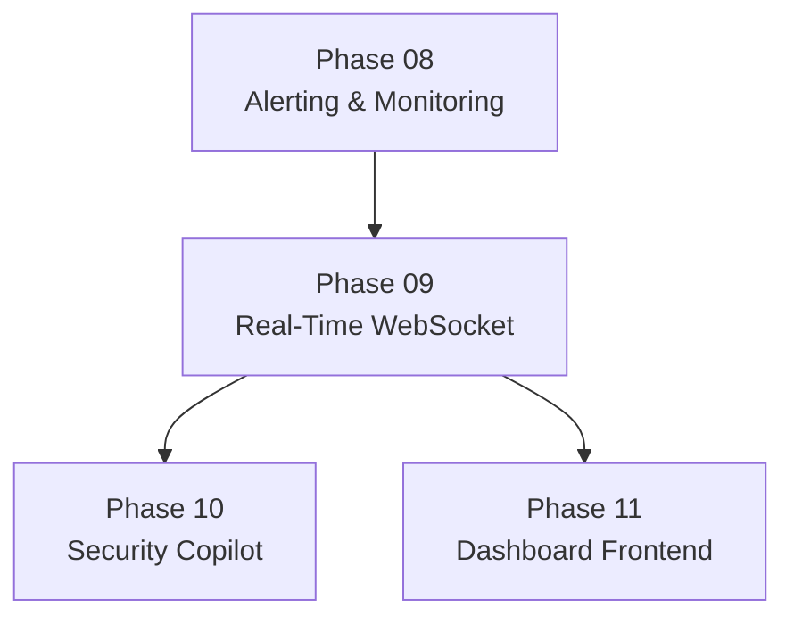

---

# 6. Real-Time Architecture

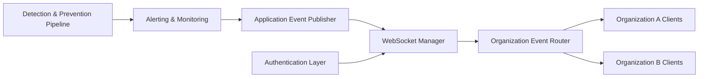

## Security Boundary

```text
Event Produced
      ↓
Identify Organization
      ↓
Identify Authorized Connections
      ↓
Route Event
      ↓
Deliver Only to Matching Organization
```

The WebSocket layer must never broadcast organization-sensitive events globally by default.

---

# 7. Core Concepts

## Connection

A connection represents an active authenticated WebSocket client.

A valid connection should have access to:

- Connection identifier.
- Authenticated user identifier.
- Organization identifier.
- Connection timestamp.
- Connection state.

## Connection Manager

The Connection Manager is responsible for:

- Registering connections.
- Removing disconnected clients.
- Tracking organization membership.
- Routing events.
- Preventing duplicate internal registration.
- Managing connection lifecycle.

## Event

An event is a structured real-time message delivered to a connected client.

Example:

```json
{
  "event_type": "ALERT_CREATED",
  "organization_id": "server-managed-context",
  "timestamp": "2026-01-01T00:00:00Z",
  "payload": {}
}
```

The client must not be trusted to define its own organization routing.

---

# 8. WebSocket Connection Lifecycle

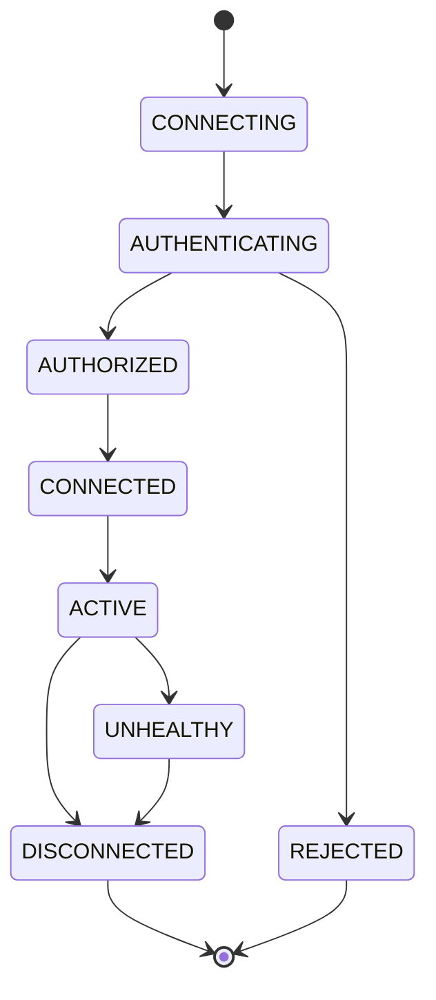

## Lifecycle Steps

```text
1. Client opens WebSocket connection

2. Server receives connection

3. Authentication credentials are validated

4. User identity is resolved

5. Organization membership is resolved

6. Authorization is checked

7. Connection is registered

8. Connection becomes active

9. Authorized events may be delivered

10. Disconnect triggers cleanup
```

---

# 9. Authentication Strategy

WebSocket connections must be authenticated before sensitive events are delivered.

Phase 09 must reuse the authentication foundation established in Phase 02.

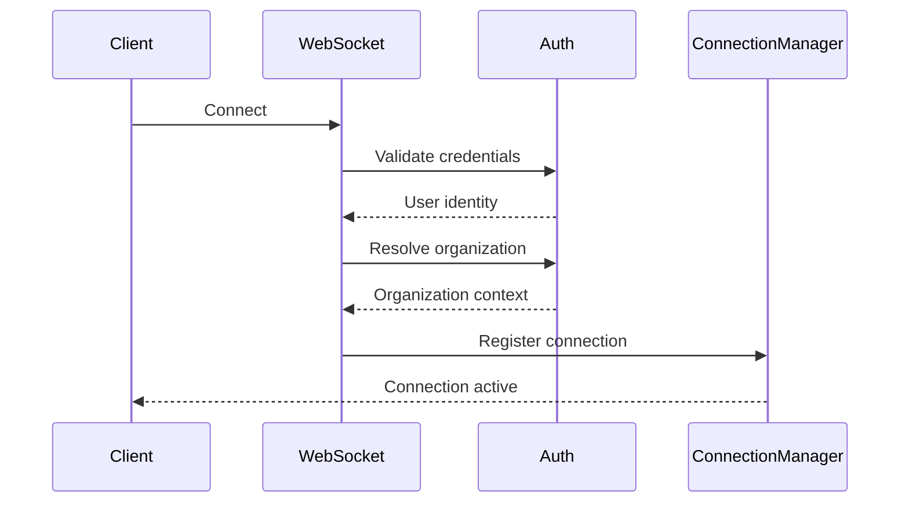

## Authentication Requirements

The implementation must:

- Reuse documented authentication mechanisms.
- Validate credentials server-side.
- Reject invalid credentials.
- Reject inactive users.
- Reject unauthorized users.
- Avoid trusting client-supplied user identity.
- Avoid trusting client-supplied organization identity.

The exact credential transport method must remain consistent with the security and API architecture.

---

# 10. Authorization and Tenant Isolation

Tenant isolation is mandatory.

A connection must only receive events belonging to its authenticated organization.

```text
Organization A Event
        │
        ▼
Organization Router
        │
        ├──────────────► Organization A Connections
        │
        └──────X───────► Organization B Connections
                         BLOCKED
```

## Required Validation

For every connection:

```text
Authenticated User
        ↓
User Active?
        ↓
Organization Membership
        ↓
Role Authorization
        ↓
Connection Registration
```

## Mandatory Rule

The following must never succeed:

```text
Organization A Client
        ↓
Manipulate Event Context
        ↓
Receive Organization B Alert
```

Routing must be derived from server-side authenticated connection context.

---

# 11. Connection Management

The Connection Manager must maintain active connections safely.

Conceptual structure:

```text
Organization
      │
      ├── Connection 1
      ├── Connection 2
      ├── Connection 3
      └── Connection N
```

Conceptual internal mapping:

```text
organization_id
        ↓
set of active authenticated connections
```

The exact data structure is an implementation detail.

## Responsibilities

The Connection Manager must:

- Register new connections.
- Associate connections with server-resolved organization context.
- Remove disconnected clients.
- Remove unhealthy connections.
- Support multiple connections per user.
- Support multiple users per organization.
- Route events to matching organizations.
- Handle failed sends safely.

---

# 12. Event Publishing Architecture

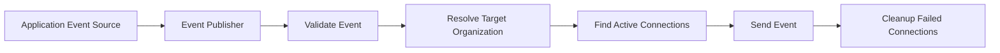

The WebSocket publisher must not independently change business data.

Its responsibility is delivery.

---

# 13. Real-Time Event Types

The exact event names should be centralized.

Conceptual event types include:

```text
ANALYSIS_CREATED

AUDIO_PROCESSING_STARTED
AUDIO_PROCESSING_COMPLETED
AUDIO_PROCESSING_FAILED

AI_DETECTION_COMPLETED
AI_DETECTION_FAILED

RISK_ASSESSMENT_COMPLETED

POLICY_DECISION_CREATED

ALERT_CREATED
ALERT_UPDATED
ALERT_ACKNOWLEDGED
ALERT_RESOLVED
ALERT_CLOSED

SYSTEM_MONITORING_EVENT
```

Events must not expose unnecessary sensitive data.

---

# 14. Event Contract

All WebSocket events should follow a consistent structure.

```json
{
  "event_id": "uuid-or-event-identifier",
  "event_type": "ALERT_CREATED",
  "timestamp": "ISO-8601 timestamp",
  "payload": {
    "alert_id": "uuid",
    "severity": "CRITICAL",
    "status": "ACTIVE"
  }
}
```

## Event Contract Requirements

Every event should support:

| Field | Purpose |
|---|---|
| Event ID | Event identity or traceability |
| Event Type | Event classification |
| Timestamp | Event time |
| Payload | Event-specific data |

The server determines routing context.

Sensitive tenant identifiers should not be unnecessarily exposed in event payloads.

---

# 15. Alert Integration

Phase 09 consumes alerts created by Phase 08.

```text
Phase 08
Alert Created
        ↓
Event Published
        ↓
Phase 09
WebSocket Event Router
        ↓
Authorized Connected Clients
```

Example conceptual event:

```json
{
  "event_type": "ALERT_CREATED",
  "payload": {
    "alert_id": "uuid",
    "type": "CRITICAL_RISK_ANALYSIS",
    "severity": "CRITICAL",
    "status": "ACTIVE"
  }
}
```

The WebSocket layer must not independently create or modify the alert.

---

# 16. Monitoring Integration

Monitoring events may also be delivered in real time when appropriate.

```text
Pipeline State Changed
        ↓
Monitoring Event Recorded
        ↓
Event Publisher
        ↓
WebSocket Layer
        ↓
Authorized Client
```

Phase 09 must distinguish between:

```text
Persistent Monitoring Event
```

and:

```text
Real-Time Delivery Attempt
```

A failed WebSocket delivery must not automatically mean the underlying monitoring event was not recorded.

---

# 17. Event Delivery Flow

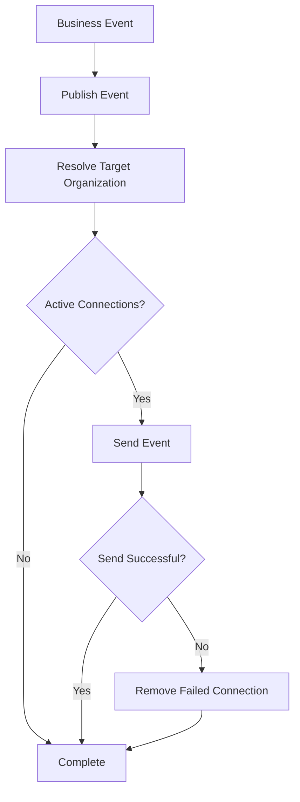

---

# 18. Reconnection Strategy

Network connections may disconnect unexpectedly.

The client may reconnect using a controlled retry strategy.

Conceptual flow:

```text
Connection Lost
      ↓
Client Detects Disconnect
      ↓
Wait Before Retry
      ↓
Reconnect
      ↓
Authenticate Again
      ↓
Register New Connection
```

The server must not assume that a previous connection remains valid after reconnection.

A new or restored connection must pass authentication and authorization checks.

## Important Boundary

Phase 09 must not silently guarantee delivery of historical events merely because a client reconnects.

Historical recovery is a separate application/data retrieval concern unless explicitly designed.

```text
WebSocket
      ↓
Live Delivery

REST API
      ↓
Historical Retrieval
```

---

# 19. Heartbeat and Connection Health

The system should define a connection-health strategy.

Conceptual heartbeat flow:

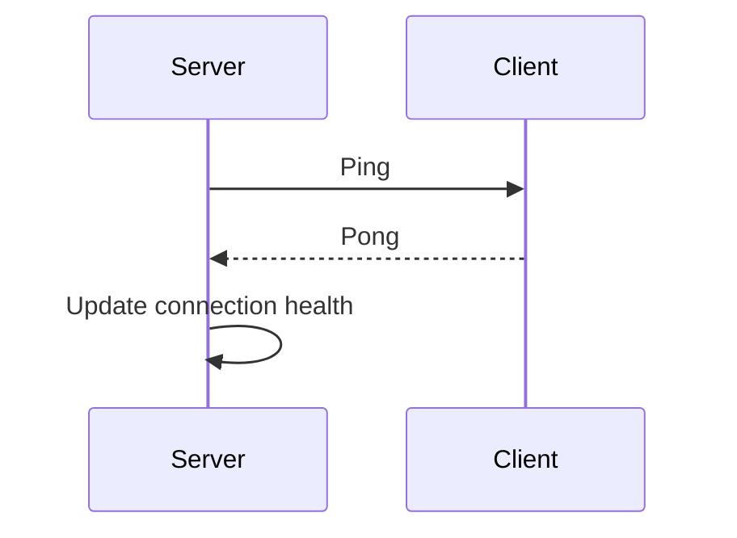

If a connection becomes unhealthy:

```text
Heartbeat Failure
        ↓
Connection Marked Unhealthy
        ↓
Cleanup Attempt
        ↓
Connection Removed
```

The exact heartbeat mechanism must remain compatible with the selected WebSocket implementation.

---

# 20. Error Handling

The WebSocket layer must fail safely.

## Error Matrix

| Condition | Required Behavior |
|---|---|
| Invalid credentials | Reject connection |
| Expired credentials | Reject or close according to auth policy |
| Inactive user | Reject connection |
| Missing organization | Reject connection |
| Unauthorized role | Reject connection |
| Invalid event | Reject event publication |
| Unknown event type | Controlled handling |
| Failed client send | Cleanup failed connection |
| Unexpected disconnect | Cleanup connection |
| No active clients | Safely complete delivery attempt |
| Server error | Controlled error handling and observability |

## Important Rule

A WebSocket send failure must not silently modify upstream business state.

```text
Alert Persisted Successfully
        +
WebSocket Delivery Failed
        =
Alert Still Exists
```

---

# 21. API and WebSocket Boundaries

REST APIs and WebSockets have different responsibilities.

| Capability | REST API | WebSocket |
|---|---|---|
| Historical data retrieval | Yes | No primary responsibility |
| Live updates | No primary responsibility | Yes |
| Alert listing | Yes | No |
| Alert detail | Yes | No primary responsibility |
| Event delivery | No primary responsibility | Yes |
| Persistent business operations | Yes | Not primary responsibility |

The frontend may combine both:

```text
REST API
   ↓
Load Current State
   +
WebSocket
   ↓
Receive Future Changes
```

---

# 22. Sequence Diagrams

## Alert to Real-Time Client

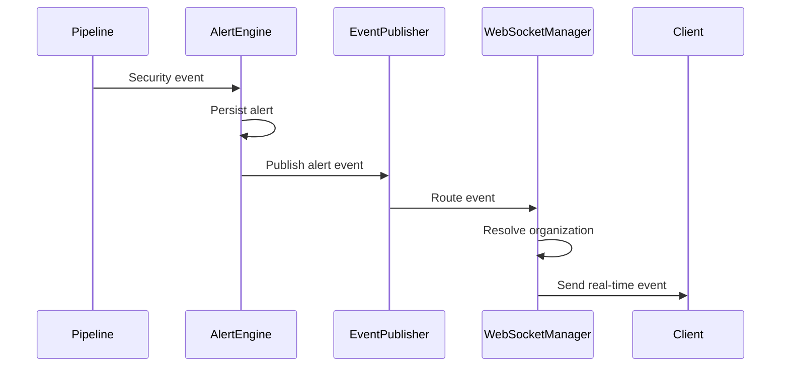

## Connection Authentication

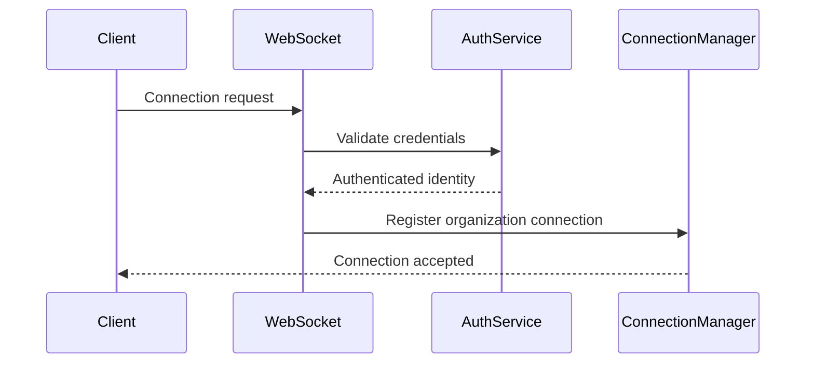

## Cross-Tenant Event Protection

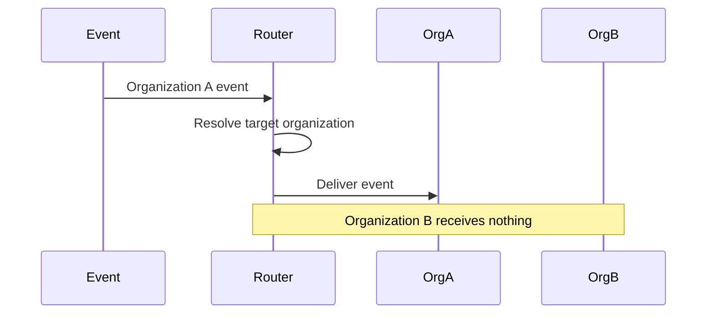

---

# 23. Implementation Architecture

Suggested logical structure:

```text
backend/

├── app/

│   ├── websocket/
│   │   ├── connection_manager.py
│   │   ├── websocket_auth.py
│   │   ├── event_publisher.py
│   │   ├── event_router.py
│   │   └── event_contracts.py
│   │
│   ├── services/
│   │   └── realtime_service.py
│   │
│   ├── schemas/
│   │   └── realtime_events.py
│   │
│   └── tests/
│       ├── test_websocket_connection.py
│       ├── test_websocket_auth.py
│       ├── test_event_routing.py
│       ├── test_tenant_isolation.py
│       ├── test_reconnection.py
│       └── test_event_delivery.py
```

The exact project structure must remain consistent with the architecture established in earlier phases.

---

# 24. Security Requirements

Phase 09 must comply with the security requirements established in Phase 02 and `SECURITY.md`.

Requirements include:

- Authenticated WebSocket connections.
- Server-side identity resolution.
- Server-side organization resolution.
- Tenant isolation.
- Default-deny access.
- No global broadcast of tenant-sensitive events.
- Safe handling of invalid connections.
- Controlled event contracts.
- No sensitive secret transmission.
- Connection cleanup.
- Auditability where required.

---

# 25. Testing Strategy

## Unit Tests

Test:

- Connection registration.
- Connection removal.
- Organization mapping.
- Event routing.
- Invalid event rejection.
- Event contract validation.
- Failed connection cleanup.

## Authentication Tests

Verify:

- Valid authenticated connection succeeds.
- Invalid credentials fail.
- Inactive users fail.
- Unauthorized users fail.

## Tenant Isolation Tests

Verify:

```text
Organization A Event
        ↓
Organization A Client Receives Event

Organization B Client
        ↓
Does Not Receive Event
```

## Integration Tests

```text
Alert Created
      ↓
Event Published
      ↓
WebSocket Router
      ↓
Connected Authorized Client
      ↓
Event Received
```

## Reconnection Tests

Verify:

- Disconnect is cleaned up.
- Reconnection creates valid connection state.
- Authentication is revalidated.
- Old connection state does not grant unauthorized access.

## Regression Tests

Phase 09 must not break:

- Phase 00 application startup.
- Phase 01 database functionality.
- Phase 02 authentication.
- Phase 03 analysis sessions.
- Phase 04 audio processing.
- Phase 05 AI detection.
- Phase 06 risk engine.
- Phase 07 policy and prevention.
- Phase 08 alerting and monitoring.

---

# 26. Edge Cases

## Multiple Browser Tabs

One user may connect from multiple browser tabs.

Expected behavior:

```text
One User
   ├── Connection A
   ├── Connection B
   └── Connection C
```

Each valid connection may receive authorized events.

---

## User Disconnects During Event Delivery

Expected behavior:

```text
Send Attempt
      ↓
Connection Failure
      ↓
Cleanup Connection
      ↓
Do Not Crash Event Publisher
```

---

## No Active Connections

An alert is created but no users are currently connected.

Expected behavior:

```text
Alert remains persisted
WebSocket delivery safely skipped
Historical retrieval remains available through API
```

---

## Duplicate Connection Registration

The connection manager must avoid inconsistent duplicate internal state.

---

## Invalid Event Payload

Expected behavior:

```text
Reject invalid event
Do not send malformed data
Record observability information where appropriate
```

---

## Cross-Tenant Routing Attempt

Expected behavior:

```text
Block delivery
Record security-relevant event where required
Do not expose target organization data
```

---

# 27. AI Guardrails

Phase 09 is not an AI inference layer.

The WebSocket layer must not:

- Run AI models.
- Modify AI confidence.
- Recalculate risk scores.
- Change prevention decisions.
- Create alternative AI conclusions.

Its responsibility is:

```text
Receive Application Event
        ↓
Validate Delivery Context
        ↓
Route Securely
        ↓
Deliver in Real Time
```

The responsibility chain remains:

```text
Phase 05
AI Detection
        ↓
Phase 06
Risk Engine
        ↓
Phase 07
Policy & Prevention
        ↓
Phase 08
Alerting & Monitoring
        ↓
Phase 09
Real-Time Delivery
```

---

# 28. Acceptance Criteria

Phase 09 is complete when:

- WebSocket connections can be established.
- Connections are authenticated.
- Server-side user identity is resolved.
- Server-side organization context is resolved.
- Invalid connections are rejected.
- Active connections are managed safely.
- Disconnected connections are cleaned up.
- Events can be published.
- Events follow a structured contract.
- Events are routed to the correct organization.
- Cross-tenant event leakage is prevented.
- Multiple connections per organization are supported.
- Alert events can be delivered in real time.
- Monitoring events can be delivered where configured.
- Failed client sends do not crash the system.
- Reconnection behavior is defined and tested.
- Connection health behavior is defined.
- Authentication tests pass.
- Tenant-isolation tests pass.
- Integration tests pass.
- Regression tests pass.

---

# 29. Phase Deliverables

| Deliverable | Expected Result |
|---|---|
| WebSocket Endpoint | Real-time connection entry point |
| WebSocket Authentication | Authenticated connection validation |
| Connection Manager | Active connection lifecycle management |
| Organization Router | Tenant-scoped event routing |
| Event Publisher | Application event delivery |
| Event Contracts | Standardized real-time message schema |
| Alert Integration | Live alert events |
| Monitoring Integration | Live monitoring events |
| Reconnection Strategy | Controlled reconnect behavior |
| Health Strategy | Connection health handling |
| Security Controls | Tenant isolation and authorization |
| Test Suite | Unit, integration, auth and isolation tests |

---

# 30. Definition of Done

Phase 09 is considered complete when the following workflow succeeds:

```text
User Opens Application
        ↓
WebSocket Connection Request
        ↓
Authentication
        ↓
Organization Resolution
        ↓
Authorization
        ↓
Connection Registration
        ↓
Connection Active
        ↓
Security Event Occurs
        ↓
Alert / Monitoring Event Published
        ↓
Organization Target Resolved
        ↓
Authorized Connections Identified
        ↓
Real-Time Event Delivered
        ↓
Client Updates Live State
```

---

# Final Phase Summary

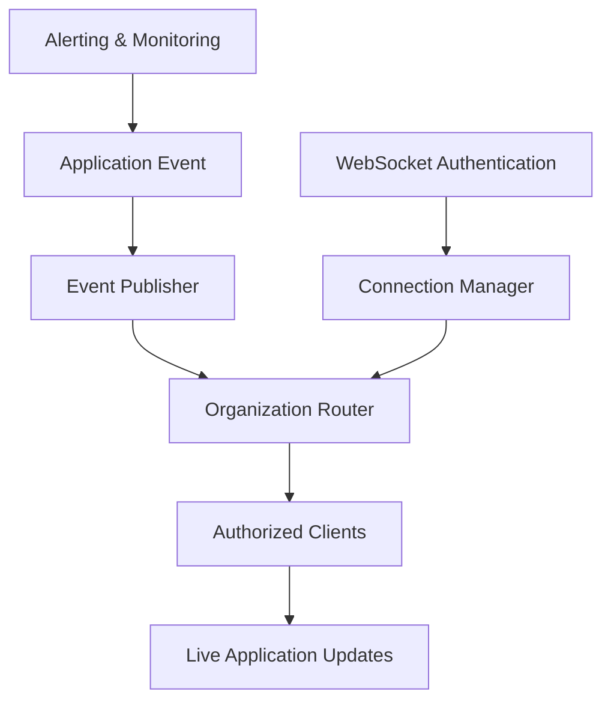

> **Phase 09 transforms persisted application events into secure real-time communication.**

> **Phase 08 records what happened. Phase 09 delivers what happened — live, securely, and only to the correct organization.**