# AI-Powered Voice Cloning Detection & Prevention System

> A privacy-aware cybersecurity platform for detecting synthetic, AI-generated, and cloned voices in real-time or near-real-time audio interactions—then turning detection signals into deterministic, actionable security responses.

Built for the **Smart India Hackathon (SIH)** under the **Blockchain & Cybersecurity** theme.

## Project Status

**Status: Phase 12 complete; Phase 13 demo hardening in progress.**

The implemented workflow covers authentication, secure audio ingestion and processing, AASIST-family inference, deterministic risk scoring, prevention policy, alerting, analyst dashboard workflows, WebSocket updates, and production request hardening.

Phase 13 focuses on repeatable presentation readiness, runtime dependency checks, and operator rehearsal.

## Core Workflow

```mermaid
flowchart LR
    audio[Audio Input] --> preprocessing[Audio Processing]
    preprocessing --> detection[AI Voice Detection]
    detection --> signal[Synthetic Voice Signal]
    signal --> risk[Deterministic Risk Engine]
    risk --> policy[Policy Engine]
    policy --> alert[Alert and Recommended Action]
    alert --> dashboard[Security Analyst Dashboard]
    dashboard -. Advisory only .-> copilot[AI Security Copilot]
```



The AI model provides a detection signal. The **Risk Engine** combines that signal with approved contextual factors to calculate a deterministic risk score. The **Policy Engine** controls critical outcomes such as warning, secondary verification, escalation, or holding a high-risk action. The Security Copilot assists analysts, but it never bypasses deterministic policy or authorization controls.

## Key Capabilities

- Secure authenticated analysis sessions and audio intake.
- Audio validation, preprocessing, normalization, and model-compatible preparation.
- AASIST-family synthetic voice detection.
- Deterministic risk scoring from `SAFE` to `CRITICAL`.
- Policy-controlled prevention outcomes.
- Alert generation and analyst investigation lifecycle.
- WebSocket-based live analysis and alert updates.
- Audit logging across security-critical operations.
- Production request correlation IDs and baseline HTTP security headers.
- Liveness and dependency-aware readiness probes.
- Advisory-only Security Copilot boundary.

## Technology Stack

| Layer | Technologies |
|---|---|
| Frontend | React, TypeScript, Vite, Tailwind CSS, shadcn/ui |
| Backend | Python, FastAPI, Pydantic, SQLAlchemy, Alembic |
| AI / Audio | PyTorch, torchaudio, librosa, NumPy, SciPy, PyDub, WebRTC VAD |
| Database | PostgreSQL |
| Real-Time | FastAPI WebSockets |
| Security | JWT, RBAC, Argon2, validation, HTTPS/TLS, rate limiting, audit logging |
| DevOps | Docker, Docker Compose, Git, GitHub |

## Security Principles

- JWT authentication with Argon2 password hashing.
- Server-side RBAC.
- Organization-level tenant isolation.
- Protected audio upload validation.
- Append-oriented audit records.
- Explicit ML failure handling.
- Deterministic risk and prevention decisions.
- Advisory-only LLM behavior.
- No credentials or secrets in demo output.
- Demo audio must be self-generated, publicly permitted, or explicitly authorized.

## Repository Documentation

| Document | Purpose |
|---|---|
| [SRS.md](Docs/SRS.md) | Functional and non-functional requirements |
| [ARCHITECTURE.md](Docs/ARCHITECTURE.md) | System architecture |
| [AI_MODEL.md](Docs/AI_MODEL.md) | Model and evaluation strategy |
| [DATABASE.md](Docs/DATABASE.md) | PostgreSQL schema |
| [API.md](Docs/API.md) | REST and WebSocket API |
| [SECURITY.md](Docs/SECURITY.md) | Security model and threat controls |
| [DEMO.md](Docs/DEMO.md) | Hackathon demo playbook |
| [PHASE_12_PRODUCTION_HARDENING.md](Docs/PHASE_12_PRODUCTION_HARDENING.md) | Production hardening |
| [PHASE_13_DEMO_HARDENING.md](Docs/PHASE_13_DEMO_HARDENING.md) | Demo-readiness gate and rehearsal |
| [ROADMAP.md](Docs/ROADMAP.md) | Product and technical roadmap |

## Demo Scenario

The demonstration uses a safe simulated impersonation scenario:

1. Show the normal dashboard and authentic baseline.
2. Start an analysis using an authorized synthetic-audio sample.
3. Show audio processing and AI detection.
4. Show deterministic risk scoring and policy evaluation.
5. Show alert creation and analyst investigation.
6. Demonstrate the alert lifecycle.
7. Show WebSocket updates when available.
8. Demonstrate Copilot only if stable and clearly advisory.
9. Finish with secondary verification or another controlled response.

Do not use a real person's cloned voice without authorization.

## Demo Readiness

From the repository root:

```powershell
cd backend
python scripts/validate_phase_13.py
```

The Phase 13 gate verifies the backend application, end-to-end pipeline, Phase 12 validation gate, AASIST checkpoint, FFmpeg availability, required API routes, optional configured demo audio, and the frontend production build when present.

## Frontend Validation

```powershell
cd ..\frontend
npm run build
npm run test
npm run lint
```

Lint warnings are tracked separately from lint errors; a clean gate requires zero lint errors.

## Failure Fallback

- ML/checkpoint issue → clearly labeled prepared result.
- FFmpeg issue → prepared processed authorized sample.
- WebSocket issue → REST retrieval.
- Database issue → prepared local backup environment.
- Frontend issue → backup tab or recording.
- Copilot issue → skip the optional advisory segment.

Fallback results must never be presented as fresh inference.

## Future Direction

- Improved anti-spoofing models and robustness evaluation.
- Streaming, telephony, and VoIP ingestion.
- Dedicated inference services and ONNX optimization.
- Redis-backed queues and horizontally scalable deployments.
- SIEM, telephony, webhook, SDK, and enterprise integrations.
- Centralized production monitoring and model lifecycle controls.

## License

Add an appropriate project license before public distribution.
