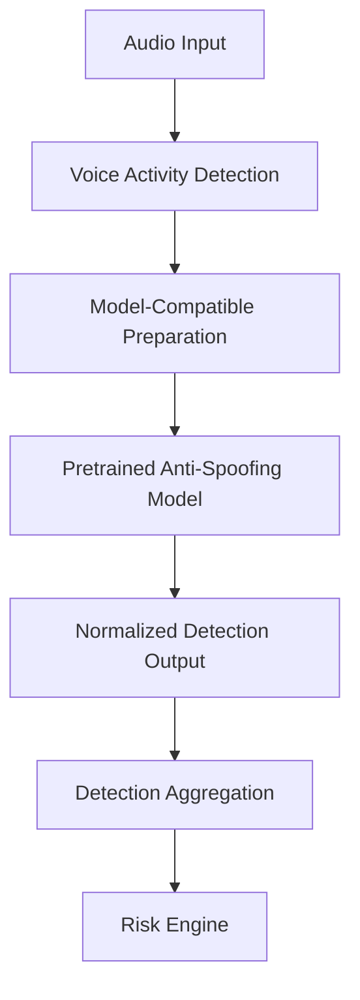

# AI-Powered Voice Cloning Detection & Prevention System

> A privacy-aware cybersecurity platform for detecting synthetic, AI-generated, and cloned voices in real-time or near-real-time audio interactions—then turning detection signals into deterministic, actionable security responses.

Built for the **Smart India Hackathon (SIH)** under the **Blockchain & Cybersecurity** theme.

## The Problem

Modern voice-cloning systems can imitate trusted individuals from short audio samples. This makes voice-based social engineering especially dangerous in banking, enterprises, government workflows, call centers, and telecom environments—where an urgent instruction may trigger a high-risk action.

Caller ID, manual callbacks, and voice familiarity alone are no longer sufficient safeguards. This project introduces a dedicated analysis and advisory layer that helps identify suspicious synthetic voice characteristics before a high-risk action is completed.

## The Solution

The platform analyzes audio interactions and connects the result to an end-to-end security workflow:

```mermaid
flowchart LR
    audio[Audio Input] --> preprocessing[Audio Processing]
    preprocessing --> detection[AI Voice Detection]
    detection --> signal[Synthetic Voice Signal]
    signal --> risk[Deterministic Risk Engine]
    risk --> policy[Policy Engine]
    policy --> alert[Alert and Recommended Action]
    alert --> dashboard[Security Analyst Dashboard]
    dashboard -. Advisory only .-> copilot[AI Security Copilot]
```

The AI model provides a detection signal. The **Risk Engine** combines that signal with approved contextual factors to calculate a deterministic risk score. The **Policy Engine** controls critical outcomes such as warning, secondary verification, escalation, or holding a high-risk action. The Security Copilot assists analysts, but it never bypasses deterministic policy or authorization controls.

## Key Capabilities

- Analyze uploaded, microphone, simulated, streamed, and future telephony/VoIP audio inputs.
- Detect suspicious synthetic or spoofed voice characteristics with a pretrained anti-spoofing model.
- Apply voice activity detection, audio validation, normalization, and model-specific feature preparation.
- Generate normalized detection signals, model metadata, and analysis status.
- Compute deterministic risk scores from `SAFE` to `CRITICAL` using ML signals and contextual factors.
- Apply policy-controlled responses such as warning, secondary verification, escalation, or high-risk action hold.
- Deliver live analysis, risk, and alert updates through WebSockets.
- Provide analyst investigation views, alert history, and append-oriented audit logging.
- Support advisory AI Security Copilot explanations and verification recommendations.
- Preserve privacy through data minimization and avoidance of unnecessary raw-audio storage.

## MVP Scope

The Smart India Hackathon MVP prioritizes a dependable core workflow over unnecessary infrastructure complexity.

| Area | MVP Focus |
|---|---|
| Frontend | React, TypeScript, Vite, Tailwind CSS, shadcn/ui |
| Backend | Python, FastAPI, Pydantic, SQLAlchemy, Alembic |
| AI/ML | PyTorch-based pretrained voice anti-spoofing inference |
| Audio Processing | torchaudio, librosa, NumPy, SciPy, PyDub, WebRTC VAD |
| Database | PostgreSQL for persistent metadata, results, alerts, and audit logs |
| Real-Time Updates | FastAPI WebSockets |
| Security | JWT, RBAC, Argon2, validation, audit logging |
| Deployment | Docker and Docker Compose |

Redis, WebRTC, gRPC, webhooks, SDKs, Kubernetes, SIEM integrations, and dedicated inference services are planned future enhancements—not MVP dependencies.

## Architecture Principles

- **MVP-first:** prove the core detection-to-response workflow before adding complexity.
- **Modular monolith:** begin with a modular FastAPI backend; extract services later only when justified.
- **Model-agnostic detection:** use a model adapter so the pretrained detector can be evaluated and replaced without redesigning the system.
- **Deterministic security actions:** the Risk and Policy Engines remain independent of the LLM.
- **Security by design:** enforce authentication, RBAC, organization-level isolation, validation, and auditability.
- **Privacy-aware processing:** minimize sensitive-data retention and avoid raw-audio storage in PostgreSQL.

## Technology Stack

| Layer | Technologies |
|---|---|
| Frontend | React, TypeScript, Vite, Tailwind CSS, shadcn/ui, Lucide React, React Router, Axios, Recharts |
| Backend | Python, FastAPI, Uvicorn, Pydantic, SQLAlchemy, Alembic |
| AI / Audio | PyTorch, torchaudio, librosa, NumPy, SciPy, PyDub, WebRTC VAD |
| AI Workflow | LangChain, LangGraph, LLM API, Pydantic Structured Output |
| Database | PostgreSQL |
| Real-Time | WebSockets |
| Security | JWT, RBAC, Argon2, HTTPS/TLS, rate limiting, audit logging |
| DevOps | Docker, Docker Compose, Git, GitHub |

## Security Model

Security controls protect both the application and the integrity of its decision workflow.

- JWT-based authentication with Argon2 password hashing.
- Server-side role-based access control for `SUPER_ADMIN`, `ADMIN`, `SECURITY_ANALYST`, `OPERATOR`, and `AUDITOR` roles.
- Organization-level resource ownership checks.
- Pydantic request validation and protected audio uploads.
- Append-oriented audit records for authentication, analysis, risk, alert, and administrative events.
- Explicit ML failure handling—model failures must not silently produce a `SAFE` outcome.
- Advisory-only Copilot: it cannot directly modify risk scores, suppress alerts, resolve alerts, or execute critical actions.

## AI Detection Design

The MVP uses a **pretrained voice anti-spoofing or synthetic-speech detection model**. A specific model is intentionally not assumed until local inference testing verifies licensing, compatibility, latency, and practical detection consistency.

The model output is a detection signal, not a fraud decision. The final risk level is generated by the deterministic Risk Engine and validated by the Policy Engine.

## Repository Documentation

The complete project design is documented in the [`Docs`](Docs) directory:

| Document | Purpose |
|---|---|
| [SRS.md](Docs/SRS.md) | Functional and non-functional requirements specification |
| [TECH_STACK.md](Docs/TECH_STACK.md) | Official technology decisions and MVP/future matrix |
| [ARCHITECTURE.md](Docs/ARCHITECTURE.md) | System architecture and component flows |
| [AI_MODEL.md](Docs/AI_MODEL.md) | AI model, inference, evaluation, and evolution strategy |
| [DATABASE.md](Docs/DATABASE.md) | PostgreSQL logical schema and data architecture |
| [API.md](Docs/API.md) | REST and WebSocket API design |
| [SECURITY.md](Docs/SECURITY.md) | Threat model, security controls, and implementation guidance |
| [DEMO.md](Docs/DEMO.md) | Hackathon demo playbook and fallback plan |
| [ROADMAP.md](Docs/ROADMAP.md) | MVP priorities and product evolution roadmap |

## Demo Scenario

The hackathon demonstration uses a safe, simulated impersonation scenario:

1. An analyst views a normal or authentic audio baseline.
2. A fictional employee receives an urgent, security-sensitive voice instruction.
3. An authorized synthetic-audio sample is analyzed.
4. The detection layer emits a suspicious signal.
5. The Risk Engine raises the risk level using deterministic logic.
6. The Policy Engine creates an alert and recommends verification or escalation.
7. The analyst investigates the alert and records the response.
8. When enabled, the Security Copilot explains the indicators and suggests verification steps without making the decision.

Use only self-generated, publicly permitted, or explicitly authorized audio samples. Do not use a real person’s cloned voice without authorization.

## Getting Started

This repository currently contains the product, architecture, API, AI/ML, security, database, roadmap, and demo specifications that guide implementation.

The recommended build sequence is:

1. Establish the React frontend, FastAPI backend, PostgreSQL database, and local environment.
2. Implement authentication, server-side RBAC, and organization isolation.
3. Implement audio-session creation, upload validation, and preprocessing.
4. Integrate a locally tested pretrained anti-spoofing model through the model adapter.
5. Implement deterministic risk scoring, policy validation, alerts, and audit logging.
6. Build dashboard APIs and frontend investigation views.
7. Add WebSocket updates and, where feasible, the advisory Security Copilot.
8. Test and harden the demo path using the [demo guide](Docs/DEMO.md).

## Project Status

**Status: Documentation and MVP design phase.**

The repository defines the approved scope and implementation blueprint. Features described as future scope in the documentation are not represented as completed functionality.

## Future Direction

- Improved and evaluated anti-spoofing models, including robustness for Indian languages and accents.
- Streaming, telephony, and VoIP ingestion.
- Dedicated inference services and ONNX optimization.
- Redis-backed transient state, queues, and horizontally scalable deployments.
- Enterprise integrations with telephony platforms, SIEM/SOC systems, webhooks, SDKs, and gRPC.
- Production monitoring, security automation, model lifecycle controls, and centralized security operations.

## Contributing

Before making implementation changes, review the relevant document in [`Docs`](Docs). Keep the core design principles intact: model-agnostic AI integration, privacy-aware processing, deterministic security decisions, and advisory-only LLM behavior.

## License

Add an appropriate project license before public distribution.
